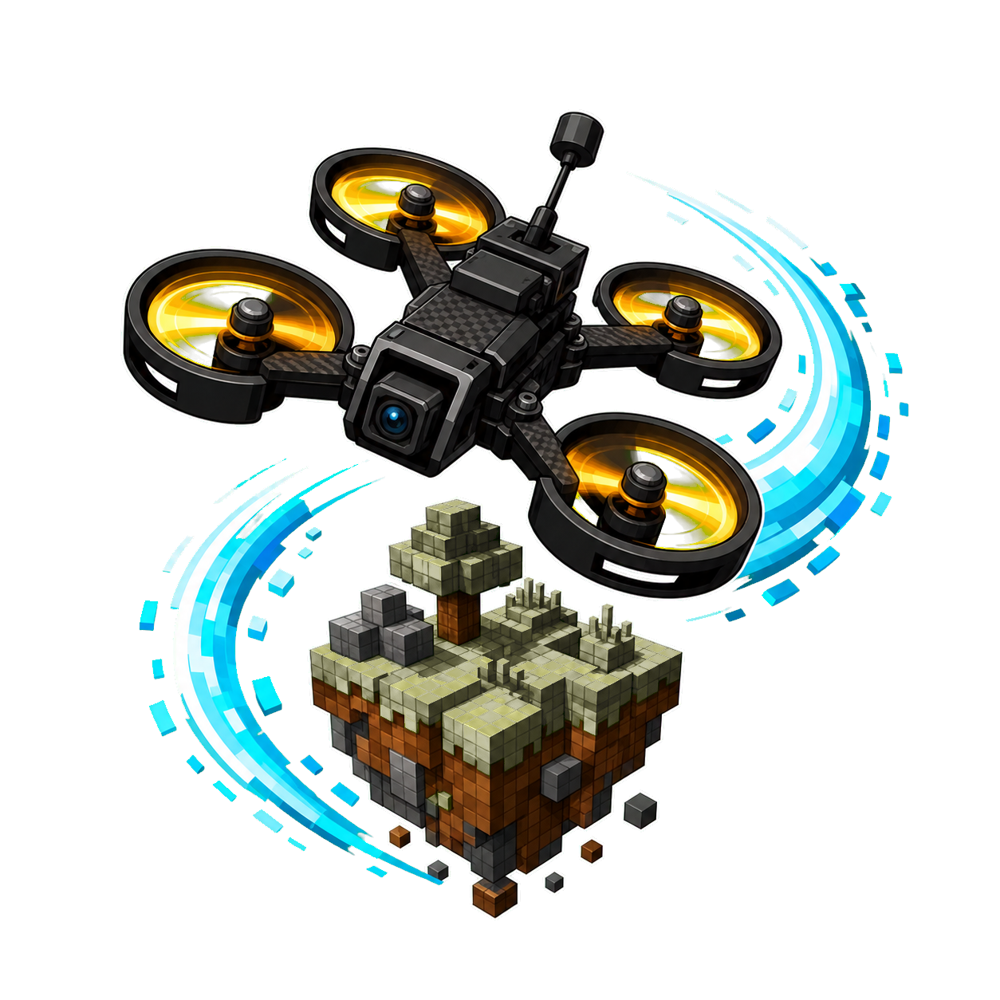

<p align="center">
  
</p>

# FPV Dronecraft

Multirotor flight simulation for Minecraft, with FPV/line-of-sight flying, controller calibration, route-tested flight-model architecture, and an experimental high-fidelity simulation core.

Languages: [简体中文](#简体中文) | [繁體中文](#繁體中文) | [English](#english) | [日本語](#日本語)

Progress archive: [简体中文完整原始记录](docs/progress/progress.zh-CN.md) | [繁體中文整理版](docs/progress/progress.zh-TW.md) | [English summary](docs/progress/progress.en.md) | [日本語要約](docs/progress/progress.ja.md)

Current release: [v0.1.0](https://github.com/SakalioLabs/FPV-Dronecraft/releases/tag/v0.1.0)

## 简体中文

FPV Dronecraft 是一个面向 Minecraft Fabric 的多轴无人机/穿越机模拟 Mod。项目目标不是把无人机做成普通载具，而是在 Minecraft 世界中实现可游玩的 FPV 飞行体验，同时保留可继续研究的飞行动力学、遥测、诊断和模型验证基础。

### 当前状态

- Minecraft 版本：`1.21.11`
- Mod 版本：`0.1.0`
- Loader：Fabric Loader `0.19.3+`
- Java：`21+`
- 当前定位：实验性可测试版本，已发布 `v0.1.0`
- 真实遥控硬件：自动输入链已闭环，仍需要更多真实设备验收反馈

### 功能概览

- 可生成并绑定 FPV 无人机，支持目视飞行和 FPV 视角。
- 支持键盘控制、虚拟遥控器和 GLFW 遥控/手柄输入。
- `I` 打开遥控器设置页，可绑定轴/按钮、交换摇杆轴、反向通道、校准油门和摇杆中心。
- `G` 切换遥控输入启用状态，`R` 解锁/上锁，`M` 切换飞行模式，`B` 切换 FPV 视角，`N` 切换 HUD，`V` 切换虚拟遥控器。
- HUD 提供精简/完整遥测，包括模式、视角、输入源、油门、高度、速度、RPM、健康和告警。
- 内置 `ANGLE`、`HORIZON`、`ACRO` 等飞行模式；ACRO 路径正在向穿越机手感收敛。
- 服务端命令支持生成、修复、预设、环境扰动、blackbox 和诊断 trace。
- `DroneEntity` 已通过统一飞行模型路由接入 playable 和 simulation 两套后端。

### 安装

1. 安装 Minecraft `1.21.11`、Fabric Loader `0.19.3+` 和 Fabric API。
2. 从 [Release v0.1.0](https://github.com/SakalioLabs/FPV-Dronecraft/releases/tag/v0.1.0) 下载 `fpv-dronecraft-fabric-0.1.0.jar`。
3. 将 jar 放入客户端和服务器的 `mods` 目录。
4. 启动游戏，在创造模式物品栏或命令中获取无人机遥控器。

### 快速开始

```text
/fpvdrone spawn
```

手持 FPV 无人机遥控器或启用虚拟遥控器后，先确认油门在最低位、横滚/俯仰/偏航回中，再按 `R` 解锁。遥控器用户建议先按 `I` 完成设备选择、轴绑定和油门校准。

### 诊断与开发

- `/fpvdrone status` 查看当前绑定无人机状态。
- `/fpvdiag start|status|stop` 录制可复现诊断 trace。
- `./gradlew.bat --no-daemon build` 运行本地完整构建和测试。
- 远端 CI 已覆盖 core/fabric 测试、full build、route-equivalence、golden trace、GameTest、序列化和 server self-test。

### 文档

- [V1 飞行模型收敛报告](docs/architecture/flight-model-convergence-v1.md)
- [仿真数据源和验证记录](docs/fpv-sim-model-validation.md)
- [数据源索引](docs/fpv-sim-data-sources.md)
- [进展归档索引](docs/progress/README.md)

### 许可和说明

本项目使用 MIT License。项目与 Mojang、Microsoft、DJI 或其他无人机厂商没有官方关联。

## 繁體中文

FPV Dronecraft 是一個面向 Minecraft Fabric 的多軸無人機/穿越機模擬 Mod。它的目標不是把無人機做成一般載具，而是在 Minecraft 世界中提供可玩的 FPV 飛行體驗，並保留可持續研究的飛行力學、遙測、診斷與模型驗證基礎。

### 目前狀態

- Minecraft 版本：`1.21.11`
- Mod 版本：`0.1.0`
- Loader：Fabric Loader `0.19.3+`
- Java：`21+`
- 定位：實驗性可測試版本，已發布 `v0.1.0`
- 真實遙控硬體：自動輸入鏈路已閉環，仍需要更多實機驗收回饋

### 功能概覽

- 可生成並綁定 FPV 無人機，支援目視飛行與 FPV 視角。
- 支援鍵盤、虛擬遙控器，以及 GLFW 遙控/手把輸入。
- `I` 開啟遙控器設定頁，可綁定軸/按鈕、交換搖桿軸、反向通道、校準油門與搖桿中心。
- `G` 切換遙控輸入，`R` 解鎖/上鎖，`M` 切換飛行模式，`B` 切換 FPV 視角，`N` 切換 HUD，`V` 切換虛擬遙控器。
- HUD 提供精簡/完整遙測，包括模式、視角、輸入來源、油門、高度、速度、RPM、健康與警告。
- 內建 `ANGLE`、`HORIZON`、`ACRO` 等飛行模式；ACRO 路徑正在向穿越機手感收斂。
- 伺服器命令支援生成、修復、預設、環境擾動、blackbox 和診斷 trace。

### 安裝

1. 安裝 Minecraft `1.21.11`、Fabric Loader `0.19.3+` 和 Fabric API。
2. 從 [Release v0.1.0](https://github.com/SakalioLabs/FPV-Dronecraft/releases/tag/v0.1.0) 下載 `fpv-dronecraft-fabric-0.1.0.jar`。
3. 將 jar 放入客戶端與伺服器的 `mods` 目錄。
4. 啟動遊戲，在創造模式物品欄或命令中取得無人機遙控器。

### 快速開始

```text
/fpvdrone spawn
```

手持 FPV 無人機遙控器或啟用虛擬遙控器後，確認油門在最低位、橫滾/俯仰/偏航回中，再按 `R` 解鎖。遙控器使用者建議先按 `I` 完成設備選擇、軸綁定與油門校準。

### 文件

- [V1 飛行模型收斂報告](docs/architecture/flight-model-convergence-v1.md)
- [仿真資料源與驗證記錄](docs/fpv-sim-model-validation.md)
- [進展歸檔索引](docs/progress/README.md)

## English

FPV Dronecraft is a Minecraft Fabric mod for multirotor and FPV drone simulation. It aims to be a playable in-world FPV experience rather than a simple vehicle mod, while keeping a research-friendly foundation for flight dynamics, telemetry, diagnostics, and model validation.

### Status

- Minecraft: `1.21.11`
- Mod version: `0.1.0`
- Loader: Fabric Loader `0.19.3+`
- Java: `21+`
- Stage: experimental playable test release, published as `v0.1.0`
- Real controller hardware: the automated input path is covered; broader hardware validation is still needed

### Features

- Spawn and bind FPV drones with line-of-sight and FPV camera modes.
- Keyboard, virtual controller, and GLFW controller/gamepad input paths.
- Press `I` to open controller settings for device selection, axis/button binding, axis swapping, inversion, throttle calibration, and stick-center calibration.
- `G` toggles controller input, `R` arms/disarms, `M` changes flight mode, `B` toggles FPV view, `N` cycles the HUD, and `V` toggles the virtual controller.
- Minimal/full HUD telemetry for mode, camera view, input source, throttle, altitude, speed, RPM, health, and warnings.
- `ANGLE`, `HORIZON`, and `ACRO` flight modes. ACRO is being tuned toward FPV freestyle/racing feel.
- Server commands for spawn, repair, presets, environment overrides, blackbox data, and diagnostic traces.
- Playable and simulation backends now run through a common flight-model routing contract.

### Install

1. Install Minecraft `1.21.11`, Fabric Loader `0.19.3+`, and Fabric API.
2. Download `fpv-dronecraft-fabric-0.1.0.jar` from [Release v0.1.0](https://github.com/SakalioLabs/FPV-Dronecraft/releases/tag/v0.1.0).
3. Put the jar into the client and server `mods` folders.
4. Launch the game and obtain the FPV Drone Controller from the creative tab or commands.

### Quick Start

```text
/fpvdrone spawn
```

Hold the FPV Drone Controller, or enable the virtual controller, then lower throttle and center roll/pitch/yaw before pressing `R` to arm. Controller users should press `I` first and complete device selection, axis binding, and throttle calibration.

### Development

- `/fpvdrone status` shows the linked drone state.
- `/fpvdiag start|status|stop` records reproducible diagnostic traces.
- `./gradlew.bat --no-daemon build` runs the local build and tests.
- CI covers core/fabric tests, full build, route equivalence, golden traces, GameTest, serialization, and server self-tests.

### Docs

- [V1 flight-model convergence report](docs/architecture/flight-model-convergence-v1.md)
- [Simulation data and validation notes](docs/fpv-sim-model-validation.md)
- [Data source index](docs/fpv-sim-data-sources.md)
- [Progress archive index](docs/progress/README.md)

### License

MIT License. This project is not affiliated with Mojang, Microsoft, DJI, or any drone manufacturer.

## 日本語

FPV Dronecraft は、Minecraft Fabric 向けのマルチローター/FPV ドローンシミュレーション Mod です。単なる乗り物 Mod ではなく、Minecraft の世界で遊べる FPV 飛行体験を作りつつ、飛行力学、テレメトリ、診断、モデル検証を継続できる基盤を残すことを目的にしています。

### 現在の状態

- Minecraft: `1.21.11`
- Mod version: `0.1.0`
- Loader: Fabric Loader `0.19.3+`
- Java: `21+`
- 段階: 実験的なプレイアブルテスト版、`v0.1.0` として公開済み
- 実機コントローラー: 自動入力経路はテスト済みですが、さらに多くの実機検証が必要です

### 主な機能

- FPV ドローンの生成とプレイヤーへのバインド、目視飛行と FPV 視点。
- キーボード、仮想コントローラー、GLFW コントローラー/ゲームパッド入力。
- `I` でコントローラー設定を開き、デバイス選択、軸/ボタン割り当て、軸交換、反転、スロットル校正、スティック中心校正を行えます。
- `G` はコントローラー入力、`R` はアーム/ディスアーム、`M` は飛行モード、`B` は FPV 視点、`N` は HUD、`V` は仮想コントローラーを切り替えます。
- HUD はモード、視点、入力元、スロットル、高度、速度、RPM、機体状態、警告を表示します。
- `ANGLE`、`HORIZON`、`ACRO` 飛行モードを搭載。ACRO は FPV フリースタイル/レース寄りの操作感へ調整中です。
- サーバーコマンドで生成、修理、プリセット、環境オーバーライド、blackbox、診断 trace を扱えます。

### インストール

1. Minecraft `1.21.11`、Fabric Loader `0.19.3+`、Fabric API を導入します。
2. [Release v0.1.0](https://github.com/SakalioLabs/FPV-Dronecraft/releases/tag/v0.1.0) から `fpv-dronecraft-fabric-0.1.0.jar` をダウンロードします。
3. クライアントとサーバーの `mods` フォルダーに jar を入れます。
4. ゲームを起動し、クリエイティブタブまたはコマンドで FPV Drone Controller を入手します。

### クイックスタート

```text
/fpvdrone spawn
```

FPV Drone Controller を持つか仮想コントローラーを有効にし、スロットルを最低位置にしてロール/ピッチ/ヨーを中央に戻してから `R` でアームします。実機コントローラーを使う場合は、先に `I` でデバイス選択、軸割り当て、スロットル校正を行ってください。

### ドキュメント

- [V1 flight-model convergence report](docs/architecture/flight-model-convergence-v1.md)
- [Simulation data and validation notes](docs/fpv-sim-model-validation.md)
- [Progress archive index](docs/progress/README.md)

### ライセンス

MIT License。本プロジェクトは Mojang、Microsoft、DJI、その他ドローンメーカーの公式プロジェクトではありません。
