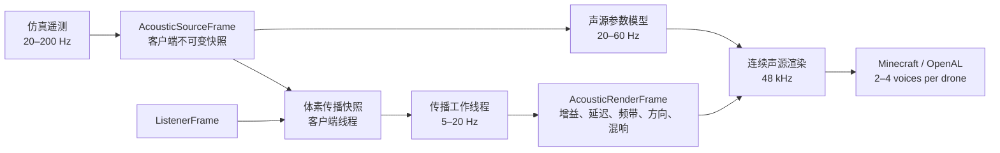

# Computational Acoustics：Minecraft 穿越机声学预研究与执行计划

> 实施状态（2026-07-23）：已在 `sim/computational-acoustics` 建立独立纯 Java
> `computational-acoustics-core`，首批数据契约、阶次声源模型、声速/Doppler 与
> CPU Amanatides–Woo 体素 DDA 已进入验证。新的本地审计确认 Fabric API
> `FabricSoundInstance#getAudioStream` 是程序化 PCM 的官方简化接入点，因此
> “程序化流式声源”从私有引擎侵入实验调整为优先实现路径；OpenAL EFX 仍保留为
> capability-gated 的后续声道扩展。CUDA 不作为直达声默认后端，只在大批量早期反射
> 射线达到 CPU 预算瓶颈后，以 CPU DDA 为正确性基准进行可选 NVIDIA 后端评估。
> 2026-07-24 已继续实现 Fabric 原生程序化 PCM、五探针 acoustic-aperture 部分遮挡、
> 稀疏方块快照、latest-wins 单 worker 批处理、三频带透射及显式源/听者 Doppler。
> 同日加入局部 sparse-air cell A* 与 extra-path/turn 三频带经验绕射基线；1000 次
> 固定墙洞绕行搜索 p95 为 312.1 µs，通过 4 ms worker gate。该基线明确标记为
> `[H]`，不是 UDFA/UTD 或最终 portal abstraction。
> 后续已实现 partition-local connected-air-region/portal hierarchy，并保留 cell A*
> correctness fallback；加入 partition fingerprint 缓存后，warm p95 为 484.6 µs，
> 单 partition 变化 p95 为 537.6 µs。另依据 2023 论文
> Eq. (2)-(6) 独立实现无限楔 UDFA 频域 oracle，未读取 toolbox 源码，尚未接入产品。
> cardinal path 的 known-solid inside-corner edge candidate 提取也已实现，输出 apex、
> edge axis 与入/出方向；90° block 的 `3π/2` wedge、优化 apex、azimuth 与
> incidence geometry 已实现。四 shelf 时变 IIR reference 在四组几何上 RMS
> 0.110-0.173 dB、约 7.78 ns/sample；论文 Section II 的 shadow/reflection zone
> classification、Eq. (10)-(17) finite edge 以及 tonal coherent/broadband
> incoherent 多路径组合已实现；edge 端点 sweep 最大 0.05458 dB/update。BRAS
> RS5 实测 candidate golden 已建立：首次到达时延误差 0.047 ms，理想单 knife-edge
> UDFA 在 1-12 kHz 的 RMS 误差 5.829 dB，暂不满足产品接入门槛。2024 Eq. (8)-(12)
> 厚屏双边 reference 已实现并通过互易/渐近测试，但 BRAS RMS 为 10.284 dB，
> 同样不接产品。全 16 路径已分类，标准高度到达时延 RMS 0.201 ms。随后已按
> Calamia 2009 Eq. (3.4)、(3.8)、(3.15)-(3.16) 建立独立 BTMS 无限楔数值
> reference：在 BRAS 理想 knife-edge 上，UDFA 相对精确 BTMS 的五点 RMS
> 只有 0.0905 dB，因此相对实测的 5.829 dB 差异应优先归入厚屏、短门控、
> 方向性和反卷积测量链。后续已完成全 16 路径 learned-energy timing、几何门控
> 和官方 Genelec 8020c MPS 校正：全矩阵 matched timing RMS 为 0.391 ms，
> single-edge 校正后 RMS 为 5.077 dB；但五条 direct control 的 1 ms 门控
> 在 1 kHz 仍有 6.368 dB RMS 离散，因此短门频谱只保留为 diagnostic。
> 官方 MDF/tile 参数也已提取：25 mm MDF mass-law transmission 在 1-12 kHz
> 为 -43.0 至 -64.6 dB，不足以解释主误差；第一条 floor + double-edge 路径晚
> 3.929 ms，解释 4 ms gate 敏感性。完整 complex source/floor/transmission
> 预算也已完成：整段 RIR RMS 从主双边 11.118 dB 仅变为 11.103/11.545 dB，
> 无稳定改善。因此停止用 RS5 经验路径拟合，下一步必须建立无 chamber residual
> 的 finite-width/two-edge wave/BTMS reference。独立 `two-edge-wave-reference`
> 模块的 2D staggered-grid FDTD、CFL、刚性 cell、sponge、Ricker source 与
> reciprocity/travel-time/boundary-return smoke gate 已开始实现。2D 线源不能
> 直接对照 3D 点源 BTMS；正式 oracle 已修正为沿 edge axis 做空间 Fourier 的
> 2.5D point-source 重建。其 1/2/4 kHz free-field 幅相及 64/96-node `k_y`
> 收敛已通过，最大幅度误差仅 `0.0000111 dB`；单个 1 kHz transformed
> Helmholtz/PML 系统也已在 24 cells/λ 下通过传播、evanescent、互易与刚性镜像
> gate，而 16 cells/λ 被明确否决。连续坐标插值与 origin-aligned 刚性面已实现；
> 32/24 cells/λ 固定几何收敛为 `0.161 dB / 1.580°`，通过当前 gate。完整障碍物
> rigid-wall inverse transform 已用 18/24 nodes、84 个实际 Helmholtz solves
> 通过三维镜像幅相及 quadrature 收敛 gate；零厚度 blocked-face 半平面又通过
> 精确 BTMS、32/24 空间与 24/18 quadrature gate。25 mm 双边 1/2 kHz wave
> candidate 也已生成并通过厚度对齐、空间与 quadrature 收敛；2 kHz 明确记录了
> 18/24、24/32、32/40 的失败/非单调过程，最终用 48/40-node
> `0.0295 dB / 0.678°` 和 6/4-cell `0.0374 dB / 3.217°` 关闭 gate。
> 同几何 2024 UDFA 分别多衰减 `4.119/6.608 dB`，1/2 kHz RMS
> `5.506 dB`，继续禁止接入产品。固定内部区域、PML 维持 `0.729 λ`
> 的域缩放已在 2 kHz 通过 `0.0167 dB / 0.648°` 不变性 gate，并将 unknowns
> 降低 `28.3%`。4 kHz 的 12-cell 96/192 求积先通过
> `0.00395 dB / 0.1085°`，但 12/8-cell spatial 相位差 `6.208°` 超过
> `5°`，因此未被发布。随后 18-cell runner 完成全部 `48` batches /
> `384` unique Helmholtz solves；其 96/192 求积变化为
> `0.00501 dB / 0.10036°`，12/18-cell complex spatial 变化仅
> `0.00225 dB / 2.8151°`，通过固定 `0.5 dB / 5°` gate。受控 finalizer
> 已将 18-cell `-16.28351 dB` 提升为正式 4 kHz golden，fixture SHA-256
> `fabb3690b778e9b0eb293b2b60e0cba895254f0ce1833d9a6e075af7ce07a9ff`。
> 同几何 UDFA 多衰减 `9.58894 dB`，1/2/4 kHz RMS 为 `7.13161 dB`，
> 进一步加强“不接入现有 UDFA 产品路径”的结论。
> 当前最多约 30 条直达射线继续使用 CPU；CUDA gate 保留给
> `>=8192 rays/update` 的早期反射。
> 本机 RTX 3060（12 GB、compute 8.6）具备实验硬件，但未安装 `nvcc`。仓库已有
> 条件编译 FP64 correctness kernel 与实编译 CPU runner，但 `.cu` 尚未被 CUDA
> 编译器接受，也没有 device execution/native bridge；因此状态严格为
> “源代码已实现、硬件可行、收益未验证”。可执行的
> parity、SoA、resident chunk、端到端 P50/P95/P99 与 C0–C4 停止条件已固化在
> [`acoustics/cuda-voxel-dda-feasibility.md`](acoustics/cuda-voxel-dda-feasibility.md)。
> `auditCudaDdaEnvironment` 现可重复输出 schema-v1 环境 JSON；当前仍是
> `toolchain-missing`，并明确保持 device reader/kernel/parity/speedup 四项为
> false。审计契约见
> [`acoustics/decision-D063-cuda-environment-audit.md`](acoustics/decision-D063-cuda-environment-audit.md)。
> WP7 第一条可执行产品边界也已建立：listener-centred 体素反射 probe、
> 三频带 RT60/EDT/DRR estimator 和一份 listener-shared 8-line FDN 已实现；
> 通过 Fabric 官方 `getAudioStream` 输出单一 relative wet bus，不按无人机复制
> delay network。128×8 probe synthetic P95 为 `0.614 ms`、FDN 为
> `44.0 ns/sample`。官方 Client GameTest 已经通过真实 block-state material
> mapping 验证闭合 stone/wool 场景的衰减排序，artifact SHA-256 为
> `20aaf4f80914aa3f3a53c478a1c18ac64be3d7aec4e61d31e1381635b0a6780c`；
> 但实际 wet-stream lifecycle、Minecraft snapshot frame P99 和真实 RIR gate
> 尚未完成，因此 `fpvdrone.listenerReverb` 默认 false。见
> [`acoustics/decision-D070-listener-shared-fdn.md`](acoustics/decision-D070-listener-shared-fdn.md)。
> 第一套真实 RIR 门禁也已建立：固定 MIT 许可的 AIR v1.4 官方 ZIP 与内嵌
> license，独立分析 17 positions × 2 channels。相对论文 Table 2 的 full-band
> RT60 median error 为 `11.56%`，但 short booth maximum error 为 `29.35%`，
> 所以逐场景 15% gate 仍未关闭；AIR 又没有匹配 Minecraft voxel scene，报告
> 强制 `minecraft_release_calibrated=false`。见
> [`acoustics/decision-D071-measured-air-rir-reference.md`](acoustics/decision-D071-measured-air-rir-reference.md)。
> 随后又完成 AIR booth/lecture 同几何误差分解：解析 Eyring 与一米 voxel
> probe 使用同一 room-average absorption 时，D077 sampler 修正后的 MFP maximum
> error `2.66%`、三带 RT60 maximum error `1.32%`；而当前 stone
> `0.03/0.05/0.08` 在同一
> 几何下至少产生真实 RT60 的 `2.78×`。因此主要误差已定位到未校准材料 `[H]`，
> 但 AIR room-average absorption 仍不得写回单一 stone block。见
> [`acoustics/decision-D072-air-shoebox-voxel-error-decomposition.md`](acoustics/decision-D072-air-shoebox-voxel-error-decomposition.md)。
> CPU C1 synthetic parity corpus 已完成 100,008 rays 的 streaming
> write/read/recompute，SHA-256
> `37532b76cc41fac515b08b86ecd19e5361a1b9eb5129f515c7f899948324344b`；
> 这关闭了 CPU corpus 规模，不代表 CUDA parity 或 crossover。
> production 输入身份已进一步拆分为 Minecraft mapping algorithm v1 与
> material-table schema v1；当前八材料系数表 SHA-256 为
> `8bed6d00ec4e433107ad44ad8178dc72fb4d6fb7633577c5cf9ea618f5ae84d8`。
> 它只保证 `[H]` 系数可复现，不证明物理准确；随后已实现自校验的 `MCFPDDA1`
> production bundle
> core writer/reader，把环境 fingerprint、mapping/table identity、snapshot
> generation/hash、cells 与 ray batch 绑定在同一文件；Minecraft adapter 也已能
> 对当前 registry 全部 block states 的最终分类生成语义内容指纹，并把真实 capture
> 与 probe rays 组成 bundle。显式 JVM property
> `fpvdrone.acoustics.ddaExport=<path>` 现可让 acoustic worker 等待首个 complete
> snapshot 并一次性原子写出；默认热路径无此开销。Java 确定性 fixture → 独立 Python reader 的
> schema-v1 gate 已通过：`482 bytes / 8 cells / 3 rays`，snapshot SHA-256
> `d7fbeb8e26df3c85bb937c91c59d993a55726310f18e5c22273a2ac85871a990`，
> file SHA-256
> `f905c3039d4e0815f4ece5e1fc91aed9b6ab07ff907cdcc889da9fd3b159e9ff`。
> 随后普通 C++20 host reader 已在 MSVC `19.44` 以 `/W4 /WX /permissive-` 编译，
> 并通过 SHA/material self-test、Java fixture 和 5-case corruption harness 三项
> CTest。它证明 host schema 可移植，不代表 CUDA device parity 或性能收益；
> `nvcc` 仍不存在。真实 capture 现可在游戏内用官方 Fabric client command
> `/fpvdrone-acoustics export-dda` 请求，`export-status` 查询结果；命令仅登记 atomic
> request，完整 bundle 仍由 acoustic worker 生成。进一步新增官方 Fabric Client
> GameTest 自动闭环：创建 integrated singleplayer world、命令生成并启动真实
> `racing_quad`、把听者后移 28 m 并依次构造 stone/glass/wood/water/foliage
> 五层屏障、等待电机进入可听转速，然后让产品 acoustic worker 导出 complete
> bundle。当前文件为 `1053 bytes / 32 cells / 5 rays`，5 条射线均为
> `29.477–29.890 m`、跨 chunk `(0,0)→(0,-2)`，且各穿过五种材料；
> 三频带损失约 `25.33/60.27/98.11 dB`。file SHA-256
> `bf009d1e497cc3e00ea946458a3edb7c140439d6060ef6e4de125dfb51cb0e9b`；
> Java/Python/C++ 三读均通过。
> 另已新增不修改 input schema 的 `MCFPREF1` Java CPU expected-results sidecar：
> fixture 为 `231` segments、`6746` bytes，SHA-256
> `30c9e506c6adaa2dbf25fe603d43ec8db8c5505dc353938d437a0b7fd1d1c67c`。
> `prepareMinecraftDdaParityOracle -Pbundle=<path>` 会三读 complete input、生成
> Java oracle，再由 Python/C++ 独立重放 traversal 与三频带结果。当前 live
> sidecar 为 `4902 bytes / 5 rays / 159 segments`，SHA-256
> `0cef2a955523f348ca8ca9e844251f6269deef35170be10f58a1654637f893f7`，
> 完整 parity oracle 已通过。可重复的一键入口是
> `captureAndVerifyMinecraftDda`；证据与边界见
> [`acoustics/decision-D064-live-minecraft-dda-capture.md`](acoustics/decision-D064-live-minecraft-dda-capture.md)。
> 这关闭了 live CPU capture/parity gate，但不代表 CUDA device
> reader/kernel/parity 或性能收益；这些仍 pending。
> 当前代码验证（2026-07-24）：受限为 `--max-workers=2` 的
> `gradlew build -x :fabric-mod:runGameTest` 已通过；129 个标准 test XML
> 共 `1028` tests、`0 failures / 0 errors / 0 skipped`，其中
> computational-acoustics-core `100`、drone-sim-core `491`、
> fabric-mod `427`、two-edge-wave-reference `10`。`runGameTest`
> 仍因本机服务端 blackbox sample 诊断单独保留，不在该成功声明内。

日期：2026-07-23  
工作分支：`sim/computational-acoustics`  
状态：预研究完成，核心声源、程序化流式渲染与 CPU 直达传播原型已实现

## 1. 结论先行

这个项目不应把“穿越机声音”继续建模成一条随 RPM 改变播放速度的循环采样，也不应在 Minecraft 运行时求解完整 CFD、FW-H、BPM 或 3D 波动方程。

推荐的目标架构是：

> **按转子阶次跟踪的谐波/调制声源 + 频带整形的随机宽带声源 + 体素原生混合传播。**

声源层按每个转子的 RPM、桨叶数、磁极对数、推力、桨尖马赫数和非定常流动状态生成声学描述；传播层用体素 DDA 求直达声和材质透射，用局部门户图与 A* 求绕墙路径，用少量时序复用射线估算早期反射，再用听者共享的多频带 FDN 生成晚期混响。

当前产品后端采用 **2 个聚合程序化声音层/每台无人机**（motor + propeller），
通过 Fabric 官方 `FabricSoundInstance#getAudioStream` 返回自定义 `AudioStream`。
这条简化接入点足以实现相位连续 tone、独立谐波、随机宽带调制和逐块 PCM 生成，
且已由 `:fabric-mod:compileClientJava` 与现有测试覆盖。它没有开放逐 OpenAL source
滤波、共享 reverb send 或 EFX 生命周期；因此程序化 PCM 是当前主路径，采样循环是
property-controlled fallback，而 OpenAL EFX/Steam Audio 仍必须作为 capability-gated
实验后端单独验收。

推荐传播主线：

1. 5 条左右的体素 DDA 软遮挡射线；
2. 三频带材料吸收与透射；
3. chunk 局部门户/边缘图上的 A* 绕射路径；
4. UDFA 风格的连续边缘绕射滤波，但不复制受限许可工具箱代码；
5. 约 256 条、1–2 次反射的稀疏早期反射；
6. 8–16 条延迟线的听者共享 FDN 晚期混响；
7. Planeverb 风格的水平/垂直 2.5D 低频波动层只作为高质量实验；
8. Steam Audio 只作为固定场景参照和可选原生后端，不作为默认依赖。

这不是“一个算法解决所有问题”。项目必须把以下三种时间尺度分开：



## 2. 证据标签与决策规则

本文用以下标签避免把论文数据、项目派生值和工程猜测混为一谈：

| 标签 | 含义 |
|---|---|
| **[M]** | 真实测量、公开数据集或论文实验值 |
| **[P]** | 论文提出的模型、公式或基准设置 |
| **[R]** | 从当前仓库代码直接读取或计算的值 |
| **[H]** | 待验证的工程初值，不是论文证明的最优参数 |
| **[G]** | 必须通过的实施或发布门槛 |

采用一个参数时，Codex Agent 必须在代码、配置或数据清单中保留 `provenance`。没有来源的数字只能以 `[H]` 身份进入实验配置，不能写成“真实物理参数”。

## 3. 目标、范围与非目标

### 3.1 产品目标

声音应能稳定表达：

- 单个转子的转速、相位连续性和多个转子间的轻微失谐；
- 桨叶通过频率（BPF）及其高次谐波；
- 电机电频、齿槽转矩/换相相关声调；
- 推力、负载、桨尖马赫数、前进比对声级和频谱的影响；
- 急加减速、姿态控制、乱流、失速、VRS、propwash、损伤、湿桨和振动产生的 AM、FM、粗糙度与宽带变化；
- 开阔地、森林、峡谷、洞穴、建筑、窄通道、水边和不同方块材料产生的遮挡、绕射、反射和混响差异；
- 高速掠过时的指向性、距离、空气吸收和 Doppler；
- 多台无人机同时存在时仍保持稳定帧时间、可控 voice 数和无音频 underrun。

### 3.2 非目标

- 不在游戏线程实时运行 CFD、FW-H、BPM、LBM 或完整 3D FDTD；
- 不为无限、可破坏世界预烘焙全局声场；
- 不把任何 CC BY-NC、NC-ND 或非商业数据/代码打包进可分发 mod；
- 不改变飞行物理结果；声学层只读飞行遥测；
- 不在服务器端为每个听者进行传播射线计算；
- 不要求 HRTF、OpenAL EFX 或特定 GPU 一定可用；
- 不以原始 PCM 的逐样本完全一致作为模型回归标准。

## 4. 当前项目基线与缺口

### 4.1 已有声音路径

当前实现位于：

- `fabric-mod/src/main/java/com/tenicana/dronecraft/sound/DroneSoundPhysics.java`
- `fabric-mod/src/client/java/com/tenicana/dronecraft/client/sound/DroneSoundManager.java`
- `fabric-mod/src/client/java/com/tenicana/dronecraft/client/sound/DroneLoopSoundInstance.java`
- `fabric-mod/src/main/java/com/tenicana/dronecraft/sound/DroneSoundEvents.java`
- `fabric-mod/src/main/resources/assets/fpvdrone/sounds.json`
- `docs/scripts/generate_drone_audio_assets.py`

现状是 motor 与 propeller 两个固定循环层。`DroneSoundPhysics` 用平均 RPM、功率、负载、空速和紊流映射音量/播放速度；`DroneSoundManager` 在 48 blocks 内选择最多 6 台无人机，在 64 blocks 外释放；每台无人机使用两个 static voices。这里没有真实 BPF、逐转子失谐、声源指向性、Doppler、空气吸收、材质透射、绕射、早期反射或晚期混响。

现有资源脚本生成 48 kHz、单声道、2 秒 Ogg，但 motor 的 180/360/720 Hz 和 prop 的 96/192/288 Hz 是手工频率锚点，没有绑定 `RPM × bladeCount / 60`。

### 4.2 当前仿真已经提供的声源遥测

`DroneEntity` 与 `SimulationFlightRuntime` 已经产生或同步大量有价值的输入：

- 每个转子的 RPM、功率、推力和负载；
- rotor tip Mach、advance ratio、blade-pass ripple；
- inflow、wake、propwash、stall、VRS；
- ground/ceiling/wall effect、flow obstruction；
- 空速、攻角、侧滑、风、紊流、雨、水、温度；
- rotor health、振动、接触、scrape 和电池纹波。

因此不应另造一套与飞行模型脱节的“声音油门”。声源映射应尽量消费这些已同步字段。

### 4.3 必须先补的数据契约

`RotorSpec` 已有 rotor radius、blade count 和 motor pole pairs，但 `RotorLayoutCodec` 目前只同步数量、位置和旋转方向。客户端不能依赖 `DroneEntity.config()` 推断真实调参，因为客户端的 runtime config 可能仍是默认 racing quad。

当前声学 mapper 已从同步的 `RotorLayoutCodec` 读取逐 rotor 旋向；只有 layout 数量与
rotor telemetry 数量不一致时才使用正负交替 fallback。radius、blade count 和 pole
pairs 已另由 entity data 同步。旋向尚未被错误地解释为“负声频”；它保留给未来有
observer azimuth 的 rotor-airframe/complex-phase 模型。

第一阶段至少需要同步以下低频变化的静态元数据，或同步一个能确定它们的 `acousticProfileId`：

| 字段 | 为什么需要 |
|---|---|
| `bladeCount` | 决定 `f_BPF = B × RPM / 60` |
| `rotorRadiusMeters` | 决定 tip speed、tip Mach 和尺寸归一化 |
| `motorPolePairs` | 决定电机电频和相关阶次 |
| `profileRevision` | 保证客户端校准 profile 与服务器机型一致 |
| 可选 `propFamily` | 区分同尺寸不同桨型的频谱包络 |

playable 与 simulation 两条 flight route 的可用遥测也不完全相同。必须通过统一的 `AcousticSourceFrameMapper` 明确：

- 哪些值来自已同步 entity data；
- 哪些值在 playable 路由下降级为估计；
- 哪些值不可用时使用中性值；
- 不允许客户端 mapper 直接读取仅服务端有效的 `simulationRuntime`。

### 4.4 当前默认机型的声学量级

从 `DroneConfig.racingQuad()` 与 `RotorSpec` 得到：

| 参数 | 当前值 | 来源 |
|---|---:|---|
| 质量 | 1.1 kg | [R] |
| 单转子最大推力 | 13.5 N | [R] |
| `T / ω²` | `1.45e-6 N/(rad/s)²` | [R] |
| 桨半径 | 0.0635 m，即 5 英寸直径 | [R] |
| 桨叶数 | 3 | [R] |
| 默认电机磁极对数 | 7 | [R] |
| 最大角速度 | 3051.29 rad/s | [R] `sqrt(13.5 / 1.45e-6)` |
| 最大机械转速 | 29137.6 RPM | [R] |
| 最大桨尖线速度 | 193.76 m/s | [R] |
| 20 °C、343 m/s 声速下的 tip Mach | 约 0.565 | [R] 派生 |
| 最大 3-blade BPF | 约 1456.9 Hz | [R] 派生 |

这解释了为什么面向大型消费级无人机、约 200 Hz BPF 的样本不能直接代表 5 英寸穿越机：本项目主 BPF 和重要谐波会进入 1–10 kHz 区域，电机声和宽带桨噪也更突出。

### 4.5 Minecraft/OpenAL 约束

对当前 Minecraft 1.21.11 映射与声音类的检查得到：

- 公共 `SoundInstance` 只有事件、声源类别、循环、位置、音量、pitch 和衰减；没有逐源低通或 reverb API；
- Fabric API 为 `SoundInstance` 增加
  `FabricSoundInstance#getAudioStream(SoundBufferLibrary, Identifier, boolean)`；
  返回的 future 可以提供自定义程序化 `AudioStream`，不需要 mixin 侵入 streaming
  buffer，但这不是逐源 EFX/filter API；
- vanilla pitch 被限制在约 `0.5..2.0`，一条采样的播放速度会整体移动 tonal 与 broadband 频谱；
- OpenAL 调用必须在专用 sound engine 线程执行；
- 高频销毁和重建声音可能让 client thread 短暂等待；
- fallback 声道池约 30 个，其中 static/streaming 分配有限，不能为 X8 的每个转子分配独立 OpenAL source；
- HRTF 只有设备支持且用户启用 `ALC_SOFT_HRTF` 时才存在；
- 设备 reload 会销毁并重建 source，任何 mixin/accessor 后端都必须正确恢复；
- 当前 6 台无人机 × 2 layers = 12 个 static voices 尚可接受，目标应保持约 12、硬上限约 16 个 drone voices **[H]**。

因此声学模型可以逐转子计算，但渲染必须按频谱和能量聚类，而不是逐转子分配 voice。
当前 `DroneLoopSoundInstance` 已实现上述官方 hook：默认返回
`ProceduralDroneAudioStream`，`fpvdrone.proceduralAudio=false` 时回退资源流；程序化
路径保持 OpenAL pitch 为 `1.0`，避免把 tone 与 broadband 一起做不正确的整体移调。

## 5. 穿越机声源预研究

### 5.1 实验事实

NASA 的 2016 年小型旋翼声学实验在 SALT 消声室测试两副固定桨距双叶桨：DJI 9443 碳纤维桨与 APC 11×4.7SF。实验使用 5 个 Brüel & Kjær 4939 麦克风，距桨毂 1.905 m，仰角从 -45° 到 +45°、步长 22.5°；采样率 80 kHz、每工况 30 秒。DJI 测试范围为 3000–7200 RPM，APC 为 1800–5100 RPM，步进 300 RPM **[M]**。[NASA NTRS 20160009054](https://ntrs.nasa.gov/citations/20160009054)

2026-07-24 的 PDF 图文复核进一步确认：两套 rotor 的 BPF 随 RPM 增强、高频
broadband roll-off 上移，但只有 APC 的 unweighted OASPL 明确随 RPM 增长；
DJI 的 unweighted OASPL 近似不变，A-weighted 甚至下降，论文归因于 broadband
与 loaded-motor noise 的共同影响。因此不采用跨 profile 的 RPM/tip-speed
单幂律；core 已改为 rotor tonal、motor tonal、broadband 分开的 profile RPM
锚点。完整证据见
[`acoustics/nasa-small-rotor-operating-point.md`](acoustics/nasa-small-rotor-operating-point.md)。

该实验给出几个直接影响本项目的结论：

- 相似推力下，两套 rotor-motor 系统的 OASPL 可相差约 8 dB；论文的 BPF 预测对比中，较慢 APC 桨相对 DJI 桨的收益随角度约 3.6–8.9 dB **[M]**；
- 主要差异来自 tip speed、宽带噪声和电机噪声，不能只由推力决定声级；
- 4200 RPM 双叶 APC 的 BPF 为 140 Hz，5400 RPM 双叶 DJI 的 BPF 为 180 Hz，并有 2–4 次 BPF 谐波；
- 孤立电机在约 10–14 个 shaft harmonics 范围仍有显著声调；14 磁极电机的突出齿槽相关频率位于 `14 × shaft frequency`；
- APC 案例在 500 Hz–1 kHz 有明显电机宽带能量；
- 论文用 3 阶 Butterworth 窄带滤波器、目标频率 ±40 Hz 提取 BPF 前两次谐波；普通 FFT 使用 Hanning 窗、75% overlap、5 Hz 分辨率 **[P]**。

NASA 另一项 2016 年实飞研究测量固定翼、四旋翼、三旋翼和六旋翼。麦克风以 20 kHz 采样，基本频谱使用 7 秒数据、8192 点 Hanning window、50% overlap、2.4 Hz bin。多旋翼噪声由 BPF 谐波与宽带噪声共同主导；多转子的 BPF 在 hover 时接近，在前飞时因姿态控制而分裂，后转子还可能比前转子产生更强的若干谐波 **[M]**。[Measured Noise from Small Unmanned Aerial Vehicles](https://ntrs.nasa.gov/citations/20160010139)

这些结果意味着：

- 声源必须保留逐转子 RPM，而不是只使用平均 RPM；
- 声压级应由每个转子/频带的能量相加，而不是先平均音量；
- 急转、前飞和阵风中的频谱变化主要来自 RPM 分裂、AM/FM 和非定常载荷；
- rotor 与 motor 必须作为组合声源校准。

### 5.2 近年的声源合成成果

2024 ICAS 论文 *Psychoacoustical Analysis of Synthesized Motor-Propeller Rotor System Noise* 使用随机频率波动序列与每转周期函数共同调制 RPM：

```text
RPM(θ) ≈ RFS(n) × IPF(θ)
```

论文考察 3000–6000 RPM、相对随机波动 0–2.5%，步长 0.5%；示例 `μ = 6000 RPM`、`CV = 1%`、`σ = 60 RPM`，5500 RPM 的展示案例使用 1.5% 波动。加入波动后能产生实测中可见的 AM、FM 与较高谐波，并改善烦恼度预测 **[P/M]**。[ICAS 2024 paper 0973](https://www.icas.org/icas_archive/icas2024/data/papers/icas2024_0973_paper.pdf)

2021–2023 年 Ko、Jeong 等人的工作进一步支持：

- `BPF = bladeCount × RPM / 60` 是基本阶次，但转子交互和高次谐波不可忽略；
- 用随机过程表达 rotor-speed fluctuation；
- 在阵风中把 tonal 模型与 BPM 类宽带模型组合，可以复现响度、粗糙度和烦恼度变化；
- 论文实验曾使用 DJI F450、约 2 kg hover、麦克风距声源 3 m、30°，Dryden 平均风速 1/3/5 m/s、每段 4 秒等设置 **[P/M]**。

相关主来源：

- [Random process-based stochastic analysis of multirotor tonal noise](https://doi.org/10.1063/5.0071850)
- [Real-time prediction framework for frequency-modulated multirotor noise](https://doi.org/10.1063/5.0081103)
- [Prediction-based psychoacoustic analysis of a multirotor in gusty wind](https://doi.org/10.1121/10.0022352)

2025 年 JASA 论文 *Synthesis and auralisation of multirotor unmanned aerial systems from hovering flight noise recordings* 从 hover 实录跟踪谱特征，再改变转速合成恒速 flyover，并加入室外传播；对四种飞行器的合成与实测取得良好一致性 **[P/M]**。它是本项目采用“真实录音标定频谱包络 + 运行时阶次重合成”的最直接证据。[开放接受稿与元数据](https://salford-repository.worktribe.com/output/4659143/synthesis-and-auralisation-of-multirotor-unmanned-aerial-systems-from-hovering-flight-noise-recordings)，[DOI](https://doi.org/10.1121/10.0039534)

两组静态/前飞商品桨实验可直接用于复现离线分析：

| 来源 | 论文工况与参数 | 对本项目的用途 |
|---|---|---|
| [Bristol different-pitch propellers](https://www.ioa.org.uk/system/files/proceedings/ns_jajluddin_a_celik_k_baskaran_d_rezgui_m_azarpeyvand_experimental_noise_characterisation_of_different_pitch_propellors_in_forward_flight.pdf) | APC 10×10 与 10×5 双叶；5000 RPM，BPF 166.7 Hz；`J≈0.47–0.66`；23 个 GRAS 40PL，半径 1.75 m、极角 40°–150°；16 s、65536 Hz | 拟合 pitch/advance-ratio/directivity 与 tonal/broadband 分离；论文示例中高桨距 BPF 约高 6 dB/Hz |
| [DJI Phantom static propeller noise](https://doi.org/10.2514/6.2020-2595) | 9.45×5 DJI 碳/塑料双叶及 9×4.5 Master Airscrew；约 2800–7900 RPM；48 kHz、每段统一 230000 samples；Welch Hann、50% overlap、32 段 | 检查 `0–3 BPF` 的桨叶 tonal 与更高阶电机/ESC/结构峰；验证 broadband 随 RPM 上升 |

这些实验仍是 9–10 英寸双叶桨，不能直接给 5 英寸三叶 FPV 规定幅值，但它们提供了可重复的分析管线和前进比维度。

NASA 的 rotor-airframe interaction 实验还表明，桨叶掠过机臂时可显著增强 BPF 高次谐波，而宽带谱变化相对较小。实验使用半径 119.2 mm 的两叶 DJI-CF、5400 RPM、BPF 180 Hz，建议分析到 `20 × BPF`；机臂间隙与观察方位都会改变结果 **[M]**。[Zawodny & Boyd rotor-airframe interaction](https://ntrs.nasa.gov/api/citations/20180001470/downloads/20180001470.pdf)

因此目标声源还需要一个相位锁定的 rotor-airframe 项：用 rotor phase、arm azimuth 和 prop-arm clearance 控制短脉冲或高次谐波包络。它不要求运行 CFD，但也不能被普通随机 broadband 替代。

### 5.3 推荐声源模型

对每个转子 `i`：

```text
frot_i(t) = RPM_i(t) / 60
fBPF_i(t) = bladeCount_i × frot_i(t)
fe_i(t)   = polePairs_i × frot_i(t)
fcog_i(t) = poleCount_i × frot_i(t) = 2 × polePairs_i × frot_i(t)  [候选阶次]

dφ_i/dt = 2π × frot_i(t)
```

相位必须由 RPM 积分，不能每 tick 根据瞬时频率重新开始振荡器。

当前音频 oscillator 已跨 telemetry frame 连续积分 phase。由于 entity 尚未同步真实
mechanical/commutation phase，初相使用 entity-id + rotor-index 的稳定 SplitMix
去相关 fallback；不再使用等间隔初相，因为四 rotor/三叶等组合会在相同 RPM 时对
BPF 谐波产生人为精确相消。该 fallback 只避免确定性伪影，不是实际相位测量，未来
有权威 phase telemetry 时必须替换。

目标声源：

```text
s(t) =
  Σrotor_i Σharmonic_k Aik(x, θ) sin(k × bladeCount_i × φ_i + ψik)
  + Σmotor_order_m Mim(x) sin(m × φ_i + χim)
  + phase_locked_rotor_airframe_interaction
  + interaction_tones
  + shaped_stochastic_broadband(x, t)
```

其中状态 `x` 至少包括：

```text
RPM, thrust, load, tipMach, advanceRatio, inflow,
bladePassRipple, turbulence, stall, VRS, vibration,
wetness, rotorHealth, airspeed, temperature
```

实现规则：

1. **Tonal rotor**
   - 默认覆盖 1–12 次 BPF 谐波，低 BPF/机架交互 profile 可扩展到 20 次 **[P/H]**；
   - `K = min(profile.maxHarmonics, floor(0.45 × sampleRate / fBPF))`，防止 alias；
   - 当前默认 5 英寸机在最大 RPM 时 Nyquist 门槛约只允许 14 次 BPF，因此“20 次”是低 RPM/大采样率上限，不是固定振荡器数量；
   - 每个谐波的基准幅值来自真实数据的 order tracking，不从固定解析公式猜测。

2. **Motor/ESC**
   - 至少保留 shaft、electrical `p × frot`、候选 cogging `2p × frot` 与若干 profile-defined orders；
   - 不假定所有电机都在同一 order 最强；
   - 使用当前仿真的 commutation phase、bus ripple 和 desync 指标调制幅度/粗糙度，但不让虚拟电机物理反过来影响飞行。

3. **AM/FM**
   - 优先使用已同步的逐转子 RPM 与 blade-pass ripple；
   - telemetry 分辨率不足时，可用 0–2.5% 相对波动做实验 sweep，1.0% 和 1.5% 作为论文复现实验点，而不是默认真值 **[P/H]**；
   - 稳态、阵风、VRS、损伤应使用不同带限随机过程，不允许逐 tick 白噪声抖动。

4. **Broadband**
   - 以确定性种子的白/粉红噪声经过 1/3-octave 或少量 biquad bands 整形；
   - 频谱包络由 `tipMach, thrust, advanceRatio, turbulence, stall, wetness` 回归；
   - NASA 结果支持把 1 kHz 以上的宽带能量作为独立重要项；
   - BPM/Amiet/BARC 只用于离线生成 8–16 个频带的先验或查表；运行时不计算完整边界层自噪声；
   - broadband 与 tonal 必须分层，使改变播放速度时不会把所有噪声 formant 一起搬移。

当前三带 procedural renderer 已把 low/mid/high 拆成独立确定性噪声支路，并按
一阶 low-pass/difference/high-pass 的解析稳态方差归一化；因此
`AcousticBands` 的线性能量不再被滤波带宽隐式改写。相同单带能量的稳态输出 RMS
跨三带比值门禁为 `<1.08`。这只关闭能量语义 bug，`20/50/30%` 默认谱包络仍是
待实录标定的 `[H]`。

5. **Rotor-airframe interaction**
   - 由 rotor phase 与每个 arm 的方位角产生相位锁定脉冲或谐波增益；
   - 增益由 prop-arm clearance、observer azimuth 和 profile 控制；
   - 没有可信几何/校准时为 0，不能凭空给所有机型添加强脉冲；
   - 与随机 broadband 分开，便于验证论文所述“高阶 tonal 增强、broadband 近似不变”。

6. **多转子合成**
   - 逐转子计算声学能量；
   - 相干 tone 保留各自相位/失谐，宽带在功率域相加；
   - dB 合成用 `Ltotal = 10 log10(Σ 10^(Li/10))`；
   - 渲染时把转子按 RPM、能量和旋向聚成最多 2 个 tonal clusters **[H]**，另保留 1 个 broadband layer；不可逐转子占用 OpenAL voice。

7. **指向性**
   - 每个谐波/频带使用低阶偶对称余弦表或 profile lookup；
   - 离线从 NASA/NEAPTIDE 的仰角测量拟合；
   - runtime 输入是 rotor disk normal 与 source-listener 方向；
   - 第一版不能把声源当成完全 omnidirectional，也不能直接照搬大型桨的指向性到 5 英寸桨。

8. **功率与归一化**
   - profile 的声压级统一到 1 m、自由场参考；
   - 地面反射已经被数据集归一化或校正时，不能再次叠加；
   - `thrust`, `tipMach`, `RPM` 的增益律通过 log-domain regression 拟合；
   - 不采用“推力翻倍固定增加 N dB”作为未经数据支持的常量。

高质量离线 profile 可以采用 NASA source-sphere 范式：为每个 RPM、前进比、观察方向和谐波存复数幅值，而不是只存标量 dB。NASA 的示范使用三叶 16×8 桨、12R source sphere、约 400 个工况、每半球少于 200 个方向点、15° 角分辨率 **[P]**。[NASA source-sphere / machine-learning source model](https://ntrs.nasa.gov/api/citations/20210017160/downloads/Machine%20Learning%20Methods%20for%20Estimating%20Propeller%20Source3.pdf)

### 5.4 两级渲染策略

#### 默认：校准后的分层 RPM 锚点库

每个 `acousticProfile` 离线生成若干 tonal anchors，例如 8k、12k、16k、20k、24k、28k RPM **[H]**。运行时：

- 选择邻近 anchor，并用窄范围 pitch 追踪精确 BPF；
- anchor 切换有滞回与短交叉淡化；
- tonal rotor、电机和 broadband 至少分成不同 layer；
- 两个 rotor clusters 只在 RPM 分裂足以听出或 owned drone 质量档启用；
- 远距离退化为一个 tonal + 一个 broadband layer。

这一方案能继续走 Minecraft 的稳定声音生命周期，并把 pitch stretch 限制在合理范围。

#### 实验：程序化 PCM

程序化后端用 phase accumulator/递归振荡器和无分配噪声滤波器，在 48 kHz 生成 256–1024 sample frame **[H]**。只有满足以下条件才可成为默认：

- Windows/Linux/macOS 均能创建和回收 streaming buffers；
- resource/device reload 后自动恢复；
- sound engine thread 之外没有 OpenAL 调用；
- 6 台无人机压力场景无 underrun；
- 与 layered backend 相比，听测或客观频谱有显著收益；
- mixin/accessor 的 Minecraft 版本脆弱性有隔离层和自动 fallback。

## 6. 真实数据集与论文参数

### 6.1 数据集优先级

| 优先级 | 数据集 | 真实内容与规模 | 许可 | 本项目用途 | 主要限制 |
|---|---|---|---|---|---|
| A-offline | [Bristol 参数化孤立桨实验](https://doi.org/10.5523/bris.29vtf33wbb4tu2vpxz3es8pilv) | 约 16.1 GiB MAT；叶片数、直径、桨距、RPM、来流速度、声压、推力/转矩 | Non-Commercial Government Licence | tonal/broadband 查表和气动-声学联合拟合 | 体量大且非商业；第一轮只按工况选择性获取 |
| A | [NEAPTIDE](https://zenodo.org/records/10512044) | 4 种无人机；hover、yaw、升降、前后/侧向；7 麦克风；约 176.3 MB/168.1 MiB | CC BY-NC 4.0 | 声源仰角指向性、动作间频谱、1 m 归一化校准 | 仅研究/验证；不得随可商业分发 mod 打包 |
| A | [DroneNoise Database v3](https://salford.figshare.com/articles/dataset/DroneNoise_Database/22133411) | 2022 苏格兰 Edzell 实飞；约 9 麦克风、校准 WAV 与 flyover 表；707.74 MB | CC BY 4.0 | 实飞动态、麦克风间一致性、flyover validation | 与 FPV 小桨并非完全同域；使用派生资产需保留署名 |
| A | [ENODISE Configuration C](https://zenodo.org/records/8334930) | 单/共轴双叶桨载荷与消声室远场；66.1 MB 数据 + 9.2 MB 技术文档 | CC BY 4.0 | 隔离桨、contra-rotating interaction、载荷-声学关系 | 桨型和 RPM 与 5 英寸 FPV 有差异 |
| B | [DDL](https://zenodo.org/records/6459183) | DJI Mini 2/Phantom 4/无机；真实 12.6 GB + 合成 4.6 GB；文件名含方位、距离、高度、温度 | CC BY 4.0 | 传播、距离与定位 sanity check | 主要为检测/定位，不适合精确 rotor-order 标定 |
| B | [Sound-Based Drone Fault](https://zenodo.org/records/7779574) | 消声室中 3 台无人机；正常、电机故障、切桨、方向；约 7.27 GB | CC BY 4.0 | damage/fault 粗糙度和频谱差异 | 文件大；机型、故障状态需先核对元数据 |
| B | [UaVirBASE](https://zenodo.org/records/15391924) | 多麦克风、位姿与城市背景；约 13.15 GB | CC BY 4.0 | 户外背景与定位/空间一致性 | 不是首选校准声源 |
| B | [1/10/30 m UAV recordings](https://doi.org/10.5281/zenodo.7329733) | 1 m、10 m、30 m UAV WAV 与 noise floor；约 244.9 MB | CC BY 4.0 | 距离和远场高频损失 sanity check | RPM/载荷标签不足 |
| C | [Motor Current-Specific Drone Noise](https://doi.org/10.5281/zenodo.16196947) | 多个 110–1020 mA 工况；约 648.7 MB MAT | 采用前再次核验 | 电流/负载代理量与频谱 | 当前元数据许可不够明确，不得自动使用 |
| A-prop | [NASA Small UAS Flyover](https://data.nasa.gov/dataset/small-uas-flyover-acoustics-data) | calibrated incident Pa、mic NED、UTC-aligned RTK/GPS/attitude、气象与多机型实飞 | catalog 未指定 | flyover propagation、距离/姿态/多麦一致性 | 无 rotor RPM；不得拟合声源 profile |
| A-request | [CIRA MATIM rotor directivity](https://doi.org/10.3390/aerospace12070647) | 3000–8000 RPM；同步 thrust/torque/shaft speed；10 calibrated mics；isolated/installed/four-rotor | 论文 CC BY；raw terms 未给 | installation effect、directivity、radial decay reduced-order validation | raw data 仅按请求提供；非目标 5-inch/3-blade |
| A-spectral | [Serration Manufacturing Effects](https://doi.org/10.57745/L8MNF5) | RPM、thrust/torque、13-angle/1.62 m acoustic autopower Pa²、3.125 Hz bins、CAD | Etalab Open Licence 2.0 | spectral slope、BPF/directivity 与 RPM trend validation | 无 raw time history/tach/background；只能走 spectral-reference adapter |
| B | [DroneAudioSet](https://proceedings.neurips.cc/paper_files/paper/2025/hash/adececbc73a58724db0f3c0d5c77f338-Abstract-Datasets_and_Benchmarks_Track.html) | 23.5 h；F330/F450、两档 throttle、上/中/下麦克风与室内环境 | MIT | ego-noise、mic placement、throttle spectral sanity | 发布数据 16 kHz 且非 raw；无同步 RPM 和逐录音绝对校准 |
| B | [Glasgow Drone Authentication](https://doi.org/10.5525/gla.researchdata.1348) | 约 2.9 GB raw WAV；model/state/distance/battery labels | CC BY 4.0 | 分类、状态与距离听感 | 无 absolute pressure calibration、同步 RPM 与完整 propulsion metadata |
| A-prop | [RWTH Aachen AIR v1.4](https://www.iks.rwth-aachen.de/en/research/tools-downloads/databases/aachen-impulse-response-database/) | 17 published positions、34 selected measured channels、48 kHz MAT；193 MiB | MIT | RT60/EDT/DRR 分析链与三带真实衰减量级 | 无匹配 Minecraft geometry/material；published DRR truth 缺失 |
| A-prop | [Real Acoustic Fields](https://facebookresearch.github.io/real-acoustic-fields/) | 36 个全向麦克风、密集真实 RIR、6DoF、视觉扫描 | 依数据发布条款核对 | 室内传播与 RIR validation | 不包含无人机声源 |
| A-prop | [SoundSpaces 2.0 real measurements](http://dl.fbaipublicfiles.com/SoundSpaces/real_measurements.zip) | 真实房间声学测量 | 依项目条款核对 | RT60、DRR、传播验证 | 底层库许可与平台支持不适合直接依赖 |

2026-07-24 的统一准入审计见
[`acoustics/decision-D065-public-source-data-admissibility.md`](acoustics/decision-D065-public-source-data-admissibility.md)
和机器登记表
[`acoustics/public-source-data-admissibility-v1.json`](acoustics/public-source-data-admissibility-v1.json)。
结论是当前审查的公开集合中没有数据同时满足 raw time history、absolute pressure
calibration、同步 measured RPM、完整几何/propulsion metadata、背景、独立 holdout、
商业兼容许可和目标 5-inch FPV domain；公开数据用于结构/传播验证，发行 profile
继续由目标硬件自采闭环。

2026-07-25 已实现 processed-autopower 专用
[`analyze_spectral_reference.py`](scripts/analyze_spectral_reference.py)，并对
Recherche Data Gouv 的真实 BP-T HDF5 完成 5 RPM × 13 angle × 8193 frequency-bin
分析。BPF plane level 在 4000–8000 RPM、数学归一到 1 m 时为
`55.480–77.979 dB SPL`；log-RPM slope `22.315 dB/doubling`，fit RMSE
`0.249 dB`。±60° directivity 拟合向 90° 外推约 `-19.215…-21.267 dB`，但报告
强制标记为 extrapolated。8 个 harmonics 的 RPM trend 表明简单 power law 对部分
高次最大残差达到约 `4.41 dB`，支持继续使用逐阶次 holdout，而不是共享一个默认
exponent。完整来源 hash、HDF5 contract、限制和命令见
[`acoustics/decision-D066-processed-autopower-spectral-reference.md`](acoustics/decision-D066-processed-autopower-spectral-reference.md)。

同日又完成 strict paired comparison：`straight_B` 与
`straight_tripped_BT` 的 65 个同 RPM/angle 点全部一一对齐。移除前 8 个 BPF
windows 后，tripped candidate 的 high-band delta 在所有点均为负，整体均值
`-2.342 dB`、范围 `-3.507…-1.263 dB`；mid 平均 `-1.832 dB`，low 则平均
`+1.129 dB` 且正负变化很大。BPF 本身平均仅 `-0.480 dB`，但不同角度范围
`-3.355…+2.018 dB`。这说明 blade/transition effect 不能实现为全频 scalar，
应保留 tonal、分带 broadband、RPM 和 directivity 的独立自由度。数值仍只属于
该公开 rotor，不进入 5-inch profile。详见
[`acoustics/decision-D067-paired-autopower-deltas.md`](acoustics/decision-D067-paired-autopower-deltas.md)。

### 6.2 NEAPTIDE 的可复现实验细节

NEAPTIDE 使用 L 形 7 麦克风阵列、Behringer ECM-8000、MOTU 8 Pre USB 和 Brüel & Kjær 4230 94 dB/1 kHz 校准器。数据说明建议：

- `int32` 声压值乘以 20 得到 `µPa`，或使用 94 dB 校准信号；
- 声压已针对球面发散、测量距离和地面反射归一到 1 m acoustic reference distance；
- hover/yaw 段通常 10 秒，飞行动作切片约 2 秒；
- 机型包括 DJI Matrice 300 RTK、Mavic 系列、Holybro S500 与 Tarot X6；
- 说明材料中 Mavic 2/Mavic 3 Enterprise 的命名存在元数据不一致，分析脚本必须记录实际文件标签，不能静默合并。

数据说明中的代表参数 **[M]**：

| 机型 | rotors | 对角尺度 | rotor diameter | 质量 | 阵列参考距离 |
|---|---:|---:|---:|---:|---:|
| DJI Matrice 300 RTK | 4 | 1440 mm | 535 mm | 6.3 kg | 7.755 m |
| Mavic 条目 | 4 | 575 mm | 220 mm | 0.920 kg | 6.025 m |
| Holybro S500 | 4 | 740 mm | 255 mm | 0.782 kg | 6.355 m |
| Tarot X6 | 6 | 1055 mm | 335 mm | 2.3 kg | 6.985 m |

阵列仰角约为 90°、71.6°、56.4°、45°、26.6°、0°、-3.5°。这些点适合拟合低阶 source directivity，但不能外推成完整球面真值。

2026-07-24 已对 Mavic hover 七通道完成可复现三频带拟合。注意上述值是相对水平面的
elevation；对水平 rotor disk，runtime 变量为
`mu=|normal·direction|=|sin(elevation)|`。整体/低频轴向相对桨盘平面约
`-12.94/-15.41 dB`，中/高频轴向却约 `+5.73/+4.85 dB`，证明单标量
directivity gain 会错误搬动频谱。`mu²+mu⁴` 偶模型的留一角度 RMSE 为
`1.75–2.29 dB`，但 CC BY-NC、单一非 FPV 机型和缺少完整方位角使产品 gate 保持
关闭。完整方法、hash、系数与复现命令见
[`acoustics/neaptide-directivity-validation.md`](acoustics/neaptide-directivity-validation.md)。

同日已完成全部五套 profile（Mavic、Matrice、Holybro、Tarot 两种桨）的
leave-one-aircraft-out。共享偶模型的最大 transfer RMSE 为 overall `12.92 dB`、
low `15.70 dB`、mid `5.06 dB`、high `2.15 dB`；只有 high 过 `3 dB` gate。
Matrice 与 Mavic/Holybro 的 overall/low 轴向趋势甚至异号，同一 Tarot 换桨也改变
结果。因此 directivity 必须属于 airframe+rotor+propeller profile，不能设一个
“通用无人机”默认曲线。

### 6.3 数据获取和许可规则

Codex Agent 必须遵守：

1. 数据只下载到 `external-data/computational-acoustics/`，该目录必须 gitignored；
2. 仓库只提交 manifest、下载脚本、SHA-256、许可快照和派生统计，不提交原始录音；
3. 单个数据集超过 1 GB 时，脚本必须要求显式 `--accept-large-download`；
4. 第一轮只取 NEAPTIDE 全集、DroneNoise 的校准文件和代表工况、ENODISE C；不要先下载 DDL、UaVirBASE 和 fault 全集；
5. 原始文件只读；派生缓存写入 `external-data/.../derived/`；
6. 每个导出的 profile 记录 source dataset、recording、channel、calibration、normalization、脚本 revision 和 license；
7. CC BY-NC 数据只能用于研究和验证，不能进入发行资产；
8. CC BY 录音即使法律上可再分发，仍优先发布模型参数和原创合成资产，不直接打包原始片段；
9. UDFA MATLAB toolbox 的 Zenodo 记录为 CC BY-NC-ND 4.0；可用来核对论文输出，但不能复制或修改后分发其代码。

## 7. 实时传播预研究

### 7.1 候选算法比较

以下复杂度是工程分析，不是论文直接给出的 benchmark。`Ns` 为声源数，`L/h` 为射线跨越体素数，`R` 为射线数，`B` 为反弹次数，`P/E` 为图节点/边。

| 方法 | 能解决的问题 | 估计成本 | 动态体素适配 | 决策 |
|---|---|---:|---|---|
| 体素 DDA | LOS、部分遮挡、透射 | `O(Ns × L/h)` | 极好 | 默认必选 |
| 少量 Monte Carlo rays | 早期反射、能量衰减 | `O(R × B × L/h)` | 好 | 默认低样本使用 |
| Image Source | 规则房间镜面反射 | 随阶数指数增长 | 差 | 只作小房间 reference |
| Beam/Cone tracing | 确定性反射 | 分裂与阶数增长快 | 一般 | 不作主线 |
| 门户/绕射边图 + A* | 绕墙、门洞、洞穴连通 | `O((P+E) log P)` | 很好 | 默认必选 |
| UTD/UDFA | 边缘绕射频谱 | 已知路径后常数级滤波 | 很好 | 默认研究项 |
| 2D FDTD | 低频波动、自然绕射 | 固定面积约 `O(A fmax³)` | 好但缺垂直维 | 可选 2.5D |
| 3D FDTD | 完整波动 | 固定体积约 `O(V fmax⁴)` | 计算不可承受 | 排除 runtime |
| 探针/预烘焙 | 高质量波动场 | runtime 低、烘焙高 | 方块变化使其失效 | 固定地图 reference |
| neural acoustic field | 极低推理 | 依赖训练和几何分布 | 任意改块困难 | 远期研究 |
| FDN | 晚期混响 | 每 sample `O(M)` | 极好 | 默认必选 |
| 时变卷积 RIR | 精细混响 | FFT 与 crossfade 较重 | 高频变化昂贵 | 不作默认 |

可参考实时声学综述 [Sound Synthesis, Propagation, and Rendering: A Survey](https://arxiv.org/abs/2011.05538)。

### 7.2 推荐传播管线

#### A. 直达声：20–40 Hz，关键事件立即刷新

- 从无人机包围体到听者发射中心线和 4 条偏移 DDA rays **[H]**；
- `visibleFraction = clearRays / totalRays`；
- 穿过方块时累计三频带 transmission，不把多层墙简化成一个布尔值；
- 方块修改、LOS 状态翻转、听者跨门/portal 时立即提交最新任务；
- 其他时刻对 gain、cutoff 和方向做 50–150 ms 平滑；
- 直达距离、温度声速、空气吸收、指向性和 Doppler 在这一层计算。

#### B. 绕射/门户：10–20 Hz，worker thread

- 从 source/listener 周围的有界 voxel snapshot 建立空气连通与 chunk portal graph；
- A* 求最短可听路径，第一版最多 2–3 个主要转折 **[H]**；
- 额外路径长度决定延迟和距离衰减；
- 转折角、楔角和可见边决定三频带低通；
- 对第一主边缘实现独立的 `DiffractionFilter` 接口；
- 先比较“额外路径长度经验低通”与按论文重实现的 UDFA，不允许复制受限 toolbox；
- 被修改方块只让相交 chunk 的图和缓存失效。

[Fast Diffraction Pathfinding for Dynamic Sound Propagation](https://doi.org/10.1145/3450626.3459751)展示了静态边可见图、双向路径采样和 A* 对高阶绕射搜索的价值；Minecraft 版本必须改为局部、增量图。UDFA 参考 [2023 原论文](https://doi.org/10.1109/TASLP.2023.3264737)及[高阶扩展](https://doi.org/10.1051/aacus/2024059)。2024 扩展论文中的一组建议参数 `α=0.5, b=1.44, Q=0.2, r=1.6` 可作为 90° block edge 的复现实验点 **[P]**，不是默认真值。

#### C. 稀疏早期反射：5–10 Hz

- 首轮 256 rays、1–2 bounces **[H]**；
- 体素 DDA 相交，不为每个方块创建三角形；
- 4–8 个传播帧做时序复用和能量累计；
- 聚类成少量 early taps：`delay, direction, gain[3]`；
- owned/nearest drone 优先；远处和次要无人机只共享环境统计；
- 反射任务有硬 ray budget，超时丢弃旧任务而不是堆积。

SoundSpaces 2.0 使用能量型双向路径追踪、MIS、概率绕射和时序相干；论文的快速模式在 Xeon Gold 6230、5 线程约 33.5 FPS，相对高质量模式 RT60 误差约 9.5%，与真实测量比较的平均 RT60 相对误差约 12.4% **[P/M]**。[论文](https://arxiv.org/abs/2206.08312)，[源码](https://github.com/facebookresearch/sound-spaces)

#### D. 听者共享晚期混响

- 从反射统计估计三频带能量衰减、平均自由程、开放度、EDT/RT60 和 DRR；
- 8–16 delay-line 的调制 FDN **[H]**；
- 房间参数在 100–250 ms 内平滑；
- 同一听者附近的所有声源使用同一环境 reverb bus，只改变各自 send；
- 默认后端若无法获得真正的共享 EFX/FDN，则先把参数映射成少量 wet layers，不能为每个 source 建长卷积。

#### E. Planeverb 2.5D 实验

[Planeverb](https://www.microsoft.com/en-us/research/publication/interactive-sound-propagation-for-dynamic-scenes-using-2d-wave-simulation/)在听者高度进行 2D FDTD，并利用互易性取得动态场景参数。论文设置 **[P]**：

| 参数 | 论文值 |
|---|---:|
| 区域 | 25 × 25 m |
| 最高模拟频率 | 275 Hz |
| 网格间距 | 0.36 m |
| 每最短波长采样点 | 3.5 |
| solver rate | 1443.75 Hz |
| impulse response 范围 | 0.25 s + 到边角的传播时间 |
| 单核更新时间 | 约 100 ms，即约 10 Hz |
| 示例压力反射率 | 0.97 |
| 声速/空气密度 | 343 m/s、1.2041 kg/m³ |

Minecraft 实验不能只取一个水平切片。至少比较：

- listener 水平切片；
- source-listener 垂直切片；
- 三个高度水平切片的融合；
- portal/A* 作为垂直拓扑 fallback。

Planeverb 仓库为 MIT，但作者标注了相关专利提醒；复制实现前必须完成法律核查。它只能在洞穴、室内、峡谷等高收益场景启用。

### 7.3 2025–2026 前沿成果的定位

- [Extrapolated Asynchronous Sound Propagation](https://nahjaeho.github.io/)在完整传播更新之间按 Path ID 外推多频带幅度；论文测试含 1024 guide rays、每源 128 rays、最多 4 reflections，并报告桌面/移动端平均约 3.5×/3.83× 加速 **[P]**。本项目应复用“稳定路径外推”，但 block change、LOS/portal 翻转必须立即重算。
- [Auralizing arbitrary urban environments including diffraction, 2026](https://doi.org/10.1051/aacus/2026033)结合 geometrical acoustics、UTD、混合反射/绕射与 Doppler，适合作为动态开放环境的最新 reference，不改变体素主线。
- [Reciprocal Latent Fields, SIGGRAPH 2026](https://doi.org/10.1145/3799902.3811214)把预计算声学参数压缩到满足互易性的 latent field，并在 Godot/Wwise 场景中做主观验证。它适合固定冒险地图或服务器预烘焙研究，不适合任意改块的默认世界。
- [NAT: Neural Acoustic Transfer, 2025](https://arxiv.org/abs/2506.06190)能编码有限物体尺寸、材质和位置变化，但仍依赖预计算训练分布；只列入中长期研究。
- [DynamicSound, 2026](https://arxiv.org/abs/2601.15433)面向移动声源/麦克风生成具有时延、Doppler、距离、空气吸收和一阶反射的多通道数据，可作为离线运动传播交叉验证工具。
- [Real Acoustic Fields, CVPR 2024](https://facebookresearch.github.io/real-acoustic-fields/)提供密集真实 RIR 与 6DoF，是 sim-to-real 传播验证的重要数据；不建议训练一个与当前世界绑定的 neural field。

结论：神经场和预计算压缩已经非常快，但它们的速度来自“场景基本固定”。Minecraft 的核心难题是低成本处理无限、可编辑体素，因此它们不是第一版答案。

## 8. 材料与环境参数

### 8.1 三频带定义

第一版沿用 Steam Audio 的三带表示，其材料中心频率为 400 Hz、2.5 kHz、15 kHz **[P]**。[官方 `IPLMaterial` 文档](https://valvesoftware.github.io/steam-audio/doc/capi/scene.html)

这些频带对穿越机有明确意义：

- 低频：shaft order、大桨/低 RPM BPF、墙体绕射；
- 中频：5 英寸穿越机主 BPF 与多个谐波；
- 高频：电机细节、桨叶宽带、空气吸收和遮挡最明显部分。

### 8.2 初始材料表

下表直接来自 Steam Audio 内置材料，只作为跨引擎 seed **[P]**。`A` 是能量吸收，`S` 是 scattering，`T` 是 transmission。

| seed | A low/mid/high | S | T low/mid/high | Minecraft 初始映射 |
|---|---|---:|---|---|
| generic | .10/.20/.30 | .05 | .100/.050/.030 | 未分类方块 |
| brick | .03/.04/.07 | .05 | .015/.015/.015 | bricks |
| concrete | .05/.07/.08 | .05 | .015/.002/.001 | concrete、平整 stone |
| ceramic | .01/.02/.02 | .05 | .060/.044/.011 | glazed/ceramic 类 |
| gravel | .60/.70/.80 | .05 | .031/.012/.008 | gravel、sand、粗糙 soil 起点 |
| carpet | .24/.69/.73 | .05 | .020/.005/.003 | wool、carpet |
| glass | .06/.03/.02 | .05 | .060/.044/.011 | glass；ice 仅临时映射 |
| plaster | .12/.06/.04 | .05 | .056/.056/.004 | plaster-like 装饰块 |
| wood | .11/.07/.06 | .05 | .070/.014/.005 | logs、planks |
| metal | .20/.07/.06 | .05 | .200/.025/.010 | iron、copper、anvil |
| rock | .13/.20/.24 | .05 | .015/.002/.001 | deepslate、rough rock |

落地规则：

- 不为数千个 block ID 手写独立参数；先映射到 8–12 个 acoustic material classes；
- leaves、snow、water、lava、soul sand、slime、蜂蜜、开放栅栏需要独立实验，不从上表冒充真实值；
- `BlockState` 的占用体积决定 partial occlusion，材料决定频带参数；
- 门、活板门、栅栏和叶片必须保留几何开放度；
- 多层方块 transmission 在能量或幅度域的选择必须通过单元测试固定，不能混用 dB 与线性系数；
- 这些值是 Steam Audio 的通用起点，不是 Minecraft 方块实测数据，最终 profile revision 必须记录校准状态。

### 8.3 空气与天气

推荐公式：

```text
c(T) ≈ 331.3 + 0.606 × T°C  m/s

fheard = fsource × (c - vlistener·n) / (c - vsource·n)
```

其中 `n` 的方向必须在接口文档中固定，并用“源朝向听者/远离听者”测试验证正负号。对分母设置物理安全夹紧，禁止接近或越过 Mach 1 时产生非有限值。

空气吸收实现应对照 ISO 9613-1 或经过验证的开源实现，运行时只输出三频带衰减。Minecraft 没有真实湿度时，可把 biome downfall 作为显式标记的游戏代理值 **[H]**，并提供关闭天气声学的配置。

雨、水和湿桨有两条不同路径：

- `source wetness/rain` 改变 rotor broadband、粗糙度和负载；
- `propagation weather` 改变空气吸收/背景和表面材料；
- 两者不能使用同一个 gain 参数。

## 9. 推荐的软件架构

### 9.1 新增纯 Java 模块

在根 `settings.gradle` 增加 `computational-acoustics-core`。该模块依赖 `drone-sim-core` 或只依赖共享的数学类型，但不能依赖 Minecraft、Fabric、LWJGL/OpenAL。

建议接口：

```text
computational-acoustics-core/
  src/main/java/com/tenicana/dronecraft/acoustics/
    frame/
      AcousticSourceFrame.java
      AcousticListenerFrame.java
      AcousticEnvironmentFrame.java
      AcousticEmissionFrame.java
      AcousticPropagationFrame.java
      AcousticRenderFrame.java
    source/
      SourceSpectrumModel.java
      OrderTrackedRotorModel.java
      RotorClusterer.java
      AcousticProfile.java
      AcousticProfileLoader.java
    propagation/
      PropagationModel.java
      DirectPathModel.java
      VoxelDda.java
      PortalPathModel.java
      DiffractionFilterModel.java
      EarlyReflectionModel.java
      LateReverbModel.java
    dsp/
      Biquad.java
      FractionalDelay.java
      FeedbackDelayNetwork.java
      ParameterSmoother.java
    material/
      AcousticMaterial.java
      AcousticMaterialTable.java
```

核心 record：

```text
AcousticSourceFrame
  timestamp, entityId
  position, velocity, orientation
  rotorCount
  rpm[], power[], thrust[], spinDirection[]
  radius[], bladeCount[], polePairs[]
  load, tipMach, advanceRatio, inflow, bladePassRipple
  stall, vrs, turbulence, vibration, wetness, rotorHealth
  temperature, airspeed
  validityMask

AcousticPropagationFrame
  directGain[3], directDelaySeconds, dopplerRatio
  apparentDirection
  visibleFraction
  diffractionGain[3], diffractionDelaySeconds
  earlyTaps[]
  lateReverbParameters
  snapshotGeneration, calculatedAt

AcousticRenderFrame
  clusteredEmission
  propagation
  rendererQuality
  frameRevision
```

所有公共构造器必须：

- 拒绝或归一化 NaN/Infinity；
- 明确单位；
- 数组长度与 rotor count 一致；
- 带 `validityMask`，不把缺失值伪装成实测；
- 产生不可变对象，worker 不得看到正在更新的 entity state。

### 9.2 Fabric 侧职责

建议新增：

```text
fabric-mod/src/client/java/com/tenicana/dronecraft/client/sound/acoustics/
  AcousticSourceFrameMapper.java
  MinecraftAcousticWorldSampler.java
  AcousticSolverScheduler.java
  AcousticVoiceAllocator.java
  VanillaLayeredAcousticRenderer.java
  AcousticDebugOverlay.java
  OpenAlCapabilityProbe.java
  OpenAlEfxRenderer.java              # 后期实验
  ProceduralPcmRenderer.java          # 已由当前 sound 包内实现，后续再按职责拆包
```

调整现有类：

| 文件 | 目标变化 |
|---|---|
| `DroneSoundManager` | 成为候选选择、LOD、snapshot、job scheduler、voice budget 和 lifecycle 主入口 |
| `DroneLoopSoundInstance` | 变成只消费 `AcousticRenderFrame` 的薄适配器，不做 raycast 或模型求解 |
| `DroneSoundPhysics` | 逐步缩为 compatibility/fallback 映射，最终由 core source model 替代 |
| `DroneEntity` | 只补必要 acoustic static metadata 同步；不在 server 增加 listener-specific 传播 |
| `RotorLayoutCodec` | 版本化扩展 blade count/radius/pole pairs，或增加单独 acoustic profile codec |
| `sounds.json` | 增加 profile/layer/range 所需事件，但避免无限声源组合 |
| `generate_drone_audio_assets.py` | 改为从 profile + RPM anchor 确定性生成，并输出 provenance manifest |

### 9.3 三线程边界

| 线程 | 允许做什么 | 禁止做什么 |
|---|---|---|
| client thread | 读取 `ClientLevel`、entity data、block state；创建有界不可变 snapshot | 重型路径搜索、长时间 FFT、OpenAL |
| acoustic worker | 只读 snapshot；DDA、A*、reflection、reverb parameter estimation | 直接读 Level/chunk/entity、阻塞 client thread |
| sound engine thread | 更新 voice、OpenAL/EFX、streaming buffer | 读取 Minecraft world、创建大量对象、等待 worker |

调度规则：

- 每个声源最多一个 outstanding propagation job；
- 全局 latest-wins；新 snapshot 到来时旧结果可完成但不得覆盖新 generation；
- worker 队列有界，满时丢弃次要/过期任务；
- block change 只失效局部 chunk；
- renderer 总能退回上一次有效 frame，再缓慢恢复；
- world unload、entity remove、mute、resource reload、device reload 都必须取消或代际隔离旧结果。

### 9.4 Voice allocator 与 LOD

初始质量层级 **[H]**：

| 质量 | 声源模型 | 传播 | 每机 voices |
|---|---|---|---:|
| OFF | 现有或静音配置 | vanilla | 0 或现有 2 |
| LOW | 1 tonal + 1 broadband | 距离 + 单 DDA | 2 |
| BALANCED | 1–2 tonal clusters + broadband | 5-ray DDA + portal + shared reverb | 2–3 |
| HIGH | 2 tonal clusters + motor/broadband | 早反射 + 高阶路径 | 3–4 |
| RESEARCH | procedural PCM / reference captures | 所有实验模块 | 硬预算内 |

优先级：

1. 玩家正在驾驶/拥有的无人机；
2. 最近且预测声级最高的无人机；
3. 当前有明显高速掠过、撞击或 fault 状态的无人机；
4. 其余合并/降级/静音。

距离不应先写死为最终值。可从近/中约 32/96 blocks 开始 profiling **[H]**，同时协调：

- manager start/release hysteresis；
- `SoundEvent` range；
- `sounds.json` attenuation；
- 实际 inverse-distance 或游戏距离映射；
- 碰撞/瞬态事件的可听距离。

### 9.5 外部 mod 与可选后端

[Sound Physics Remastered](https://github.com/henkelmax/sound-physics-remastered) 是有价值的 Minecraft 实际参照，但为 GPL-3.0。没有接受 GPL 传播影响前，不复制代码。

运行时应检测外部传播 mod：

- 若外部 mod 已处理 occlusion/reverb，本项目只输出 clean drone source；
- 禁止两套传播同时叠加，避免双重低通和双重混响；
- 后端接口至少包括 `VanillaFallback`, `VoxelEfx`, `ExternalPropagationCompatible`。

实施状态（2026-07-24）：已通过 Fabric Loader 官方 `isModLoaded` API 检测
`sound_physics_remastered`。默认 `auto` 在检测到它时停止内部 DDA/portal 结果
写回并平滑回到 unity transmission，但继续输出 order synthesis、directivity 与
Doppler；`fpvdrone.acoustics.propagationMode=internal|clean` 可做显式对照。
显式 DDA diagnostic export 在 clean 模式仍能临时捕获 snapshot，但不会把结果应用
到声音。实现与证据见
[`acoustics/decision-D062-external-propagation-ownership.md`](acoustics/decision-D062-external-propagation-ownership.md)。
Minecraft/Fabric 可依赖与不可依赖的原生音频边界、精确版本和本地 source-jar
SHA 审计见
[`acoustics/official-native-audio-boundary.md`](acoustics/official-native-audio-boundary.md)。

[Steam Audio C API](https://valvesoftware.github.io/steam-audio/doc/capi/guide.html)支持三频带透射、partial occlusion、air absorption、reflections、pathing、HRTF 与动态实例，是最佳工程 reference。官方实时示例使用 4096 rays/16 bounces，烘焙示例使用 32768 rays、1024 diffuse samples、64 bounces **[P]**，远高于本项目默认预算。若后期评估 JNI：

- 每个 chunk 先做 greedy surface mesh；
- 动态改块只重建相交 chunk；
- 原生库要覆盖三大桌面平台；
- GPU backend 不得与渲染争抢造成帧抖动；
- 只有相对纯 Java 体素方案有显著听觉收益才保留。

## 10. 首轮参数注册表

所有 `[H]` 值必须进入可编辑 config/profile，不得散落为 magic numbers。

### 10.1 声源参数

| 参数 | 初值/范围 | 标签 | 说明 |
|---|---:|---|---|
| sample rate | 48 kHz | [R/H] | 与现有资源一致 |
| tonal harmonics | 默认 12，profile 最多 20 | [P/H] | 同时受 0.45 Nyquist 限制；20 次用于低 BPF/机臂交互 |
| motor orders | profile-defined，首轮 shaft/electrical/cogging | [P/H] | 按数据选择，不把所有 order 等权 |
| RPM fluctuation sweep | 0–2.5%，0.5% 步长 | [P] | 复现 ICAS 2024 |
| steady fallback CV | 1.0% 与 1.5% 两个实验点 | [P/H] | 不直接定为产品默认 |
| rotor tonal cluster | 1–2 | [H] | 受全局 voice budget 限制 |
| profile reference distance | 1 m | [M] | 与 NEAPTIDE 归一化一致 |
| anchor RPM | 8/12/16/20/24/28k | [H] | 根据 profile 覆盖范围调整 |
| anchor pitch window | 目标 0.8–1.25 | [H] | 避免 broadband 随 pitch 大幅搬移 |
| parameter smoothing | 20–80 ms tonal；50–150 ms gain | [H] | 保留急加速但避免 zipper；当前 procedural tonal frequency 使用固定 40 ms 相位连续 chirp，tonal/broadband gain 使用固定 60/120 ms attack/release；两者均与 PCM buffer 切分无关，数值仍待实录标定 |

### 10.2 传播参数

| 参数 | BALANCED 初值 | 标签 |
|---|---:|---|
| direct DDA rays | 5 | [H] |
| direct update | 20–40 Hz | [H] |
| acoustic bands | 3 | [P/H] |
| portal graph resolution | 0.5–1 block | [H] |
| portal update | 10–20 Hz | [H] |
| max principal turns | 2–3 | [H] |
| early reflection rays | 256 | [H] |
| reflection bounces | 1–2 | [H] |
| reflection update | 5–10 Hz | [H] |
| temporal accumulation | 4–8 propagation frames | [H] |
| FDN delay lines | 8–16 | [H] |
| reverb smoothing | 100–250 ms | [H] |
| average worker budget | 1–2 ms | [H/G] |
| global drone voices | target 12, hard max about 16 | [H/G] |

### 10.3 参数发布要求

版本化 v1 已实现，完整字段、示例和 activation gate 见
[`acoustics/acoustic-profile-schema-v1.md`](acoustics/acoustic-profile-schema-v1.md)。
它分离 exact physical key、calibration、evidence、order source、
operating-point anchors 与三频带 directivity；resource path 与 namespaced id
必须一致。

Profile loader 必须拒绝：

- schema 不兼容；
- 未知或缺失字段；
- 重复 profile id 或 physical key；
- 无序 RPM anchors；
- 非有限系数；
- 未声明来源和许可的发行 profile；
- 与同步的 airframe/rotor/blade/radius/pole-pairs key 不一致的选择。

当前 loader 已满足上述结构 gate，并采用整批原子重载；尚无实测 profile 通过
`<=3 dB` 未见 RPM/角度 gate，因此发行资源目录保持为空，运行时使用显式
research-unity fallback。

## 11. 明确研究问题与实验

### RQ1：阶次声源是否显著优于当前 pitch-loop？

比较：

- A：当前 motor + prop loops；
- B：离线校准 RPM anchor bank；
- C：程序化 order tracking + shaped noise。

输入工况：

- hover 10/15/20/25/29k RPM；
- roll/pitch/yaw step；
- 前飞导致前后 rotor RPM 分裂；
- 1/3/5 m/s Dryden-like wind；
- VRS、propwash、stall、湿桨、单桨 50% health；
- 快速升油/收油。

客观指标 **[G，项目目标而非论文结果]**：

- BPF 频率相对误差 ≤ 0.5%；
- 前 6 个有效谐波幅度 MAE：校准集 ≤ 3 dB，保留集 ≤ 5 dB；
- 1/3-octave spectral MAE ≤ 4 dB；
- 总响度误差 ≤ 10% 或与基准录音相关系数 ≥ 0.9；
- 无非有限样本、clipping 或 loop seam click；
- 相同输入和 seed 产生确定性 acoustic descriptors。

主观：

- 12–20 名参与者的 MUSHRA-like 比较；
- 条件随机化、响度匹配；
- 评价真实感、油门可读性、速度感、烦恼度和疲劳；
- 只有 C 相对 B 有统计和实际意义的收益，才承担 procedural backend 风险。

### RQ2：哪种绕射近似最适合 Minecraft？

比较：

- A：布尔 occlusion + low-pass；
- B：额外路径长度 + 经验频带衰减；
- C：portal/A* + UDFA-style filter；
- D：局部 Planeverb 2.5D reference。

测试几何：

- 单块墙边；
- 1-block 门洞；
- L 形走廊；
- 两个相连房间；
- 垂直井道和跨楼层；
- 洞穴转角；
- 连续放置/破坏方块；
- source 以高速掠过 shadow boundary。

门槛：

- 穿越阴影边界时单次更新不得出现 >3 dB 非物理跳变 **[G/H]**；
- portal 改变后下一 client tick 发出 invalidation；
- 稳态 worker p95 不超过 4 ms，平均目标 1–2 ms **[G/H]**；
- C 若相对 B 无可听收益，则第一版保留 B；
- 2.5D 在垂直场景系统性错误时自动降级，不允许悄悄输出错误路径。

### RQ3：三频带是否足够？

比较 3 bands 与 6 bands/octave-style：

- glass、wood、stone、metal、wool、leaves、多层墙；
- 5 英寸 FPV 的 1–10 kHz 关键谐波；
- 客观频谱误差、CPU、voice/filter 能力；
- 若 Minecraft 默认后端无法独立表现 6 bands，模型仍可内部 6 bands、渲染前降维 3 bands。

第一版选择三带，除非 6 带在听测中有稳定收益且不增加 voice。

### RQ4：稀疏射线 + FDN 能否表达环境差异？

环境：

- 开阔草地；
- 森林；
- 石头洞穴；
- 木屋；
- 玻璃/金属房；
- 长隧道；
- 峡谷；
- 水边/雨天。

对照：

- RAF/SoundSpaces 真实 RIR；
- 固定测试地图上的 Steam Audio 或离线 image-source/wave reference；
- 指标 RT60、EDT、DRR、early reflection delay、三带衰减。

目标 **[G/H]**：

- RT60/EDT 相对误差 ≤ 15%；
- DRR 误差 ≤ 3 dB；
- 第一主反射 delay 误差 ≤ 10 ms；
- 环境切换无 reverb tail 突然截断。

### RQ5：多机与高速运动的性能上限

压力矩阵：

- 1 owned quad；
- 6 quads；
- 1 X8；
- 6 X8 的最坏遥测输入但仍受 voice clustering；
- 96-block 高速 flyby；
- chunk 加载/卸载；
- 连续改块；
- resource/device reload；
- 外部 Sound Physics mod 存在/不存在。

记录：

```text
active voices
rays per update
snapshot blocks and bytes
worker p50/p95/max
queue depth
cache age
dropped/stale jobs
audio buffer underruns
client tick p95
allocations/GC
backend fallback reason
```

## 12. Codex Agent 可执行工作包

每个工作包都应独立提交；前一个 gate 未通过时不得继续叠加更复杂算法。

### WP0：基线、分支与研究可追溯性

目标：建立不会污染飞行物理的声学实验基线。

任务：

1. 确认分支为 `sim/computational-acoustics`；
2. 记录当前两层声音的 CPU、voices、距离、资源频谱和 6 机行为；
3. 为 `external-data/`、派生 cache 和捕获音频增加 `.gitignore`；
4. 新增 `docs/acoustics/decision-log.md` 与机器可读 source manifest；
5. 保存现有 `DroneSoundPhysicsTest` 结果和 audio resource hashes；
6. 跑完整现有测试，保存 baseline。

输出：

- `docs/acoustics/baseline.md`
- `docs/acoustics/sources.lock.json`
- `build/reports/acoustics-baseline/`，不提交大文件

Gate：

- `./gradlew --no-daemon build` 通过；
- simulation/playable golden 未改变；
- 没有原始数据或录音进入 git。

### WP1：数据获取、校准与离线分析

目标：把论文证据变成可重复 profile，而不是人工听音调参数。

任务：

1. 在 `tools/acoustics/` 增加按 manifest 下载、校验和许可确认脚本；
2. 首先获取 NEAPTIDE、DroneNoise 代表子集、ENODISE C；
3. 解析 WAV/int32 校准，保留原 sample rate；
4. 统一派生到 float32 Pa、1 m reference，但原始文件不改；
5. 实现 tach/RPM 可用时的 order tracking；没有 tach 时追踪 BPF ridge 并记录置信度；
6. 输出 STFT、1/3-octave、harmonic levels、AM/FM、roughness、directivity；
7. 把 dataset calibration 与地面反射处理写入 provenance；
8. 建立 train/validation split，不能用同一 maneuver 同一 channel 同时调参与验收。

建议离线复现实验：

- NASA：Hanning/75% overlap/5 Hz 和 BPF ±40 Hz 3 阶 Butterworth；
- NASA 实飞：7 秒、8192 点、50% overlap；
- ICAS：0–2.5% RPM fluctuation sweep；
- NEAPTIDE：7 个仰角的低阶 directivity fit。

输出：

- `tools/acoustics/README.md`
- `tools/acoustics/source_manifest.yaml`
- `tools/acoustics/analyze_recording.py`
- `tools/acoustics/fit_order_source_model.py`
- `tools/acoustics/fit_acoustic_profile.py`
- `computational-acoustics-core/src/main/resources/acoustic-profiles/*.json`
- 自动生成的 profile report

实施状态（2026-07-24）：`tools/acoustics/fit_acoustic_profile.py` 已实现严格
descriptor CSV、recording/maneuver 独立 split、log-RPM operating points、运行时
同语义的固定三带 broadband distribution、三带偶 directivity、`<=3 dB` 未见
RPM/角度 gate、输入/输出 SHA 与原子发布。`fit_order_source_model.py` 进一步从
analyzer 的逐阶次 isolated level 自动拟合连续 BPF harmonic count、pressure
rolloff、shaft/electrical/twice-electrical 相对幅值和 reference-RPM broadband
energy，并对未见 RPM 做独立 `<=3 dB` order-spectrum holdout。profile metadata
已禁止手填 source-model，必须消费通过门限且由 analyzer-report SHA 绑定的
order-model；Java constructor 同时复核 RPM、角度和阶次三类 gate。
同日新增 `tools/acoustics/analyze_recording.py`：支持不重采样的 8/16/24/32-bit
PCM、声校准器 Pa 换算、5 Hz Hann/75% Welch、背景 PSD 扣除、同步 tach 稳态
gate、BPF/shaft/electrical/2×electrical order 窗口、三带 residual broadband、
1 m 归一化与完整文件 SHA。详细数值约定和失败条件见
[`acoustics/recording-analysis-pipeline.md`](acoustics/recording-analysis-pipeline.md)。
18 条合成 24-bit 录音已贯通
analyzer→order-model fitter→profile fitter→Java decoder，并恢复 4 个 BPF
harmonics 与已知 rolloff；这只证明工具链，不替代真实 5-inch 数据。

Gate：

- 同一输入重复运行的 descriptor 差异为 0；
- calibration 单位测试覆盖 µPa/Pa/dB；
- profile 包含来源、license、hash 和 holdout 指标；（v1 constructor 与 fitter
  已强制，真实数据尚待）
- 未经批准不下载任何 >1 GB 数据集。

### WP2：纯 Java 声学模块与数据契约

目标：建立独立、可测试、无 Minecraft 依赖的核心。

任务：

1. 新增 `computational-acoustics-core`；
2. 添加 frame records、profile schema/loader、finite-value guard；（v1 已实现；
   loader 位于 Fabric 边界，core 保持无 Gson/Minecraft 依赖）
3. 实现 BPF/electrical order、功率域合成、Doppler、声速、三频带模型；
4. 添加与 `drone-sim-core` 相同风格的 dependency boundary test；
5. 从现有 flight golden CSV 提取 acoustic feature golden，不生成 PCM golden；
6. 保证声学模块对飞行模型没有回写路径。

单元测试：

- BPF 与 blade count；
- electrical/cogging candidate orders；
- dB/功率合成；
- Doppler 正负号与 Mach clamp；
- directivity 对称性；
- material transmission 单调性；
- 空气吸收随距离非增；
- 所有输出 finite/deterministic。

Gate：

- core 不依赖 Fabric/Minecraft/LWJGL；
- 现有 flight golden bit-identical；
- acoustic descriptor golden 通过。

### WP3：静态声学元数据同步与 source mapper

目标：客户端获得正确 blade/radius/poles，同时保持网络负担可控。

任务：

1. 设计 versioned acoustic profile metadata；（v1 physical key 与
   `airframe_preset` 同步已实现；同几何多 propeller 型号需要 v2 stable ids）
2. 扩展 `RotorLayoutCodec` 或新增 codec；
3. 服务端只在 spawn/config change 同步低频元数据；
4. `AcousticSourceFrameMapper` 只读 synced entity fields；
5. 明确 simulation/playable route 的 validity 与 fallback；
6. GameTest 验证 round-trip、旧版本 fallback 和非法值归一化。

Gate：

- 客户端不读取 `simulationRuntime.currentConfig()` 猜机型；
- 4/6/8 rotor、不同 blade/poles round-trip；
- packet 大小记录并有上限；
- 网络变化不改变飞行 state。

### WP4：阶次声源与默认 layered renderer

目标：在不做世界传播前证明声源本身正确。

任务：

1. 实现 `OrderTrackedRotorModel` 与 `RotorClusterer`；
2. 从 profile 生成 emission descriptors；
3. 更新资源生成脚本，使频率严格绑定 BPF/motor order；
4. 构建 RPM anchor bank；
5. `VanillaLayeredAcousticRenderer` 控制 anchor、pitch、crossfade 和 voice；
6. `DroneLoopSoundInstance` 只消费 render frame；
7. 保留 feature flag，可一键 A/B 回到现有声音。

测试：

- 8k–30k RPM sweep 的 BPF；
- 3-blade 与 2-blade；
- 前后 rotor split；
- anchor 边界连续性；
- loop seam、RMS、peak、clipping、mono/48 kHz/duration；
- 6 台无人机 voice 不超过硬预算；
- entity remove/reload 无残留声音。

Gate：

- 达到 RQ1 的频率和频谱门槛；
- 相对旧声音至少在盲听中提高 RPM/负载可辨识性；
- 无持续 client hitch 或 source churn。

### WP5：直达传播、材料与 Doppler

目标：先解决最大听觉收益且最低风险的传播项。

任务：

1. client thread 捕获 source-listener 有界 voxel snapshot；
2. 实现中心 + 4 偏移 rays 的 DDA；
3. 实现 partial visibility、三带 transmission 和材料 classes；
4. source directivity、距离、温度声速、空气吸收、Doppler；
5. scheduler latest-wins、generation check 和平滑；
6. debug overlay 显示 ray、material、gain、cutoff、job age。

Gate：

- worker 从不读取 `ClientLevel`；
- 单墙/多墙/门/玻璃/羊毛测试符合单调性；
- 改块后立即 invalidation；
- 6 机 snapshot + direct solver 满足预算；
- 外部传播 mod 存在时能禁用自身传播。

### WP6：portal/A* 与绕射

目标：让声音能稳定绕过方块边缘和门洞。

任务：

1. 建立 chunk-local air portal/edge graph；
2. 只在 source/listener 周围固定半径内生成；
3. A* 求 2–3 主转折路径；
4. 实现经验低通 baseline；
5. 从论文独立实现 UDFA-style filter 并记录推导；
6. 与局部 Planeverb/offline reference 比较；
7. block update 只失效相交 graph partition。

Gate：

- 通过 RQ2 连续性；
- graph 更新无全世界扫描；
- toolbox 代码未复制；
- 若 UDFA 无稳定收益，保留接口但产品使用经验 baseline。

### WP7：早期反射与共享 FDN

目标：使洞穴、建筑、森林和峡谷具有稳定可辨识差异。

任务：

1. 256-ray、1–2 bounce baseline；
2. 反射 path temporal reuse 与 4–8 frame accumulation；
3. 聚类 early taps；
4. 估计 openness、mean free path、三带 decay；
5. 实现或映射 8–16 line FDN；
6. owned/nearest priority 与质量降级；
7. 建立固定 acoustic lab maps。

Gate：

- 达到 RQ4 的 RT60/DRR 门槛，或记录为什么参考不适用；
- reverb tail 不因 job 丢弃/环境切换突断；
- 次要无人机不会按 source 数复制 late reverb 成本。

### WP8：程序化 PCM 主线、EFX 与 Steam Audio 评估

目标：保留已验证的官方 Fabric 程序化 PCM 主线，只在其稳定后评估 EFX/Steam
Audio 等高风险原生后端。

子实验：

1. `ProceduralDroneAudioStream`：phase-continuous tonal + filtered noise；
   **已实现**，由 `FabricSoundInstance#getAudioStream` 接入，默认启用并有资源流
   fallback；
2. OpenAL EFX：三带近似、reverb send、capability probe；
3. Steam Audio JNI：单一固定 acoustic lab map；
4. Planeverb 2.5D：水平 + 垂直切片。

EFX、Steam Audio 与 Planeverb 各自使用独立 feature flag 且默认关闭；程序化 PCM
不是同一风险等级，当前以 `fpvdrone.proceduralAudio=false` 显式退回采样资源流。

Gate：

- 跨平台、reload、无 underrun；
- 相对默认后端有量化或盲听收益；
- 原生许可、打包体积和维护成本审查通过；
- 任一失败时删除产品依赖，保留研究报告。

### WP9：验证、配置与发布

任务：

1. 完成 LOW/BALANCED/HIGH/RESEARCH profiles；
2. JFR/async-profiler 记录 client、worker、sound thread；
3. 6 quad/X8、改块、chunk、reload、外部 mod matrix；
4. 完成主观听测；
5. profile/source/license 清单；
6. 更新用户配置和故障 fallback 文档；
7. 完整 CI。

Definition of Done：

- 声源阶次与真实/论文参数可追溯；
- 开阔/森林/洞穴/建筑/隧道至少五类环境可盲辨；
- 飞行 golden 完全不变；
- 默认质量无音频 underrun，voice 与 worker budget 有硬上限；
- 不分发许可不兼容的数据/代码；
- 没有 OpenAL/HRTF/外部 mod 时仍有稳定 vanilla fallback；
- 所有 `[H]` 参数都有实验记录或保留为可调配置。

## 13. 测试矩阵

### 13.1 Core unit tests

```text
OrderTrackedRotorModelTest
AcousticPowerSumTest
RotorClustererTest
DopplerModelTest
AirAbsorptionModelTest
DirectivityModelTest
VoxelDdaTest
MaterialTransmissionTest
PortalPathModelTest
DiffractionContinuityTest
FeedbackDelayNetworkTest
AcousticProfileLoaderTest
AcousticFrameFiniteTest
```

### 13.2 Fabric pure tests

```text
AcousticSourceFrameMapperTest
AcousticVoiceAllocatorTest
AcousticSolverSchedulerTest
AcousticSnapshotBudgetTest
DroneSoundLifecycleTest
DroneSoundResourcesTest
AcousticMetadataCodecTest
```

必须覆盖：

- 48/64 现有滞回与新 range 迁移；
- owned drone priority；
- playable fallback 不读取 client runtime config；
- mute、entity remove、world change；
- resource/device reload；
- stale worker result 不覆盖新 generation；
- 外部 sound physics detection；
- 资源 mono/48 kHz/RMS/peak/no clipping/loop seam/频带/provenance。

### 13.3 Golden 与 GameTest

- 用 `simulation-v1.csv` 和 `playable-direct-v1.csv` 生成 acoustic descriptors；
- golden 存 BPF、band energy、roughness、Doppler factor，不存 raw PCM；
- GameTest 只验证 acoustic metadata 同步和两条 flight route 映射；
- 听觉/OpenAL 在 `runClient` acoustic lab 验证，不伪装成服务端 GameTest。

### 13.4 性能测试

- pure solver 可用 JMH；
- CI 使用确定性 operation budgets：rays、nodes、jobs、voices、snapshot blocks；
- wall-clock 只作为本地/JFR release gate，避免 CI 机器抖动造成误报；
- 任何 per-sample、per-ray 对象分配都应视为 bug；
- 输出 p50/p95/max，而不是只报告平均值。

## 14. Codex Agent 操作规约

1. 每次开始工作先确认当前分支和 dirty worktree；
2. 不覆盖用户已有修改；
3. 一个 WP 一个有意图的 commit，建议前缀 `acoustics:`；
4. 先写/更新测试，再改变参数；
5. 任何新数字先登记 `[M]/[P]/[R]/[H]` 来源；
6. 不因“听起来更好”静默修改飞行参数；
7. 不自动下载 >1 GB 数据；
8. 不把 temp PDF、数据集、音频 capture 或模型 cache 提交；
9. 不从 NC、ND、GPL 资源复制代码到当前许可证未知/不兼容的模块；
10. 若论文参数与本项目尺度不一致，建立 dimensionless mapping 或明确只作 reference；
11. 每个实验报告必须包含 baseline、变更、数据、指标、失败案例和结论；
12. 任一高质量后端失败时，保持 vanilla fallback 可构建、可运行；
13. 每个 WP 至少运行：

```powershell
.\gradlew.bat --no-daemon :drone-sim-core:test
.\gradlew.bat --no-daemon :computational-acoustics-core:test
.\gradlew.bat --no-daemon :fabric-mod:test
.\gradlew.bat --no-daemon build
git diff --check
```

`computational-acoustics-core` 尚未创建的 WP0/WP1 阶段跳过对应命令，并在报告中说明。

## 15. 决策登记

| 决策 | 状态 | 原因 | 重新打开条件 |
|---|---|---|---|
| order-tracked tonal + shaped broadband | 采用 | 符合 rotor/motor 实测和项目遥测 | holdout/听测不优于简单 bank |
| 逐转子计算、聚类渲染 | 采用 | 保留 RPM split，控制 voices | streaming mixer 证明可低成本合并 |
| layered anchor bank 作为默认首版 | 采用 | 公共 Minecraft API 最稳 | procedural backend 全门槛通过 |
| voxel DDA direct path | 采用 | 与方块世界天然匹配 | 无 |
| portal/A* diffraction | 研究后采用 | 动态门洞/洞穴成本可控 | RQ2 无可听收益 |
| sparse rays + shared FDN | 研究后采用 | 环境差异与成本折中 | RQ4 不达标 |
| full 3D FDTD runtime | 拒绝 | 动态世界 CPU/内存不可承受 | 专用 GPU 且有跨平台预算 |
| global precomputed field | 拒绝默认 | 无限可改世界使其失效 | 固定地图模式 |
| neural acoustic field | 远期 | 推理快但依赖场景训练 | 可泛化到任意局部体素且无需重训 |
| Steam Audio dependency | 暂不采用 | JNI、原生打包、动态 mesh 成本 | WP8 显著胜出 |
| UDFA toolbox code | 禁止复制 | CC BY-NC-ND | 获得兼容授权 |
| NEAPTIDE audio 打包 | 禁止 | CC BY-NC | 获得商业兼容授权 |

## 16. 风险与缓解

| 风险 | 影响 | 缓解 |
|---|---|---|
| 数据集不是 5 英寸 FPV | 频谱/声级外推偏差 | 只拟合可迁移结构；后续自采 5 英寸校准 |
| 没有同步 blade/radius/poles | BPF/电频错误 | WP3 先完成 static metadata |
| playable 遥测缺失 | 声音在两条 flight route 不一致 | validity mask + 明确 fallback + golden |
| pitch anchor 搬移 broadband | 不自然的“磁带变速” | tonal/broadband 分层 |
| 程序化 PCM 版本脆弱 | crash/reload/跨平台失败 | capability gate + vanilla fallback |
| worker 直接读世界 | race/crash | client snapshot + boundary test |
| 动态改块导致 job 风暴 | client hitch/旧声学状态 | bounded queue + latest-wins + local invalidation |
| voice 枯竭 | 挤占游戏其他声音 | 聚类、全局 12/16 budget、LOD |
| 双重传播 mod | 过度低通/混响 | 外部 mod 检测与 clean-source mode |
| 材料值被误认为实测 | 错误物理宣称 | provenance 与 `[H]` 标记 |
| 非商业/ND/GPL 许可 | 无法发布 | 数据和代码许可 gate，优先重实现论文思想 |
| 主观更真实但更烦 | 玩家疲劳 | loudness normalization、质量/强度配置、听测 |

## 17. 仍需补充的关键数据

公开数据对大型/消费级无人机较多，对 5 英寸三叶穿越机的“同步 RPM + 推力 + 多角度校准声压”仍不足。若 WP1 证明 domain gap 过大，应设计一次自己的最小实验：

- 5 英寸三叶桨至少 2 种；
- 2306/2207 级电机至少 2 种 KV；
- 8k–30k RPM，每 2k 或自适应步进；
- 同步 optical tach/ESC telemetry、推力、电流、电压；
- 1 m reference，至少 rotor-plane 的 -45/0/+45/90°；
- 48 或 96 kHz、24-bit；
- 94 dB/1 kHz 校准；
- 单电机、单桨、电机+桨分别测；
- steady、RPM ramp、模拟阵风/遮挡、轻微桨损伤和湿桨；
- 记录温度、湿度、气压、背景噪声和房间响应；
- 采用可公开的 CC BY 4.0 或 CC0 数据许可。

这一实验比继续扩大大型无人机数据集更可能减少最终误差。

2026-07-25 已将该实验转成可执行 preflight：
[`tools/acoustics/plan_capture_session.py`](../tools/acoustics/plan_capture_session.py)
在录音前固定 train/validation RPM、axis-cosine holdout、正负半球、take 和
geometry-matched background。默认示例生成 35 段 measurement、13 个 background，
其中 24 train、11 validation；同时预检 0.45×sample-rate Nyquist guard 和所有
BPF/shaft/electrical window collision。materializer 只接受 `captured` 且文件存在的
记录，并输出 plan/results/manifest hash sidecar。当前只证明矩阵可执行，未声称已有
真实 5-inch 数据。详见
[`acoustics/decision-D068-target-capture-session-preflight.md`](acoustics/decision-D068-target-capture-session-preflight.md)。

## 18. 参考资料

### 18.1 旋翼与无人机声源

- NASA, [Acoustic Characterization and Prediction of Representative, Small-Scale Rotary-Wing UAS Components](https://ntrs.nasa.gov/citations/20160009054), 2016.
- NASA, [Measured Noise from Small Unmanned Aerial Vehicles](https://ntrs.nasa.gov/citations/20160010139), 2016.
- NASA, [Identification and Prediction of Broadband Noise for a Small Quadcopter](https://ntrs.nasa.gov/citations/20220010078).
- NASA, [Computational Prediction of Broadband Noise from a Representative UAS Rotor](https://ntrs.nasa.gov/citations/20205003566).
- NASA, [Electric Motor Noise from Small Quadcopters, Part I](https://ntrs.nasa.gov/citations/20180005543).
- NASA, [Investigation of Rotor-Airframe Interaction Noise](https://ntrs.nasa.gov/api/citations/20180001470/downloads/20180001470.pdf).
- NASA, [Machine Learning Methods for Estimating Propeller Source Spheres](https://ntrs.nasa.gov/api/citations/20210017160/downloads/Machine%20Learning%20Methods%20for%20Estimating%20Propeller%20Source3.pdf).
- Ko et al., [Random process-based stochastic analysis of multirotor tonal noise](https://doi.org/10.1063/5.0071850).
- Ko et al., [Real-time prediction framework for frequency-modulated multirotor noise](https://doi.org/10.1063/5.0081103).
- [Prediction-based psychoacoustic analysis of multirotor noise in gusty wind](https://doi.org/10.1121/10.0022352).
- ICAS 2024, [Psychoacoustical Analysis of Synthesized Motor-Propeller Rotor System Noise](https://www.icas.org/icas_archive/icas2024/data/papers/icas2024_0973_paper.pdf).
- 2025 JASA, [Synthesis and auralisation of multirotor UAS from hovering recordings](https://doi.org/10.1121/10.0039534).
- [Effect of blade number on small-scale rotor noise](https://doi.org/10.1016/j.jsv.2023.118176).
- [Experimental noise characterization of different-pitch propellers in forward flight](https://www.ioa.org.uk/system/files/proceedings/ns_jajluddin_a_celik_k_baskaran_d_rezgui_m_azarpeyvand_experimental_noise_characterisation_of_different_pitch_propellors_in_forward_flight.pdf).
- [DJI Phantom static propeller noise characterization](https://doi.org/10.2514/6.2020-2595).
- [Ffowcs Williams–Hawkings original formulation](https://doi.org/10.1098/rsta.1969.0031), [Lowson moving-source formulation](https://doi.org/10.1098/rspa.1965.0247), and [BPM Airfoil Self-Noise report](https://ntrs.nasa.gov/citations/19890016302).

### 18.2 真实数据

- [NEAPTIDE Dataset](https://zenodo.org/records/10512044).
- [DroneNoise Database v3](https://salford.figshare.com/articles/dataset/DroneNoise_Database/22133411).
- [H2020 ENODISE Configuration C](https://zenodo.org/records/8334930).
- [Bristol parameterized isolated-propeller acoustics](https://doi.org/10.5523/bris.29vtf33wbb4tu2vpxz3es8pilv).
- [DDL drone detection and localization dataset](https://zenodo.org/records/6459183).
- [Sound-Based Drone Fault Classification dataset](https://zenodo.org/records/7779574).
- [UaVirBASE](https://zenodo.org/records/15391924).
- [UAV recordings at 1 m, 10 m and 30 m](https://doi.org/10.5281/zenodo.7329733).
- [Motor Current-Specific Drone Noise Dataset](https://doi.org/10.5281/zenodo.16196947).
- [Real Acoustic Fields](https://facebookresearch.github.io/real-acoustic-fields/).
- [SoundSpaces 2.0 real measurements](http://dl.fbaipublicfiles.com/SoundSpaces/real_measurements.zip).

### 18.3 实时传播与渲染

- [Sound Synthesis, Propagation, and Rendering: A Survey](https://arxiv.org/abs/2011.05538).
- [Planeverb paper/project](https://www.microsoft.com/en-us/research/publication/interactive-sound-propagation-for-dynamic-scenes-using-2d-wave-simulation/) and [source](https://github.com/themattrosen/Planeverb).
- [SoundSpaces 2.0](https://arxiv.org/abs/2206.08312) and [propagation source](https://github.com/facebookresearch/rlr-audio-propagation).
- [Fast Diffraction Pathfinding for Dynamic Sound Propagation](https://doi.org/10.1145/3450626.3459751).
- [A Universal Filter Approximation of Edge Diffraction](https://doi.org/10.1109/TASLP.2023.3264737).
- [Higher-order UDFA](https://doi.org/10.1051/aacus/2024059).
- [Extrapolated Asynchronous Sound Propagation](https://nahjaeho.github.io/).
- [Auralizing arbitrary urban environments including diffraction](https://doi.org/10.1051/aacus/2026033).
- [Reciprocal Latent Fields](https://doi.org/10.1145/3799902.3811214).
- [NAT: Neural Acoustic Transfer](https://arxiv.org/abs/2506.06190).
- [WaveBlender](https://research.nvidia.com/labs/prl/xue2024waveblender/waveblender.pdf).
- [Steam Audio C API guide](https://valvesoftware.github.io/steam-audio/doc/capi/guide.html), [material reference](https://valvesoftware.github.io/steam-audio/doc/capi/scene.html), and [releases](https://github.com/ValveSoftware/steam-audio/releases).
- [OpenAL Soft](https://github.com/kcat/openal-soft) and [Effects Extension Guide](https://openal-soft.org/misc-downloads/EffectsExtensionGuide.pdf).
- [Project Triton](https://www.microsoft.com/en-us/research/project/project-triton/) and [Project Acoustics archive](https://github.com/microsoft/ProjectAcoustics).

## 19. 下一步

声源、Java 契约、Fabric 程序化 PCM、DDA、portal/A* 和第一轮绕射 reference
已经完成。BRAS 全 16 路径 timing、短门频谱、Genelec 方向性、完整
source/floor/transmission/diffraction 端到端 reference，以及 25 mm 双边缘 2.5D
wave reference 与正式 4 kHz golden 也已经完成。下一位 Codex Agent 不应重做这些
工作。D075 已关闭 listener-shared reverb 的 Java 侧 capture/probe、最重 wet-stream
P99 与可控生命周期门禁；它没有关闭 OpenAL device 端或声学校准门禁。当前独立执行
线是：按 D068 完成真实 5 英寸采集；把 D076 two-hit 候选扩展到多几何并用
matched RIR 约束 mixing time；在 CUDA Toolkit 可用后按 D069 编译并运行
standalone device parity。
普通 C++ host reader、真实 Client GameTest capture 和 conditional FP64 source
已存在，但 device build/parity 通过前不得开始 CUDA 性能宣称。live 文件的权威入口是
`verifyMinecraftDdaCapture -Pbundle=<path>`，必须由 Java/Python/C++ 三端共同接受。

### 19.1 恢复并完成 4 kHz 超细网格

权威 checkpoint 是
`build/research/double-edge-4000hz-superfine18-pilot.checkpoint.json`，逐批证据写入
`build/research/double-edge-4000hz-superfine18-96-192-batches/`。以下命令可以安全
复用已有样本；如果后台 runner 已存在，不要并行启动第二个写同一 checkpoint 的进程。

```powershell
python docs/scripts/run_2p5d_double_edge_batches.py --frequency-hz 4000 --thickness-cells 18 --intervals 96 --refined-intervals 192 --domain-minimum-x-m 0.1875 --domain-maximum-x-m 1.8125 --domain-minimum-z-m 0.1875 --domain-maximum-z-m 1.2125 --pml-width-m 0.0625 --checkpoint build/research/double-edge-4000hz-superfine18-pilot.checkpoint.json --output-directory build/research/double-edge-4000hz-superfine18-96-192-batches --label superfine18-96-192 --batch-size 8
```

CLI 的 domain 参数是**包含 PML 的完整边界**；非 PML 内部边界才是
`x=[0.25,1.75] / z=[0.25,1.15]`。把内部边界误传给 CLI 会改变物理域并被
checkpoint metadata 拒绝。

不要从仍在写入的 checkpoint 读取中间 JSON。只检查文件长度/修改时间和已关闭的
batch JSON；每批必须是退出码 `3`、`status=incomplete`，最后一批允许退出码
`0`（gate 通过）或 `1`（数值 gate 失败）。所有 stderr 都必须为空。最终报告必须有
`384` 个 unique Helmholtz solves，并先满足 96→192 求积变化
`<= 0.05 dB / <= 0.5°`。

安全状态检查不会打开活跃 checkpoint：

```powershell
python docs/scripts/inspect_2p5d_batch_run.py --directory build/research/double-edge-4000hz-superfine18-96-192-batches --label superfine18-96-192 --target-solves 384
```

它检查批号连续性、每批 JSON、空 stderr、唯一 solve 单调递增和 terminal
位置，并从已完成批次估算剩余时间。状态区分 `healthy-incomplete`（有活跃批次）、
`paused-incomplete`（检查点可恢复但当前没有活跃批次）和 `complete`；terminal
报告的 unique solve 数必须恰好等于目标。2026-07-24 前三批实测为
`1502.773 s / 24 solves = 62.616 s/solve`，在 `25/384` 时剩余估算约
`22,479 s`（`6.24 h`）。主 runner stdout/stderr 仍可能因外层重定向保持 0 bytes，
不能代替逐批文件作为健康性证据。

### 19.2 关闭空间 gate

用最终 18-cell refined complex pressure 除以已记录的 12-cell refined pressure
`0.04865818376 + 0.10847882781i`。空间变化必须同时满足
`abs(20 log10(|p18/p12|)) <= 0.5 dB` 与
`abs(arg(p18/p12)) <= 5°`。

不要手算或手动寻找最终批次。首选 finalizer 先要求 batch run 达到
`complete/384`，自动定位 terminal JSON，再执行空间 gate：

```powershell
python docs/scripts/finalize_2p5d_spatial_gate.py --reference-json build/research/double-edge-4000hz-fine-96-192-schema-v1/fine96-192-schema-v1-batch01.json --candidate-directory build/research/double-edge-4000hz-superfine18-96-192-batches --candidate-label superfine18-96-192 --target-solves 384 --output-json build/research/double-edge-4000hz-superfine18-final.json
```

退出码 `0/1/2/3` 分别表示空间通过、空间未收敛、输入无效、runner 尚未 terminal。
finalizer 的 JSON 同时保存 batch-run audit 与 spatial gate，适合作为最终决策证据。
其中 `candidate_summary` 内嵌 schema、模型、声速、相位约定、完整几何、域、网格、
求积和复压力，不依赖临时 batch 路径即可审计；只有空间 gate 通过时
`promotion_eligible=true`。cell 数、unknowns、求积阶数和 solve 数保持严格 JSON
整数类型。`--output-json` 只原子写入 terminal pass 或 terminal spatial failure；
`not-ready`、invalid 或写入失败不会覆盖已有证据。

2026-07-24 实际 terminal audit 已确认 `48` 个完整 batches、`384/384` unique
solves、无 active batch；18-cell 内部 96/192 求积变化为
`+0.0050076 dB / -0.100356°`。12/18-cell spatial gate 为
`+0.0022476 dB / -2.815115°`，通过 `0.5 dB / 5°`，finalizer 原子保存
`status=complete / promotion_eligible=true`。
底层 evaluator 仍可用于单独复核已知的两个完整 JSON；它会拒绝频率、物理厚度、
计算域、求积阶数不一致，或内部 quadrature gate 未通过的输入：

```powershell
python docs/scripts/evaluate_2p5d_spatial_gate.py --reference-json build/research/double-edge-4000hz-fine-96-192-schema-v1/fine96-192-schema-v1-batch01.json --candidate-json build/research/double-edge-4000hz-superfine18-96-192-batches/superfine18-96-192-batch48.json --json
```

evaluator 退出码 `0/1/2` 分别表示通过、数值未收敛、输入不是有效的空间比较对。
两份报告还必须具有相同 schema、模型标识、声速与 complex Green convention；
当前 schema-v1 明确写为 `2.5d-point-source-helmholtz-double-edge`、
`343 m/s`、`outgoing exp(+i*k*r)`。该工具已用
8/12-cell 已知结果回归，复现 `+0.014156 dB / -6.208380°` 和失败退出码 `1`；
反转粗细输入会以退出码 `2` 拒绝。`batch48` 来自已有 1 个 pilot solve 加
`47 × 8 + 7 = 383` 个新 solves；若用不同 checkpoint 或 batch size 重启，必须以
最后一个 `status=complete` 的报告代替该文件名。

轻量回归不启动 Helmholtz 求解，可随时执行：

```powershell
.\gradlew.bat testAcousticResearchScripts
```

统一确定性验证入口为 `.\gradlew.bat acousticResearchCheck`；它同时运行上述 Python
回归以及 `computational-acoustics-core`、`drone-sim-core`、`fabric-mod` 和
`two-edge-wave-reference` 的测试，不包含长时间 wave solve 或 `runGameTest`。

- 若通过：把 **18-cell refined** 结果（不是 12-cell candidate）提升为 4 kHz
  golden，写入 machine-readable fixture，并更新
  `acoustics/decision-log.md`、`acoustics/two-edge-independent-reference.md`
  和本文；重新计算 1/2/4 kHz UDFA RMS。
- 若失败：不得放宽阈值或调 UDFA 参数。保留失败证据，先估算 18/27-cell 的内存和
  CPU 成本；若 27-cell 不适合单机批次，再实现高阶 Helmholtz 空间离散并相对
  18-cell 结果做独立收敛，不能把 12-cell 值发布为 golden。

只有 finalizer 已原子生成 `promotion_eligible=true` 的 terminal JSON 后，才运行：

```powershell
python docs/scripts/promote_2p5d_wave_golden.py --finalizer-json build/research/double-edge-4000hz-superfine18-final.json --output-json two-edge-wave-reference/src/test/resources/golden/double-edge-wave-4000hz-v1.json
```

promotion 工具再次检查 batch complete、solve 计数、spatial pass、candidate schema
和内嵌 gate；输出不含临时 batch 路径和时间戳。空间失败时保留 finalizer 失败证据，
但不得创建或覆盖 golden fixture。

promotion 成功后必须立即运行：

```powershell
python docs/scripts/verify_2p5d_wave_golden.py --fixture-json two-edge-wave-reference/src/test/resources/golden/double-edge-wave-4000hz-v1.json
```

verifier 重算 normalized dB，校验 25 mm/18-cell 物理厚度、固定几何与完整 PML 域、
schema/model/声速/相位约定、96/192 quadrature、384 solves、复压力一致性及
`0.5 dB / 5°` spatial gate；provenance generator 与 promotion rule 也必须保持
固定。promotion 的实际输出格式已直接通过 verifier 端到端契约测试。4 kHz
fixture 现已生成并通过独立 verifier，SHA-256 为
`fabb3690b778e9b0eb293b2b60e0cba895254f0ce1833d9a6e075af7ce07a9ff`；
若未来缺失则返回 `not-present`/`3`，不能把缺失当作通过。
Gradle `verifyPromotedWaveGolden` 可独立执行该验证；
`acousticResearchCheck` 在配置时只有检测到源树中的 fixture 才自动依赖它，因此
收敛前不会把“没有 golden”混为“golden 已验证”，发布后的每次统一检查又不会漏跑。

### 19.3 数值 gate 之后的产品研究

1. 采集项目自有 wall edge、doorway、L-room、cave RIR，保存 raw sweep、
   inverse filter、loopback 与 free-field calibration；
2. 用 A/B/ABX 比较当前经验 B 模型与经 golden 约束的 C 模型；
3. 只有 C 模型稳定可闻且通过连续性、CPU 和 voice-budget gate，才接入产品
   audio stream；
4. 之后再进入稀疏早期反射和听者共享晚期混响。

当前最重要的研究问题已从“UDFA 是否逼近无限楔”转为“厚体素的双边传播和真实
测量链如何校准”。任何更复杂的混响都不能替代这一步。

### 19.4 PTB 材料候选与异质表面门禁

材料参数研究已进入 D073。PTB 官方数据库的 archive 与 XLS-entry hash、四类
train/holdout 行号、六倍频程值和显式 source-energy reduction 已固定；详见
[`acoustics/decision-D073-ptb-material-absorption-and-mixture.md`](acoustics/decision-D073-ptb-material-absorption-and-mixture.md)。

当前 flat-per-octave diagnostic 表明 stone 原假设接近 dense masonry 汇编值，而
wood mid/high、glass low 和 porous wool 偏差显著。但异质
stone-floor/wool-ceiling/wood-wall/glass-wall voxel lab 相对 mean-log reference
最大仍差 `17.77%`，10% gate 失败。因此后续顺序固定为：

1. 记录按面法线/材料分类的 hit histogram；
2. 做 rays×bounces 收敛矩阵；
3. 比较逐 ray `log(mean energy)` 与当前 `mean(log retention)`；
4. 目标 5-inch 实测频谱完成后才替换 flat octave weights；
5. matched multi-room RIR holdout 通过后才 version material table。

在这五步完成前，不改 `AcousticMaterials`、不刷新 native parity material hash、
不打开默认 reverb feature。

D074 已完成 hit histogram 与收敛矩阵：configured 48-bounce ray sweep 在 `1.735%`
内收敛，但长期 horizontal hits 达 `77.21%`，显著偏离 diffuse-area 的 `64.71%`；
修正 D077 发现的采样相关性后，同 absorption/geometry 的全漫射对照把最大 RT60
误差从 `25.02%` 降到 `0.38%`。
因此下一实现不再增加 ray 数，而是把 early material BRDF 与 late diffuse transport
分离；完整证据见
[`acoustics/decision-D074-late-field-scattering-control.md`](acoustics/decision-D074-late-field-scattering-control.md)。

D075 已补齐性能与生命周期证据：集成世界 capture/probe P99 分别为
`0.4501/1.0397 ms`；6-source/360-tone 两档 wet-stream 的最大 P99 buffer fraction
为 `8.05%`；source removal、tail、close 和 replacement stream gates 全部通过。
因此不需要为当前 runtime probe 引入 CUDA。尚未覆盖 OpenAL scheduling、真实音频
设备替换和 underrun，且材料/late-field/RIR 仍未校准，所以 reverb 继续默认关闭。
完整证据见
[`acoustics/decision-D075-listener-reverb-performance-lifecycle.md`](acoustics/decision-D075-listener-reverb-performance-lifecycle.md)。

D076 已提供不改 runtime 默认入口的最小实现：前两次 hit 使用 material scattering，
后续 direction 强制漫射。在同一 35-point matrix 的 4096×48 reference 中，最大
公式误差从 configured `25.02%` 降到 `0.40%`，hit-fraction 误差为 `0.17 pp`，
同时保留两个 early material hits。下一步不再比较更多固定 bounce 常数，而应将
切换点表达为 path length/mixing time，并跨不同长宽高比、开放口与 matched RIR
验证。详见
[`acoustics/decision-D076-two-hit-early-late-transport-split.md`](acoustics/decision-D076-two-hit-early-late-transport-split.md)。

D077 进一步发现旧线性半球序列与 ray path 存在系统相关性，已替换为无状态
SplitMix64 sampling。四个闭合几何、36 runs 的验证显示：configured 最大误差
`29.36%`，fixed-two 为 `0.76%`，`2×(4V/S)` 路径阈值为 `1.04%`，全部
0–4×MFP candidates 均低于 `2.23%`。下一步固定为 doorway/open-room 与
matched-RIR mixing-time 验证，不能因 closed-shoebox 通过而打开 feature。详见
[`acoustics/decision-D077-path-scaled-mixing-time-and-diffuse-sampler.md`](acoustics/decision-D077-path-scaled-mixing-time-and-diffuse-sampler.md)。

D078 已把 `2×MFP` 候选放入逐步开放的 `11×11×5` room。0→55-cell nested
aperture 使 openness 从 `0` 严格升到 `0.9917`；三带 RT60/EDT 和 wet gain
全程非递增，三带 DRR 非递减，最终 wet gain `0.00311`。这关闭单房间静态
doorway continuity，但没有覆盖邻室回返或动态门。详见
[`acoustics/decision-D078-doorway-escape-and-reverb-continuity.md`](acoustics/decision-D078-doorway-escape-and-reverb-continuity.md)。

D079 已建立两个封闭 `9×9×5` 房间的 7-step portal matrix：门洞由 `0→45 cells`
时，邻室 hit fraction `0→0.4482`、进入邻室 rays `0→4086`、返回本室 rays
`0→4012`，同时全部 `escaped_rays/openness` 保持为零；mid RT60/EDT 分别由
`3.438/3.017 s` 降到 `0.570/1.191 s`。真实 `ListenerSharedFdn` 的 200 ms
参数平滑也通过双向门禁：单样本 progress `0.0104%`、200 ms `63.2121%`、
1 s residual `0.6738%`。下一实现转入 Minecraft Client GameTest：以真实
block-state 双房间/门洞做 closed→open→closed snapshot 序列，检查 material
mapping、20-tick 环境更新与 FDN 参数绑定；matched coupled-room RIR 和 OpenAL
scheduling 仍单独 pending。详见
[`acoustics/decision-D079-two-room-portal-and-dynamic-door.md`](acoustics/decision-D079-two-room-portal-and-dynamic-door.md)。

D080 已把该语义推进到 Minecraft 1.21.11 integrated client world。真实
stone/white-wool/glass block state、12-cell 门洞与 closed→open→closed 序列得到：
closed room-B hits `0`；open room-B hits `53,420`、进入/返回 rays
`2,795/1,334`；mid RT60 `3.920→0.871 s`，两态 openness 均为零，最终 closed
端点完全复现。实现同时固定两条动态场景规则：等待完整变更区域同步，并用固定
listener anchor 隔离玩家移动。下一研究重点因此转为 matched coupled-room/doorway
RIR 与真实 OpenAL callback 的 click/underrun 测量，而不是继续扩展无实测约束的
portal 尺寸矩阵。详见
[`acoustics/decision-D080-minecraft-portal-snapshot-integration.md`](acoustics/decision-D080-minecraft-portal-snapshot-integration.md)。

D081 已关闭 WP8 的首个 OpenAL capability gate。真实 Client GameTest 通过两个
只读 accessor 把探针调度到 Minecraft `Sound engine` 线程；当前设备为 OpenAL Soft
`1.1 ALSOFT 1.23.1`，`ALC_EXT_EFX=true`、maximum auxiliary sends `2`。标准
reverb effect、low-pass filter 与 auxiliary slot 的创建、绑定、逆序释放均通过且
AL error 为零，因此本机 `native_efx_eligible=true`。`ALC_SOFT_HRTF` 虽存在，
当前 HRTF 明确未启用。下一实现可以是默认关闭的一个 listener-shared EFX slot 和
已有 drone channel 的 low-pass/send，但必须先关闭 source removal、device reload、
sound restart 和 OpenAL callback 门禁；不得因为 capability 通过就替换当前 Java FDN
或声称已校准。详见
[`acoustics/decision-D081-openal-efx-native-capability.md`](acoustics/decision-D081-openal-efx-native-capability.md)。

D082 进一步从 `SoundEngine.instanceToChannel` 选择一个真实活动
`DroneLoopSoundInstance`，并在 `ChannelHandle.execute` 的声音线程 callback 中把
low-pass direct filter 和共享 reverb auxiliary send index 0 瞬时接入该 source。
attach、null-slot/null-filter 恢复及 slot/filter/effect 释放均以 AL error `0`
完成，且没有增加 OpenAL voice。由此 EFX 已从 capability object 推进到真实产品
channel routing；但当前仍是 `persistent_efx_enabled=false` 的诊断。下一步 controller
必须只持有一个 listener-shared slot、在 source stop 前 detach、在 context/device
变化后重建，并与 Java wet bus 互斥。详见
[`acoustics/decision-D082-openal-efx-drone-source-routing.md`](acoustics/decision-D082-openal-efx-drone-source-routing.md)。

D083 已实现 `fpvdrone.openalEfx=true` 才启用、默认关闭的产品 controller。它复用
listener environment probe，持有一个 shared standard-reverb effect/aux slot，并为
motor/propeller 每条活动 source 分配一个 send filter；不增加 OpenAL voice。真实
Client GameTest 同时请求 EFX 与 Java reverb 时，Java wet bus 被抑制；两条 source
attached/filters 为 `2/2`，删除无人机后降为 `0/0`、shared resources 释放、
cleanup `0→1`，全程 AL error `0`。详见
[`acoustics/decision-D083-persistent-shared-openal-efx.md`](acoustics/decision-D083-persistent-shared-openal-efx.md)。

D084 已关闭 Minecraft sound-engine/context reload 门禁。测试在两个 drone layer
均 attached 时真实调用 `SoundManager.reload()`；该入口执行
`SoundEngine.destroy()/loadLibrary()`。重载前后 attached sources/filter 均为
`2/2`，shared resources 均 operational，context rebuilds `1→2`，AL error `0`，
Java wet bus 继续 suppressed；随后删除无人机仍正常 cleanup。证据严格记录
`sound_engine_reload_exercised=true` 与
`physical_device_switch_exercised=false`，不得把前者写成物理设备热切换已经通过。
下一门禁是 loopback/麦克风 capture 中的 reload click/dropout、OpenAL callback
underrun、EFX/Java-FDN/dry decay 与 A/B/ABX；matched coupled-room RIR 前
`release_calibrated=false`。详见
[`acoustics/decision-D084-openal-efx-sound-engine-reload.md`](acoustics/decision-D084-openal-efx-sound-engine-reload.md)。

D085 已把下一轮 audible gate 固化为默认不录音的工具链。新增的 FFmpeg/DirectShow
capture tool 只有在给出精确枚举设备、`0.1–600 s` 有限时长及字面授权
`RECORD_AUDIO` 时才开始录音，并固定 PCM24/WAV/FFmpeg/config hashes；已有文件一律
拒绝覆盖。本机只完成无录音枚举，当前 FFmpeg 没有 WASAPI demuxer，所以四个
DirectShow endpoint 的名称不构成物理 loopback 证明。连续性 analyzer 以同步
reload timestamp 为中心，测 pre/post RMS、level delta、robust click 与
5 ms-frame dropout。确定性 fixture 在 `3.000 s` 注入的 click 和
`3.650–3.710 s` 的 60 ms dropout 均被独立 verifier 正确定位；但
`real_minecraft_capture=false`、
`physical_output_loopback_confirmed=false`、
`openal_callback_underrun_counter_available=false`。下一步必须经操作者确认端点与
授权后，采集 dry/Java-FDN/EFX 的 no-reload/reload 三次独立 take，再进入盲化
A/B/ABX；waveform dropout 不能冒充 native callback underrun counter。详见
[`acoustics/decision-D085-audio-capture-and-continuity-gate.md`](acoustics/decision-D085-audio-capture-and-continuity-gate.md)。

D086 已增加 Minecraft 内部的确定性 audio-lab。session 原子选择 dry、
listener-shared Java FDN 或 listener-shared OpenAL EFX，三者严格互斥；结束、失败、
world/sound-manager stop 后恢复 `DEFAULT`，正常游戏仍遵循原有默认关闭 properties。
每次实验播放 48 kHz mono PCM16、80 ms、带 5 ms fade 的
880/1320/1760 Hz 三个 listener-relative marker，tick 50 执行 control boundary 或
真实 `SoundManager.reload()`，post marker 只在目标 backend ready 后播放。真实
Client GameTest 已通过 dry-control、Java-FDN-control、OpenAL-EFX-reload：
EFX sources/filters 保持 `2/2`，context rebuilds `2→3`，AL error `0`；最终证据的
reload call `73.1107 ms`，tick 70 恢复，即 boundary 后 20 ticks。新增命令
`/fpvdrone-acoustics audio-lab <backend> <control|reload>` 和 `status`。报告仍明确
`real_audio_capture=false` 与 `physical_output_loopback_confirmed=false`；下一步是
从真实 WAV 自动识别三个 marker、拟合 recorder↔Minecraft 时间轴，再把对齐后的
reload timestamp 交给 D085 continuity analyzer。详见
[`acoustics/decision-D086-minecraft-audio-lab-protocol.md`](acoustics/decision-D086-minecraft-audio-lab-protocol.md)。

D087 已关闭 recorder↔Minecraft 自动时间对齐的算法/fixture 门禁。工具从 PCM WAV
检测 D086 的 880/1320/1760 Hz markers，以 normalized sine/cosine quadrature score
消除未知 phase，并用三个对应点拟合
`recorder_time = slope × minecraft_time + offset`；reload/control boundary 随后被
映射为 `boundary_audio_s`。在含 233/701 Hz tones、固定 seed noise、`2000 ppm`
clock difference 的 48 kHz PCM24 fixture 中，minimum marker score `0.982008`、
maximum marker error `0.8000 ms`、fit residual `0.4658 ms`、boundary error
`0.2301 ms`。D085 continuity analyzer 现可用 `--alignment-json` 读取这个 boundary
并固定 alignment report hash。当前仍是
`real_audio_capture=false` 与
`physical_output_loopback_confirmed=false`；下一步不再缺工具或同步算法，而是需要
操作者确认实际 audio endpoint 并明确授权录音，然后执行六个 backend×variant case
的至少三次 take。详见
[`acoustics/decision-D087-audio-lab-marker-alignment.md`](acoustics/decision-D087-audio-lab-marker-alignment.md)。

D088 已把真实 audio-lab 的实验矩阵和证据链固化为机器协议。安全的 plan 命令只生成
dry/Java-FDN/OpenAL-EFX × control/reload × 至少三次 take 的确定性重排，不枚举
endpoint、不授权或开始录音。materializer 要求每个 case 的 WAV、D085 capture
report、D086 timeline、D087 alignment 和 continuity report 全部存在，并逐级固定
WAV/timeline/alignment SHA-256、backend/variant/reload 语义、单一 endpoint 与 PCM
format。continuity gate 逐 take 要求 marker `≥0.35`、affine residual `≤2 ms`、
click/dropout 为零且 level delta `≤3 dB`；不允许用均值掩盖失败 take。通过证据检查
后生成 dry↔Java、dry↔EFX、Java↔EFX 的 `18` 个匿名 ABX trials，A/B pair 平衡，
X 答案 `9/9`，公开 manifest 与私有答案键分别固定 hash。确定性 fixture 的 18 个
case 虽然 evidence complete，但 reload cases 故意含 click，所以 real loopback、
continuity、listening 和 release gates 都保持 false。下一步已不缺会话编排工具；
仍需操作者确认 endpoint 并明确授权真实录音，然后另行执行听测和统计。详见
[`acoustics/decision-D088-audio-lab-session-and-abx-evidence.md`](acoustics/decision-D088-audio-lab-session-and-abx-evidence.md)。

D089 补齐了 ABX package 之后的预注册与统计门禁。任何 response 存在前，protocol
先固定 D088 session/public/private hashes、至少 12 名参与者、每人完整 18 trials、
最多三次额外重放、alpha 0.05 与 0.75 participant-majority effect gate。每名
pseudonymous participant 的 presentation order 由
`SHA-256(seed NUL participant NUL trial)` 独立生成并通过 CSV index 复核，避免所有
人使用同一顺序。每个 backend-pair×variant 的三个 take 先归并为一个 participant
majority；discriminability 用 one-sided exact binomial，preference 用 two-sided
exact binomial，两个六检验 family 分别 Holm correction，避免把同一人的重复点击当
作独立样本。12×18=`216` synthetic-answer fixture 正确检出四个植入的 dry-vs-wet
差异和四个 wet-over-dry 偏好，Java-vs-EFX 的两组均未检出。realism 1–5 仅作
ordinal descriptive summary；fixture 没有真人、个人数据或听觉结论。真实下一步
仍必须先完成 D088 loopback/continuity gate，再在知情同意和隐私流程下创建
response-free preregistration 后招募参与者。详见
[`acoustics/decision-D089-preregistered-abx-statistics.md`](acoustics/decision-D089-preregistered-abx-statistics.md)。

D090 已核实当前 Minecraft/OpenAL Soft 的原生时序简化支持。只读探针在真实
`Sound engine` thread 上、`SoundManager.reload()` 前后各取两个 sample：当前运行时
暴露 `AL_SOFT_source_latency=true`，source offset 在约 `240–247 ms` host interval
内前进 `240 ms`，source-to-output latency 为 `51–61 ms`，AL/ALC error 均为零；
但 `ALC_SOFT_device_clock=false`，因此没有 OpenAL device-vs-host drift 数据。独立
verifier 接受这种明确的部分支持，同时拒绝 unsupported device-clock 字段、
callback underrun、物理设备切换或 release-calibration overclaim。该延迟只是
renderer/device pipeline estimate，不是电声端到端延迟；真实录音仍必须使用 D086
markers 与 D087 recorder mapping。下一步不再尝试从 source offset 推断 underrun，
而是在操作者确认 endpoint 并明确授权后执行 D088 录音矩阵；若需要原生 underrun
计数，则另行研究 backend/callback instrumentation。详见
[`acoustics/decision-D090-openal-source-latency.md`](acoustics/decision-D090-openal-source-latency.md)。

D091 已把 D090 从一次性诊断推进为每个 audio-lab take 的哈希证据。D086 timeline
升级为 schema v2：dry、Java-FDN、OpenAL-EFX 的 control/reload session 都必须在
boundary 前后分别完成一对同时相隔至少 4 ticks/150 ms host time 的 sound-thread
native sample；pre pair 未在 tick 50 前完成或 post pair 未在 report 前完成时
fail closed。真实三个 backend 共六对样本的 host interval 为
`194.0219–215.5776 ms`、回绕修正后的 source offset advance `200–220 ms`、
source latency `51–61 ms`，共同身份仍为 OpenAL Soft、
source-latency true、device-clock false，AL/ALC error 均为零。D087 alignment 通过
timeline SHA-256 自动绑定完整 pair；D088 materializer 又重验数值、拒绝 overclaim
并把每 case timing 摘要纳入 18-case session report。旧 schema v1 可继续用于 D087
历史 fixture，但不能进入新的 D088 materialization。下一步仍是操作者确认 endpoint
并明确授权后执行真实录音矩阵；renderer latency 不能替代 marker-based 端到端
alignment。offset 判定限定 pair `<800 ms`，raw delta `<=0` 时只允许一次恰好
一秒的 Minecraft streaming-buffer rollover，并要求修正 advance 与 host elapsed
一致，避免把相同 offset 误当成进展。详见
[`acoustics/decision-D091-audio-lab-native-timing-chain.md`](acoustics/decision-D091-audio-lab-native-timing-chain.md)。

D092 完成了另一个官方原生简化候选——OpenAL Doppler——的产品所有权审计。
OpenAL 1.1 native Doppler 按 source/listener 径向速度改变整条 source stream 的
playback rate；这会把当前 PCM 内已移动的 tonal orders 再乘一次 ratio，并错误地
重采样 broadband turbulence/noise，因此不能直接代替项目的 spectral-component
模型。Minecraft 1.21.11 `Channel`/`Listener` bytecode 当前都不写
`AL_VELOCITY`，native 路径原本 inert；新增 per-source guard 仍把“不重复移频”
变成显式 invariant：仅对两条活动 drone source 设置
`source velocity = listener velocity`，不改变 global factor 或其他 source。
真实 Client GameTest 在 sound-engine reload 前后得到 sources `2/2`、contexts
`1→2`、native ratio deviation `0`、`AL_PITCH=1`、AL error `0`，同时 PCM 内部
tonal ratios 约 `1.000214/1.000200`，证明两种处理没有相乘。官方 EFX 仍作为
listener-shared reverb 简化保留；native Doppler 因处理粒度不匹配被拒绝。下一步
把 blackbox 径向速度、理论 ratio 和 oscillator 实测频率绑定，再经授权做真实
loopback sweep；本次没有可听或 release-calibration 结论。详见
[`acoustics/decision-D092-openal-native-doppler-ownership.md`](acoustics/decision-D092-openal-native-doppler-ownership.md)。

D093 把 D092 的“没有重复移频”推进为真实 Minecraft 运动学到 PCM16 的定量门禁。
Client GameTest 等到 drone source speed 至少 `0.25 m/s` 后，固定同次 update 的
source/listener 三维位置与速度、simulation timestamp、temperature-dependent
sound speed、Doppler 前 emission 和 render-state ratio。生产 `DopplerShift`
重新计算 motor/propeller tonal target，生产 `PhaseContinuousSynthesizer` 生成
孤立 tone，再经过 soft clip 和 PCM16；独立 verifier 从三维向量重算 radial
velocities 和经典 ratio，不信任 Java 报告的中间量。本次 ratio
`1.000244828829`，motor 115.2977 Hz 与 propeller 345.8931 Hz 的反测误差仅
`-3.3095/+0.1287 ppm`，无 clipping。该结果只证明稳态 tonal PCM 一致性：
`server_blackbox_csv_bound=false`、`mixed_live_stream_measured=false`、
`openal_playback_capture=false`。下一步必须记录连续生产 audio chunks、emission
hash、smoothing state 与 server blackbox tick，覆盖 approaching/closest/receding
和 40 ms 连续 chirp，再经明确授权进入真实 loopback。详见
[`acoustics/decision-D093-doppler-kinematics-to-pcm.md`](acoustics/decision-D093-doppler-kinematics-to-pcm.md)。

D094 已关闭 D093 留下的生产混合流与服务器飞行数据绑定门禁。默认关闭的有界 tap
复制 `ProceduralDroneAudioStream.read()` 实际返回的 PCM16 bytes，并固定同次
emission hash、Doppler ratio、tracked rotor/order 和前/40 ms/after oscillator
state；真实 Client GameTest 取得 motor/propeller 各 4 个一秒分块。ratio 从
`1.000245603196` 穿越到 `0.999972530741`，8/8 分块在第 1,920 sample 达到新
frequency target，最大跨分块 PCM step 为 `71`。同一 integrated-server 的
1,070-column blackbox 覆盖 trace ticks `22–83`，8/8 tracked-rotor RPM 在
`±2 ticks` 内匹配。server 读取使用 Fabric 官方 `computeOnServer`，没有关闭网络
synchronizer。该结果仍只到生产 `AudioStream` 返回边界：
`openal_source_queue_observed=false`、`openal_playback_capture=false`、
`callback_underrun_counter_available=false`。下一步应只读审计 OpenAL streaming
queue/processed buffer/underrun 可观测性，并与 D090/D091 timing 和 D094 sequence
绑定；物理 loopback 仍必须等待操作者确认 endpoint 和明确录音授权。详见
[`acoustics/decision-D094-production-doppler-chunk-trace.md`](acoustics/decision-D094-production-doppler-chunk-trace.md)。

D095 已把 D094 的生产 `AudioStream` 证据推进到 Minecraft/OpenAL queue 边界。
Minecraft 1.21.11 原生 `Channel` 对 stream 使用一秒 buffers、初始 pump 4 个，
随后按 `AL_BUFFERS_PROCESSED` unqueue/delete 并等量补充；项目决定直接复用这一
生命周期。默认关闭的探针把每份生产 PCM hash 按 `AudioStream` 对象身份绑定到
实际 `alSourceQueueBuffers` buffer id。本次 motor/propeller 共 8 个 distinct
buffers，全部为 48 kHz mono PCM16/96,000 bytes；每个 post-refill 点都是
`AL_PLAYING + AL_STREAMING`、queued `4`、processed `0`，sample offset
`0–40 ms`、source latency `51–61 ms`、AL error `0`。当前实现支持
`AL_SOFT_events`；D096 同一有界 window 内实际注册 callback，所以 D095 的 8/8
refill 都真实记录 callback pointer present。buffer-completed event 本身仍不等于
underrun。因此
`continuous_underrun_observation=false` 与
`callback_underrun_counter_available=false`，不能从 8 个离散成功点外推连续播放。
完整回归还修正了 D091：第二份 timing sample 同时等待至少 4 ticks/150 ms，并按
Minecraft 一秒 buffer contract 显式识别 offset 回绕，再与 host elapsed 交叉
验证。该无录音方向已由 D096 完成：具有明确 context ownership/lifecycle 的
`AL_SOFT_events` 诊断已把 buffer-completed/source-stop 序列绑定为 queue-health
证据，但不冒充物理输出。下一隔离研究方向转为 `ALC_SOFT_loopback` 的离线
rendered-output 正控；真正 physical continuity 与可听结论仍需操作者确认 endpoint
并明确授权 D085–D089 loopback。详见
[`acoustics/decision-D095-openal-streaming-queue-binding.md`](acoustics/decision-D095-openal-streaming-queue-binding.md)。

D096 已完成 `AL_SOFT_events` 的安全所有权实验。探针仅在 callback/user pointer
均为零时注册，并在 `Sound engine` thread 上启用 buffer-completed/source-state
event；callback 内不调用 AL，只写入上限 256 的固定事件队列。20 ms、48 kHz mono
PCM16 全零正控真实产生一个 completion 和一个 stopped event，证明 delivery 而不
加入非零波形。3.3319 s 生产窗口内 motor/propeller 各收到 4 个 completion，
D095 的 8/8 refill 在各自 host timestamp 前都有累计 completion 覆盖，production
stop 为零、probe dropped 为零。随后 disable/unregister，callback/user pointer
归零，正控 source/buffer 删除，248.7 ms quiet window 内事件数保持 `16→16`。
context-global callback 另观察到一个具有 state event 的 Minecraft 瞬态 source
completion；独立 verifier 允许并单独统计它，但不把它计入 drone coverage。
`AL_SOFT_events` 只定义 completion/state/disconnect，未定义 underrun；因此该结果
仍是 queue-health diagnostic，不是连续无中断或物理播放证明。永久 runtime callback
被拒绝，因为它是 context-global singleton，必须让位于 Minecraft/其他 mod/未来
owner。下一官方原生方向优先评估隔离 `ALC_SOFT_loopback` context，研究能否在不
录麦克风、不替换 Minecraft live device 的情况下取得 rendered-buffer 参考；真实
物理连续性仍等待 endpoint 确认与明确授权。详见
[`acoustics/decision-D096-openal-events-queue-health.md`](acoustics/decision-D096-openal-events-queue-health.md)。

双边缘 reference 已固化为
[`acoustics/two-edge-independent-reference.md`](acoustics/two-edge-independent-reference.md)
中的两条路线：经用户授权向作者索取可再分发数值，或默认实现独立 2.5D point-source
wave reference；现有 2D FDTD 只作数值 harness。第一阶段只覆盖 1/2/4 kHz，并要求
三维自由场、互易性、吸收边界、`k_y`、精确 BTMS 与网格收敛全部通过后才允许比较
2024 UDFA；禁止从论文图片描图作为 golden。

D097 已完成 `ALC_SOFT_loopback` 的隔离 rendered-output 正控。它在独立
`ALC_EXT_thread_local_context` 工作线程中建立 48 kHz mono PCM16 loopback
device，把同一次 D094 最早的 motor/propeller 生产 chunk 作为两个 source。50 ms
墙钟等待期间 offset 保持 0；显式 render 24,000 frames 后两个 offset 都为 24,000，
渲染满 48,000 frames 后都进入 `AL_STOPPED`。输出 PCM 与输入和信号在 48-sample
renderer lag 后 normalized correlation 为 0.999999239，Minecraft 主
context/device/`Sound engine` identity 前后不变。空白 s16 output 有 65 个非零
sample，但峰值为 1 LSB，符合 OpenAL Soft 的 8/16-bit dithering；不能把 dither
误判为 source 泄漏。该证据是软件 renderer readback，不是主 context、物理端点、
连续无 underrun 或听感证明。下一步 D098 应用同一 oracle 对 exact production PCM
做 dry / native EFX / Java FDN 的传递函数对照。详见
[`acoustics/decision-D097-openal-loopback-render.md`](acoustics/decision-D097-openal-loopback-render.md)。

D098 已完成相同生产输入下的 dry / OpenAL EFX / Java FDN 受控传递对照。环境参数
来自 Minecraft 集成世界的封闭石质房间快照，经生产 reflection estimator 与
`FdnEnvironmentMapper` 得到 low/mid/high RT60
`6.547526/3.919805/2.442873 s` 和 wet gain `0.388324`，没有人工指定混响量。
三条输出均在 48 samples 对齐输入；排除 renderer lag 后，EFX early/late tail RMS
为 `30.2686/0.6387`，Java FDN 为 `56.0013/3.1302`，dry 保持约
`0.5 LSB` dither floor。结果支持“双路径”方向：EFX 是支持设备上的低成本原生
简化，Java FDN 是确定性回退与三频带 RT60 研究路径；两者不做听感等价或发布校准
声明。下一步 D099 应扩展到封闭/开放/门洞过渡的多环境单调性与连续性矩阵，再决定
D088 授权录音矩阵中的调参候选。详见
[`acoustics/decision-D098-openal-efx-java-fdn-transfer.md`](acoustics/decision-D098-openal-efx-java-fdn-transfer.md)。

D099 将 D098 扩展为封闭、4 格门洞和 12 格门洞的三环境稳态矩阵。三频带 RT60
均严格下降；wet gain 只从 `0.388324` 轻微下降到 `0.385751`。相同生产输入下，
EFX early tail RMS 为 `30.2686→11.5601→5.1758`，Java FDN 为
`56.0013→34.1475→23.7437`；middle tail 也分别严格单调下降。九条 PCM 与 D094
trace、Minecraft portal report、各 segment range/hash 全部绑定，三份 dry
bit-identical。结果证明两种生产后端都响应真实 Minecraft 几何，且 Java FDN
保留更强的三频带尾声；仍没有听感优劣结论。本次是独立稳态，
`dynamic_transition_measured=false`。下一步 D100 必须在同一渲染流中测量
closed→partial→open→closed 更新，分别验证 Java 的 0.2 秒平滑与 EFX 直接写参数
是否产生 boundary step/click；若 EFX 不连续，再研究 slew 或双 slot crossfade。
详见
[`acoustics/decision-D099-backend-environment-matrix.md`](acoustics/decision-D099-backend-environment-matrix.md)。

D100 已在同一个隔离 loopback 流中用 D094 的 4 个连续生产 chunk 执行
closed→partial→open→closed 精确 sample-boundary 更新。EFX 三个湿声残差
step 均低于局部差分 P99（`19<38.01`、`7<10`、`2<7`），Java FDN 也同样通过；
两者的 5 ms 边界能量比均在 `[0.5,2.0]`。EFX 和 Java segment residual RMS
都随开门减弱、关门增强。当前 OpenAL Soft 因此保留 EFX 直接参数更新，不引入
双 slot crossfade；Java 保持生产 0.2 秒指数平滑且不清尾声。这个结论仍只是软件
renderer readback，不是 endpoint 或可听 click 阈值。下一步 D101 应把
EFX-first/Java-fallback、context-loss failover、环境遥测与真实 workload CPU
预算固化为发布后端合同；听感参数继续等待 D085–D089 的授权录音。详见
[`acoustics/decision-D100-backend-dynamic-transition.md`](acoustics/decision-D100-backend-dynamic-transition.md)。

D101 已将上述实验结论固化为运行时合同。EFX 现在显式区分 inactive、等待
context、等待 source、扩展缺失、当前 context 失败和 operational；正常模式只有
`EXTENSION_UNAVAILABLE`/`CONTEXT_FAILED` 才允许 Java FDN fallback，pending
阶段保持 dry，显式 audio-lab 不自动换算法。元数据 telemetry 记录实际 backend、
environment generation、三频段 RT60、wet、context rebuild 与 AL error，并明确
`capturesAudio=false`。真实 Client GameTest 在首次挂载和 SoundManager reload 后
验证 EFX 独占湿声、`doubleWetPath=false`。

最坏生产负载也已分别量化：12-source shared EFX 在当前 OpenAL Soft loopback 上的
P99 为 buffer 的 `0.6614%`，相对 dry 增量为 `0.3387%`；六机 Java FDN 两种 read
尺寸的最大 P99 为 `7.5844%`。两者都通过 `P99 <= 25% buffer`，但因测量边界不同，
不用于宣称算法间速度倍率。下一步 D102 是在 sound thread 对资源创建、参数写入与
source-send 路由做可控 native fault injection，证明 cleanup→fallback→新 context
恢复的完整序列；物理录音和 ABX 继续等待明确授权。详见
[`acoustics/decision-D101-runtime-backend-contract.md`](acoustics/decision-D101-runtime-backend-contract.md)。

D102 已在真实 Minecraft sound thread 对 EFX 的资源创建后、参数写入后和 source-send
路由后三处各注入一次 context-local OpenAL error。三个循环都完成
cleanup→Java FDN 下一 tick 接管→同失败 context 至少 3 tick 不重试→真实
`SoundManager.reload()`→EFX 恢复，且全程 `doubleWetPath=false`、不采集音频。
首次实验还发现 native context pointer 可能在 reload 后复用；controller 现同时使用
`SoundEngine.reload()` 单调 generation 与 native handle 识别生命周期，避免新 context
继承旧失败锁。下一步 D103 研究能力缺失（`ALC_EXT_EFX` unavailable）路径与可对齐的
后端切换 metadata timeline；若没有第二种无 EFX 实现，必须明确标记为 policy 仿真，
不能冒充硬件实测。详见
[`acoustics/decision-D102-openal-efx-fault-failover.md`](acoustics/decision-D102-openal-efx-fault-failover.md)。

D103 已把当前设备实测与能力缺失策略严格分离。当前 Minecraft sound-thread capability
仍证明 OpenAL Soft 的 `ALC_EXT_EFX`、2 个 auxiliary sends 和临时资源生命周期可用，
所以 shared EFX 是可行的原生简化层；Fabric/Minecraft 没有公开高级模组 EFX API，
仍需本项目管理 sound-thread object 与 source sends。无 EFX 的 Java/CLEAN 路由只在
纯 policy matrix 中执行并标记 `simulated=true`，当前没有第二种无 EFX 硬件或实现，
不得冒充实测。

运行时新增 256-event metadata timeline，按 backend/status/environment/context/fault
变化记录主机单调时钟、Minecraft tick、RT60/wet 与 ownership，不记录 PCM、身份或
坐标。本轮 48 个真实事件完整绑定 D102 的三次 EFX→Java→EFX 循环；游戏内命令
`/fpvdrone-acoustics export-backend-timeline` 可导出供未来授权 recorder 对齐。
下一步 D104 在隔离软件 renderer 中验证 EFX→Java 和 Java→EFX fallback 边界的
click/dropout/双尾声风险；物理 endpoint 连续性与听感仍保持未声明。详见
[`acoustics/decision-D103-capability-policy-and-backend-timeline.md`](acoustics/decision-D103-capability-policy-and-backend-timeline.md)。

D104 已将 D100 的连续生产 PCM 与 D102 三类真实 fault cycle 绑定，在 closed、
partial、open 三个稳态环境内各执行一次 EFX→Java fallback 和 Java→EFX recovery。
派生输出逐 sample 只选择一个 warm-state 后端，不 crossfade、不相加；六个边界的
最大 step/local-difference-P99 比为 `1.1652`，最小 20 ms output/dry RMS 比为
`0.9850`，最长零样本 run 为 1 sample。独立 verifier 未解析到异常 click 或
20 ms dropout，并证明 `exclusive_wet_owner=true`。

该结论严格标记 `warm_state_source_renders=true`、
`cold_start_measured=false`：它没有证明故障后新建 FDN delay lines 或 reload 后
新建 EFX effect 的 onset/尾声连续性。下一步 D105 必须在切换边界才创建新 owner，
量化 cold-start wet onset、tail loss 和 dropout；若失败，只允许对新 owner 做
dry-safe fade-in，不得预运行第二湿声或用 crossfade 违反单所有者合同。详见
[`acoustics/decision-D104-backend-failover-continuity.md`](acoustics/decision-D104-backend-failover-continuity.md)。

D105 已真正执行 cold-start 生命周期。隔离 OpenAL Soft renderer 在 fallback 边界才
创建空 delay-line 的 `ListenerSharedFdn`，在 recovery 边界才创建新的
effect/slot/filter；dry 全程连续，且不预热第二湿声。六个边界最大 step/local-P99
为 `0.7468`，最小 20 ms output/dry 为 `0.9949`，所以没有解析到总输出 click 或
dropout。新 FDN 的第一条 `1,423-sample` delay 使湿声在 `29.6458 ms` 后出现。

但 cold-start 与 D104 warm-state 的 100 ms wet RMS 最低比只有 `0.1938`；Java
fallback 三例与 EFX recovery 三例都未通过 `>=0.5` 的工程尾声等价门限。因此不把
dry 连续误写为混响连续：下一步 D106 必须 sweep Java 的
`0/50/100/250/500/1000 ms` 历史输入 pre-roll，并测一次性处理预算；EFX recovery
另行决定是否直接接受新 context 尾声重置或只做短 onset fade-in。详见
[`acoustics/decision-D105-cold-start-backend-continuity.md`](acoustics/decision-D105-cold-start-backend-continuity.md)。

D106 已完成 `0/50/100/250/500/1000 ms` Java FDN 历史输入 sweep。实验固定同一段
真实生产 mixed PCM，并分别应用 closed/partial/open 控制，以 1000 ms 作为有界参考。
500 ms 是三环境共同通过 correlation `>=0.90`、RMS ratio `[0.90,1.10]`、
NRMSE `<=0.50` 和 P99 `<=25%` buffer 的最短候选；限制项是 closed，250 ms 仅有
`0.8384 correlation / 0.8881 RMS ratio / 0.5473 NRMSE`。500 ms 的三环境最低
相关性为 `0.93346`，最大 NRMSE 为 `0.36647`，最新 selected-case 最大 P99 为
`2.05461 ms / 4.8155% buffer`。

生产接入仍需 D107：不能直接保留一个已排入多秒静音 buffer 的 OpenAL shadow stream，
也不能在 shadow→active replacement 时重置 synthesizer phase。下一步应建立
500 ms listener-shared mixed-input ring、共享 phase owner、显式 active-source restart
和 `java_shadow_active/java_wet_active` 分离 telemetry，再在真实 fault GameTest 中
验证 first-wet latency 与无双湿声。详见
[`acoustics/decision-D106-fdn-history-preroll-sweep.md`](acoustics/decision-D106-fdn-history-preroll-sweep.md)。

D107 已把 500 ms 历史正式接入 Java fallback 生产路径，并排除了 silent OpenAL
shadow source。新的 listener-owned producer 在 EFX/pending 阶段每 tick 生成
`2,400 frames`，以 `24,000-frame` ring 保存最近混合输入；motor/propeller phase
随 producer 从 shadow 独占转交 active stream，新 stream 先用历史预运行空 FDN，
再输出第一块当前湿声。Minecraft 原生的一秒缓冲、初始四缓冲队列只用于 active
source；shadow 没有 source，因此不会继承数秒静音。新 owner 会立即使旧 owner
输出全零，关闭旧 owner 也不会误释放 replacement。

三环境、六 source 最新离线生产路径中，shadow tick P99 最大 `1.1038 ms`，完整
handoff P99 最大 `2.8095 ms`，均低于各自 25% 预算；closed/partial/open 的第一块湿声都从
frame 0 非零。遥测现已区分 `java_shadow_active`、`java_wet_active` 与
`java_history_frames`，`double_wet_path` 只计算真正 wet owner。本结果仍严格标记
`client_gametest_measured=false`：下一步 D108 必须在真实 fault Client GameTest
绑定 listener stream 的首个非零 OpenAL buffer、source restart 与 recovery 后历史
重建，才允许宣称 Minecraft runtime failover 延迟已经验证。详见
[`acoustics/decision-D107-listener-reverb-history-handoff.md`](acoustics/decision-D107-listener-reverb-history-handoff.md)。

D108 已完成真实 Minecraft sound-thread 的 listener fallback queue 验证。三类 EFX
fault 前均等待 24,000-frame shadow history；fallback 后分别创建 stream sequence
`1/2/3`，每个新流都把 4 个 96,000-byte、48 kHz mono PCM16 buffer 排入其 active
source。首 buffer 从 frame 0 非零，fallback request→首 queue 最大 `10.9937 ms`，
四 buffer fill 最大 `42.8676 ms`，FDN pre-roll 最大 `0.8992 ms`，均低于门限。
recovery 首个 shadow tick 从 2,400 帧重新开始，随后回到 24,000 帧；没有 silent
OpenAL shadow source 或 double wet owner。

本 Client GameTest 确实打开 Minecraft 的实时 OpenAL 输出 device，但没有 renderer
readback、录音或 microphone capture，因此明确记录
`physical_endpoint_opened=true`、`physical_output_captured=false`、
`captures_audio=false`，不作可听或发布校准声明。下一步 D109 转向 Java→fresh EFX
recovery tail reset policy：仅比较直接 reset 与短 onset slew，不允许双 wet
crossfade；先用隔离 loopback 做 click/dropout/100 ms wet-energy 与预算选择，再回到
真实 Client GameTest 验证。详见
[`acoustics/decision-D108-listener-reverb-live-queue-handoff.md`](acoustics/decision-D108-listener-reverb-live-queue-handoff.md)。

D109 已决定 Java→fresh EFX recovery 保持 0 ms 直接恢复，不增加 onset slew。筛选
严格绑定最新 D105 cold-start 与 D104 warm-state PCM，在 frame
`24,000/72,000/120,000` 对 `0/5/10/20/50 ms` 线性 wet-slot gain 候选重算
click、20 ms output/dry 与 100 ms wet-energy。direct 的最坏 step/P99 为
`0.608857`、最小 20 ms output/dry 为 `0.993407`；所有正斜坡的最坏 step/P99
反而升到 `0.717811`，最小 wet/direct retention 分别只有
`0.929882/0.929193/0.928516/0.899747`，既不能恢复 fresh context 丢失的历史 tail，
也未达到至少 10% 的 step 改善。独立 verifier 从六份 hash-bound report/PCM
重新构造五个候选，不信任 screen report 的 metric、flag 或 selection；14 个负向
测试覆盖 source 脱离、metric/threshold/selection 篡改与 double-wet/capture
overclaim。最终 `selected_slew_ms=0`、`production_change_required=false`、
`exclusive_wet_owner=true`。正斜坡只是 exact D105 PCM 的后处理，不是新的 OpenAL
render、物理 capture 或听感阈值。

下一步 D110 转向可校准的 closed/partial/open、距离、遮挡和材质响应矩阵，并与可
再分发的真实 RIR 数值统计对齐；物理 endpoint 录音与 ABX 仍等待明确授权。详见
[`acoustics/decision-D109-efx-recovery-slew-policy.md`](acoustics/decision-D109-efx-recovery-slew-policy.md)。

D110 已完成真实房间 RIR 与 block material 的校准资格分层。AIR 17 个位置中 13 个
复现到 published RT60 的 15% 内，可作为 scene-level RT60 目标，但并非所有位置
通过。AIR-matched booth/lecture 中，当前 stone RT60 相对 measured 的范围是
`2.7841–15.5171×`，AIR 等效房间吸声相对 stone 最大为 `12.5548×`；这些差异同时
包含家具、座椅、安装和内装，不能归因于 stone block。反向交叉检查 PTB dense-stone
试样后，当前 `0.03/0.05/0.08` 与候选 `0.02667/0.035/0.07` 的最大相对差只有
`30%`，因此当前 stone 仍可作为研究 material prior，不应被 AIR room average
覆盖。Minecraft closed→partial→open 三频带 RT60 继续严格下降，保留相对环境响应。

独立 verifier 从 AIR、AIR shoebox、PTB 与 backend matrix 四个 hash-bound report
重算 room metric、material delta、环境单调性、eligibility matrix 与 production
decision；15 个负向测试覆盖 source/metric/order/monotonicity 及校准 overclaim。
最终 `replace_runtime_stone_absorption=false`、`production_change_required=false`、
`next_parameter_level=scene-composition-and-interior-treatment`。下一步 D111 用 AIR
房间级目标和 PTB material prior 求非负 surface mixture，并在匹配 voxel room 中做
holdout；不得把 inverse mixture 冒充 AIR 真实家具清单。详见
[`acoustics/decision-D110-calibration-admissibility.md`](acoustics/decision-D110-calibration-admissibility.md)。

D111 已把 scene-composition 方向落实为完整 inverse 与真实 voxel estimator holdout。
使用 PTB dense stone / solid wood / porous wool / glass 四类 research candidate，按
现有 mean-log path retention 在 `1/200` simplex 上为每个 AIR 房间完整枚举
`1,373,701` 个非负、和为 1 的表面积组合。lecture 的全局最优权重为
`0.230/0.125/0.090/0.555`，最大解析吸声误差 `5.64%`；booth 最优已经落到
`0/0/0.380/0.620` 的边界，最大误差仍为 `28.33%`。

两组解随后分别离散到 AIR 尺寸匹配的 `3×2×2` 与 `11×11×3` voxel shell，每房间
运行 8 个确定性空间布局、256 rays、12 bounces。lecture 的 voxel median RT60 为
`0.8360/0.7763/0.6681 s`，最大相对误差 `14.03%`；booth 为
`0.1920/0.0990/0.0809 s`，最大误差 `51.37%`。两房间最大 layout span/median
分别为 `13.91%/18.86%`，所以 booth 失败不是单次材料排列造成。独立 verifier
再次完整枚举 simplex，重算全部 16 个布局、surface-cell fractions、RT60 与
feasibility；16 个负向测试通过。

结论是 lecture 可保留为 inverse explanation，但四材料 basis 无法共同解释 booth，
`production_change_required=false`，不得生成统一 preset。下一步 D112 从 PTB 原始
产品/安装行筛选有真实依据的 broadband 类别，以产品级 train/holdout 每次只扩展一个
basis；若仍失败，再分别研究空气损耗、散射和有限体素边界，不直接发明 damping。
详见
[`acoustics/decision-D111-air-scene-composition-inverse.md`](acoustics/decision-D111-air-scene-composition-inverse.md)。

D112 已完成 PTB 原始 selection table 的全量宽带产品级筛选。只接受
`character of absorption=2`、六个 octave 齐全且系数位于 `[0,1]` 的行；不做
clamping。1,384 个合格配置按规范化厂商首行与 trade-name/type/description
首个非空标签聚合为 868 个产品，逐 octave 取同产品所有配置的中位数。拆分使用
`uint32(sha256(product_key)[0:8]) mod 5`，bucket 0 为 holdout、其余为 discovery，
因此同产品配置不会跨集合，拆分也不读取 AIR booth 目标。最终得到 683 个 discovery
与 185 个 holdout 产品。

AIR booth 的 low/mid/high 等效吸声目标为
`0.376645/0.354159/0.425425`。discovery 最佳候选 `hanged heavy pleated curtains`
为 `0.350/0.325/0.500`，最大相对误差 `17.53%`；holdout 最佳 `moderato 40`
为 `0.380/0.390/0.340`，最大误差 `20.08%`。两个集合都没有通过 `<=10%`
门限的产品。曾看似有利的 row 1088 单行误差为 `10.68%`，但它属于 holdout
的 `Travertin micro`；该产品六种配置的中位数为
`0.463333/0.460000/0.475000`，误差上升到 `29.89%`。选择该行既是 holdout
目标泄漏，也是配置 cherry-picking，因此 verifier 固定拒绝
`single_row_target_screen`。

独立 verifier 从原始 CSV 重新实现 header 解析、产品键、六频带中位数、hash bucket、
868 产品完整排名与 row 1088 归属检查；24 个负向测试覆盖 source、winner、metric、
split、leakage、隐私边界与 production/capture/release overclaim。最终
`basis_extension_selected=false`、`production_change_required=false`，D111 的 booth
四材料 basis 不充分结论保持不变。本轮没有打开物理 endpoint、没有采集音频，也不是
release calibration。D113 应优先寻找 AIR booth 的真实装修/家具资料；否则以不读取
AIR 目标的语义材料 taxonomy 在独立房间上验证，并分别研究温湿度相关空气吸收、
specular/diffuse scattering 与有限 voxel 边界，不再逐行反向搜索 PTB 或发明全局
damping。详见
[`acoustics/decision-D112-ptb-broadband-product-screen.md`](acoustics/decision-D112-ptb-broadband-product-screen.md)。

D113 回到 AIR 原始论文并通过 PDF 第 3 页 Table 1 与第 4 页 Figure 3 的视觉核对，
补全了此前缺失的语义构造证据。studio booth 为 `3.00×1.80×2.20 m`，墙面使用
custom-made low-reflective acoustic panels，地面 carpet，且明确无 furniture；
lecture 为 `10.80×10.90×3.15 m`，墙面为 3×glass windows 与 1×concrete
wall，地面 parquet，内部为 wooden tables/chairs。由此 AIR 可以约束合法材料
taxonomy，但仍缺 ceiling、逐频带 absorption/scattering、完整表面积比例和 lecture
家具数量/暴露面积，故 `air_semantic_scene_constraints_eligible=true`、
`air_material_parameter_fit_eligible=false`。D112 的无约束 PTB product search
继续被拒绝，D111 inverse weights 也不得冒充真实装修比例。

下一受控参考选为 dEchorate v2。D113 没有下载 25.8 GB 全量数据或 4.2 GB RIR，
而是固定并审计 2.9 MB 的 CC BY 4.0 metadata CSV：10,912 rows、11 个
facet-state/furniture room codes、每 code 992 rows、六个独立 surface reflectivity
columns、10 source ids、31 microphone ids。所有实体 capsule 与非 silence source
均有三维坐标；id 30 是电子 loopback reference，352 行不具空间坐标并被显式隔离，
不能误计为传感器元数据缺失。独立 verifier 重算全部结构并维持
`production_change_required=false`、无 endpoint/capture/release claim。

D114 将由 11 个 room codes 构造精确六面 voxel snapshots，优先选择全吸声、
逐面 one-hot 与 progressive-reflective 的最小真实/合成 RIR 子集，比较 early
reflection timing、RT60/EDT 与 late-tail mismatch；CPU 与未来 CUDA 必须复用同一
snapshot/expected-results contract。详见
[`acoustics/decision-D113-air-room-construction-evidence.md`](acoustics/decision-D113-air-room-construction-evidence.md)。

D114 已把 dEchorate 的 11 个 room codes 转换为可复算的一米六面 voxel
snapshot 合同。官方代码固定在 commit
`d3e664f1e7a7d46241d7f7b3b3761448686b9537`；编码顺序为
floor/ceiling/west/south/east/north，`0` 为 perforated rock-wool
absorptive panel，`1` 为 Formica reflective panel。家具状态 `020002`
严格解释为 `010001 + furniture=true`，而不是把 `2` 当成第三种表面；
由于没有家具坐标，`furniture_geometry_known=false`。物理尺寸
`5.705×5.965×2.355 m` 最近整数化为 `6×6×2`，每个快照有 120 个有向
surface cells；体积误差为 `−10.1588%`，总表面积误差为 `−2.4599%`，
所以后续必须分离连续几何误差、voxel 离散误差和材料误差。

真实 RIR 子集已在读波形前固定为 66 条：source 4
（echo-annotation-compatible invdirectional）与 source 6
（omnidirectional），各自在 30 个实体麦克风中按距离选择 rank
`1/15/30`，跨全部 11 个 room codes；偶数集合的中位规则固定为 lower
median。HDF5 的精确大小为 `4,192,401,641 bytes`，发布 MD5 为
`8b42a0e99766acce8a100130774bd5b3`，且服务器支持 HTTP Range；但当前
远程 HDF5 superblock/深层 group 的按需遍历不可信，完整文件也尚未下载并核验
MD5。因此当前只承认快照、坐标、提取路径和比较协议，不承认真实波形指标或材料
拟合，`production_change_required=false`。

D115 应先以可断点续传方式物化并核验完整 HDF5，随后只提取 manifest 中的 66
条 RIR，分别比较连续 image-source、CPU voxel DDA 与使用同一
snapshot/expected-results contract 的 CUDA DDA；逐层报告 direct sample、
一阶 echo timing、octave EDT/T20/T30、early/late energy，并把家具状态保留为
holdout。详见
[`acoustics/decision-D114-dechorate-facet-rir-experiment.md`](acoustics/decision-D114-dechorate-facet-rir-experiment.md)。

D115 已通过官方 README 指向的公共 Google Drive，取得 D114 预注册的 66 个逐文件
SOFA，而不再要求先下载 4.2 GB 单体 HDF5。66 文件总计 `115,271,864 bytes`，按 manifest
顺序聚合 SHA-256 为
`944e528bea93e30352f3b28a580ca85ef1a36b5cbf0d6e6102aab6ebf43c1d5e`；
官方 annotation 也按字节数和 SHA-256 固定。每文件下载器支持并发、已有精确文件跳过、
临时文件原子替换和逐文件 hash/HDF5 magic 校验。66 个 SOFA 的 `Title` 全部与文件名一致，
但 `RoomDescription` 全部错误地写为 `room_code:020002`，因此房间身份只接受公共文件夹
文件名 + Drive id + hash，不接受该内部字段。

实测 source 4 的 direct/六面一阶 annotation 共 21 条路径显示：连续 shoebox 几何的绝对
采样残差中位数 `2.0332`、最大 `4.3400`，而 `6×6×2` 一米体素几何的中位数
`2.4957`、最大 `83.9773`。这证明一米 voxel 可用于拓扑、遮挡和环境统计，但不能无修正地
承担精确 early-reflection timing。相对全吸声基线的 direct-arrival shift 中位数为
`1 sample`、最大为 `8 samples`。

500/1000/2000 Hz 的房间 T20 与 reflective facet count 的 Spearman ρ 分别为
`0.89865/0.83400/0.93744`；从全吸声到五个可切换面全反射，T20 分别由
`0.16559/0.10548/0.09353 s` 增长到 `0.59039/0.61334/0.58888 s`。但局部 echo
能量的反射/吸声可分性高度依赖表面：ceiling AUC `1.0`，west/east/north 仅约
`0.65–0.68`，south 为 `0.4405`；floor 没有反射配置。`020002` 又缺少无家具
`010001` 配对，因此不能识别家具因果效应。结论保持
`production_material_fit_eligible=false`、`production_change_required=false`、
`release_calibrated=false`。

D116 应在固定 discovery/holdout 上比较三种真实 CPU DDA 模型：纯一米体素面、体素拓扑
加连续局部平面修正、以及后者加有限一阶反射候选。逐路径报告 timing、early energy 和材料
序列，逐房间报告三频带衰减，并测量每 tick 的 P50/P95/P99、分配和 cache 命中。CPU 是
正确性基线；CUDA 只有在 `nvcc` 可用时才运行同 bundle 的序列/数值/端到端时间对照，缺少
编译器时继续只承认静态 source contract。详见
[`acoustics/decision-D115-dechorate-measured-sofa-analysis.md`](acoustics/decision-D115-dechorate-measured-sofa-analysis.md)。

D116 已把 dEchorate 比较接入项目真实 Java `VoxelDda`。66 个
room/source/microphone 场景共重算 `924` 条 direct/一阶 reflection 路径；所有路径均在
预算内拓扑可见，单路径最多访问 12 个 cells。Java arrival samples 与 D115 独立 Python
image-source 结果的最大差异低于 `1e-9 sample`。连续边界最大 annotation residual
保持 `4.3400 samples`，一米边界仍为 `83.9773 samples`，从而确认 DDA 拓扑正确不等于
early-reflection timing 正确。

固定四候选的未拟合 `material_prior/path_length²` 启发式被拒绝：discovery/holdout
Top-4 overlap 为 `0.65625/0.69444`，而随机选择 4/6 的期望已为 `0.66667`。随后只在
8 个 discovery room、三个固定 microphones 上进行的受控五表面线性耦合筛查，在 3 个
room holdout 的 9 组比较上得到 Top-4 overlap `1.0`、Top-1 captured `9/9`，但幅度
RMSE 为 `3.0811 dB`，且使用 per-microphone 系数，所以只承认“表面耦合可学习”，不承认
production generalization。

本机 7-path/scenario Java 微基准通过 `P99 ≤50 µs` 研究门，但 P95 仍分配约
`2,045 bytes/scenario`，零分配门失败；该测试也不包含 Minecraft snapshot、线程切换与
音频后端。D117 将复用 66 个 SOFA 文件中已有的全部 5 receiver channels，把数据扩展为
330 RIR，并对 room 与 position 做双重 holdout；候选模型必须移除 per-microphone 系数，
只使用运行时几何、facet/material state、角度、路径长度与 DDA sequence，同时增加可复用
批量 buffer API。CUDA 本轮未执行，仍只承认静态 contract。详见
[`acoustics/decision-D116-dechorate-java-cpu-dda-holdout.md`](acoustics/decision-D116-dechorate-java-cpu-dda-holdout.md)。

D117 已复用 66 个 SOFA 文件内部全部五个 receiver channels，把实测语料扩展为 330 RIR：
source 4 覆盖 microphones 10–24，source 6 覆盖 0–4、10–14、25–29。330 个 waveform
hash 全部不同，330 组 source/receiver 坐标均与官方 metadata 对齐；direct shift 的绝对值
中位数仍为 1、最大为 8 samples。

位置泛化筛查完全移除 per-microphone coefficients。允许特征为 facet states、target
orientation、continuous path/reflection point、incidence angles、listener normalized
position 和它们的 state interactions。按 position-validation 固定选择
`geometry-interaction`、ridge λ `0.1`、420 features；position-validation Top-4 overlap
为 `0.8705`、Top-1 capture 为 `1.0`。room×position joint exploratory 的 Top-4 为
`0.9643`，但 RMSE 为 `4.4573 dB`。由于开发期间曾提前查看该 joint 聚合结果，它被明确
标记 contaminated，不能成为 confirmatory holdout；模型只获准继续研究，production 与
amplitude gates 均不通过。

D117 同时新增 reusable primitive 七路径 CPU DDA。6 个 source/mic pairs 的 42 条
direct/first-order paths 相对对象 Java 参考实现，在 length、reflection point、visited cells
和 visibility 上全部零差异；五个各 250,000 场景的热路径 allocation windows 均为
`0 bytes`，本机 P99 远低于 50 µs 研究门。该结果不包含 Minecraft snapshot/worker/audio
集成，也没有执行 CUDA。

在发现文件 id 或读取新波形前，D118 已预注册 source 4 arrays 1/2/6、11 rooms、33
files、165 unseen RIRs，并冻结 D117 family/λ/features/coefficients、Top-4 `≥0.80`、
Top-1 `≥0.90`、RMSE `≤3 dB` 门。D118 禁止 refit，失败也必须保留。详见
[`acoustics/decision-D117-dechorate-multichannel-and-zero-allocation.md`](acoustics/decision-D117-dechorate-multichannel-and-zero-allocation.md)。

D118 已按预注册顺序完成真正的 unseen 位置确认，并以失败结束。官方 public folder
中的 33 个精确文件名全部唯一命中；文件总计 `58,056,851 bytes`、聚合 SHA-256 为
`0a52e237710084428b84a07cbcadc706dcef174432e4a71fdeab256bde8157eb`。
165 条 source-4 RIR 的 waveform hash 全部唯一，且与 D117 的 330 条训练/探索语料
零重叠；165 组 source/receiver 坐标全部与官方 metadata 绑定，direct shift 的绝对值
中位数/最大值为 `0/2 samples`。

冻结的 `geometry-interaction`、λ `0.1`、420-feature 模型在不 refit、不改阈值的条件下，
Top-4 overlap 只有 `0.690909`（随机期望 `0.666667`），Top-1 capture 为
`0.569697`，amplitude RMSE 为 `30.721787 dB`。三个新阵列分别得到
`0.6591/0.7136/0.7000` Top-4 与 `44.0490/23.2313/18.7476 dB` RMSE，
因此不是单一坏阵列。失败已保存为 tracked、hash-bound JSON；独立 verifier 完整重读
165 RIR，并要求模型 canonical SHA-256
`7ac69464c042fd054218e96f47aaa4d3456f89766e34d94398466731288ab97c`、
阈值 `0.8/0.9/3.0`、`refit_performed=false` 与 production/CUDA/capture/release
全部 false。D117 顶层报告含本机微基准而会换 hash，故历史 snapshot hash 被保留为
来源证据，运行时模型身份改由包含全部 420 coefficients/scales 的 canonical model
hash 判断；模型数值没有变化。

D119 的 post-confirmatory 失效诊断重算全部 330 条 source-4 RIR，但不拟合。17-sample
target 相对 33-sample target 的 Top-4 稳定度在旧/新位置分别为
`0.8833/0.8803`；新位置实测变化绝对值最大仅 `28.1726 dB`，而冻结模型预测达到
`161.0097 dB`、最大误差 `155.8690 dB`。新位置 990 行中有 660 行至少一个几何
feature 超出 D117 fit range，旧位置只有 60 行。新位置一阶 arrival 碰撞确实更多
（≤16 samples 的 facet pairs 为 `16`，旧位置为 `9`），所以未来应使用
collision-aware event clusters；但窗口稳定性相近而外推幅度失控，主要失败机制是
无约束高维 ridge 的空间外推。

下一实现方向因此冻结为：保留 continuous image-source timing、DDA topology/visibility、
零分配 CPU batch 与可追溯 material priors；拒绝 state×target×geometry 全展开 ridge；
只研究有物理上下界、符号/单调约束和 training-support distance fallback 的路径排序或
bounded gain correction；按三维坐标做 spatial-block/convex-hull validation，并在模型
训练前固定 collision-aware target-quality gates。D118 的全部位置已经成为 exploratory
data，任何新模型必须换版本并取得另一批在读取波形前预注册的 unseen 数据。当前不改
Minecraft production 参数；没有 `nvcc`，CUDA 仍只保留静态 contract，且必须在包含
传输/同步后快于当前 primitive CPU batch 才有继续价值。详见
[`acoustics/decision-D118-dechorate-confirmatory-failure.md`](acoustics/decision-D118-dechorate-confirmatory-failure.md)。

D120 已把 D119 的方向实现为零分配 Java 首阶增益与事件聚类内核。每频带能量由
continuous path spreading、`1-absorption`、`1-scattering` 和最多
`[-6,+3] dB` 的校准修正组成；正增益严格限于 `[1e-6,1]`，不可见路径为零。
source/listener 使用分离空间支持域，任一端越界时校准修正强制归零并退回 material
prior。六个首阶 arrival 以 `16 samples @ 48 kHz` 为相邻连接阈值合并，cluster
能量求和、arrival 以总能量加权。独立 Python 参考逐项重算 7 条 image-source 路径、
supported/unsupported gain 与 5 个事件簇；五个热路径 allocation windows 全为零，
本机 P99 为 `0.48125 µs/solve`。

对全部 330 条已解盲 source-4 RIR 的 post-confirmatory 探索复算没有执行 fit。旧位置
AABB 支持 15/15 旧位置、拒绝并回退 15/15 新位置；30 个位置中 19 个至少有一次
`≤16 samples` 碰撞。未拟合 `SOFT/WOOD` 材质假设的全部位置 Top-4 overlap 为
`0.66333`，与随机期望 `0.66667` 相当，RMSE 为 `6.13547 dB`；输出虽始终在
`[-60,0] dB` 安全范围内，却不能预测 strongest echo。因此只接受
`bounded_material_fallback`，拒绝 `unfitted_material_ranking`，production、
Minecraft integration、release calibration 与 CUDA execution 继续保持 false。

D121 应建立 Minecraft 离线 scene/snapshot fixture，把 block material、真实 voxel
shape/local plane、DDA visibility、D120 event cluster 和 late-reverb energy accounting
串成同一可审计流水线，并测 moving-source cache invalidation、worker handoff、
每 tick source budget 与参数平滑；在新的预注册 unseen 空间数据出现前，不研究非零校准
系数。详见
[`acoustics/decision-D120-bounded-first-order-gain-and-support-fallback.md`](acoustics/decision-D120-bounded-first-order-gain-and-support-fallback.md)。

D121a 已先冻结 early/late 能量所有权，防止未来 D120 显式首阶事件与现有
listener-shared EFX/FDN 重复消费同一份 first-hit energy。六路径 gain 先除以六得到
每频带显式候选平均，listener probe 的 first-hit mean 作为 `[0,1]` 环境预算；
explicit early 取二者最小值，late residual 取预算减 early，逐频带严格守恒。late
wet gain 只由 residual、openness 与既有 `0.4/0.45` scale/cap 生成。独立 Python
验证覆盖充足预算、tight budget 与全开放零预算三场景；五个各 100,000 次 allocation
windows 均为零，本机 P99 `39.0625 ns/partition`。

这只是 D121 的前置账本，不是 Minecraft live integration。审计确认现有
BlockState→material/fill 映射、direct-path snapshot、listener reflection volume、
late estimator 与 source/render snapshot 可以复用；仍需实现真实 VoxelShape local
plane、反射可见性 snapshot、cluster→early tap 数据、moving-source generation/cache
invalidation 和多 source worker budget。详见
[`acoustics/decision-D121a-early-late-energy-ledger.md`](acoustics/decision-D121a-early-late-energy-ledger.md)。

D121b 已完成真实 Minecraft 连续局部平面的离线场景主链。原生 1.21.11 named
`VoxelShape.optimize().toAabbs()` 夹具覆盖完整方块、半砖、楼梯和相邻方块；AABB
并集只输出 solid→air 外露面，相邻方块内部面为零。一个重要修正是：非空
`VoxelShape` 不能把整格 DDA cell 当成实心，否则半砖空气侧反射点仍落在同一格并被
误遮挡。当前实现以 DDA 负责步进/预算，以向内缩 `1e-9 m` 的精确形状 AABB 负责两段
连续遮挡，反射点沿空气法线偏移 `1e-7 m`；半砖自身不遮挡，另一 AABB 穿过任一
反射腿时严格拒绝。

场景求解从 8 个可见候选按三频带有界能量、连续路径长度和 canonical patch index
严格选出 6 个，并以 `16 samples @ 48 kHz` 合并为 5 个 arrival clusters；每簇输出
单位方向、能量和加权到达。exact generation 与 source/listener IEEE-754 坐标构成
cache identity，任一移动即失效。显式路径总能量继续进入 D121a ledger，逐频带满足
early allocated + late residual = environment budget。独立 Python 重算选择、反射点、
gain、AABB 相交、方向和能量账本全部通过；五个 allocation windows 均为零，本机
P99 为 `0.590625 µs/scene`。

本轮仍是离线数据路径：`minecraft_integration_enabled=false`、
`worker_handoff_measured=false`、`physical_endpoint_opened=false`、
`captures_audio=false`、`cuda_executed=false`、`release_calibrated=false`。
根 Gradle/Fabric Loom 配置仍会在无输出状态超过 60 秒，故只承认 Java 21 独立编译、
直接 reference、真实 named Minecraft jar 与 Python verifier，不承认完整 Gradle gate。
D121c 下一步应实现只传 DTO 的有界 worker handoff，测量 1/4/8/16 sources 的
snapshot/queue/solve/apply P50/P95/P99、过期 generation 丢弃、incomplete fallback 与
连续移动 delay/gain slew；通过后才允许接入 early renderer。详见
[`acoustics/decision-D121b-minecraft-local-plane-scene.md`](acoustics/decision-D121b-minecraft-local-plane-scene.md)。

D121c 已把 D121b 场景核放入真实后台线程，但仍未接入 Minecraft 或音频。固定容量
handoff 支持最多 16 个 source、每 source 一个 pending slot：未开始的旧 generation
可被覆盖，已经求解中的 generation 在发布前还要再次比对最新值，过期结果必须丢弃。
worker 只持有冻结 patch/AABB query 和标量坐标，不读取 `ClientLevel`、`BlockState`、
`VoxelShape`、OpenAL、PCM 或 renderer state；consumer 只复制与当前期望 generation
匹配的固定容量 primitive DTO。

确定性夹具验证 pending generation 1→2 只发布 2、求解中的 generation 1 被 generation 2
超越后丢弃，以及 incomplete snapshot 只发布 direct + conservative late fallback、
不产生 early path。实际线程分别测量 1/4/8/16 sources、每组 100 warm-up + 500 measured
frames；16-source batch P99 为 `206.9 µs`，queue/solve/apply P99 分别为
`148.9/6.0/1.2 µs`。所有原始时间样本均写入报告，独立 Python verifier 重算分位数并
逐样本验证 end-to-end 时间分解。submit-only 与 submit+worker+consumer-copy 的五个
steady-state allocation windows 都是零。

这里的 `worker_handoff_measured=true` 仅限离线 core worker；snapshot 构造、
Minecraft tick、参数平滑和 renderer 仍未测量，故
`minecraft_integration_enabled=false`、`live_early_renderer_enabled=false`、
`physical_endpoint_opened=false`、`captures_audio=false`、`cuda_executed=false`、
`release_calibrated=false`。D121d 下一步必须测真实 client-tick snapshot producer，
并研究 listener-centred/shared scene snapshot，避免 16 个 source 重复读取同一世界
体素；通过 world-read/AABB/union/generation-churn/fallback 预算后才接 early renderer。
详见
[`acoustics/decision-D121c-local-plane-worker-handoff.md`](acoustics/decision-D121c-local-plane-worker-handoff.md)。

D121d 先关闭有限快照的正确性缺口：DDA 离开 complete capture coverage 时现在返回
`complete=false/coverage_miss=true`，unknown cell 不再冒充空气；已覆盖 blocker 则保持
`complete=true/visible=false`。listener/source capture planner 按距离与 source index
确定性分组，最多 4 组、16 sources、每组 4096 sampled states、水平 32 blocks、垂直
16 blocks。只有共享新增 cells 不超过该 source 独立捕获 cells 时才合并，超 axis/cell/
group budget 的 source 直接使用无 early 的保守 fallback。

原生 1.21.11 named `Shapes/VoxelShape.optimize().toAabbs()` 的 16-case 筛查覆盖
1/4/8/16 sources 与 coincident/clustered/corridor/dispersed。相邻同材质共面小 patch
现在执行严格重复 edge merge，不跨空隙、部分边或材料，并由 Python 独立 union 重算。
16-source coincident 将 3920 个独立 cells 合并为 245；clustered 将 5120 合并为 550，
产生 137 boxes/189 patches；corridor 分配 13、回退 3，共 1395 cells/438 patches；
dispersed 16 个全部回退。对应 capture P99 分别为 `0.210/0.460/1.172/0.003 ms`，
共享场景 batch P99 为 `0.051/0.099/0.138/0 ms`，全部通过 10 ms capture 和 5 ms solve
研究门槛。

但该夹具没有读取 `ClientLevel`，所以只标记
`native_shape_construction_measured=true`，继续保持
`snapshot_producer_measured=false`、`client_level_read=false`、
`minecraft_client_started=false`、`minecraft_integration_enabled=false`、
`physical_endpoint_opened=false`、`captures_audio=false`、`cuda_executed=false`、
`release_calibrated=false`。D121e 下一步应抽取最小 block-view snapshot producer，
用冻结方块视图测已加载/缺块/generation-change/cache-rebuild，而无需启动声音设备；
若最终必须运行真实 ClientLevel GameTest，则需先取得启动物理输出端点的明确授权，或
提供强制禁用设备的可审计启动方式。详见
[`acoustics/decision-D121d-shared-snapshot-coverage-and-native-shape-screen.md`](acoustics/decision-D121d-shared-snapshot-coverage-and-native-shape-screen.md)。

D121e 已把局部几何生产与 `ClientLevel` 解耦为最小 `FrozenBlockView` 契约：
`generation()`、`isLoaded(...)` 与 `appendMaterialBoxes(...)`。核心同步扫描 exact
inclusive coverage，要求全部 cells loaded、扫描前后 generation 相同、每个 AABB
有限/正体积且位于所属 unit cell、union grid 不超过 2,000,000 cells；任一完整性失败
只发布空几何。halo owner 在 coplanar merge 前筛除，避免 halo 面通过合并后的质心重新
进入 inner snapshot。

五个冻结夹具分别验证完整 3×3×3、单缺块、generation 1→2、65-box union 超预算和
逃逸 AABB 拒绝。完整夹具由独立 Python 重建为 27 sampled、18 empty、11 material
boxes、4 inner patches；其余失败路径均不公开几何。clustered 1/4/8/16-source 共享
生产批次的最大 P99 为 `0.2236 ms`，通过 `≤10 ms` 门；16-source 分配约
`76.2 KiB/batch`，因此后续必须靠 cache/rebuild ratio 控制，尚未获准每 tick 重建。

Minecraft 适配器已改用同一生产器，并以 Java 21 对 named 1.21.11 client/common jars
独立编译通过；18 项核心 JUnit 与当前 5 项相关 Python 测试通过。但没有实例化或读取
真实 `ClientLevel`，所以严格保持
`frozen_block_view_producer_measured=true`、
`client_level_snapshot_producer_measured=false`、
`snapshot_producer_measured=false`、`client_level_read=false`、
`minecraft_client_started=false`、`minecraft_integration_enabled=false`、
`physical_endpoint_opened=false`、`captures_audio=false`、`cuda_executed=false`、
`release_calibrated=false`。

D121f 下一步应实现 coverage-aware dirty token/cache、bounds 内外失效、chunk unload
与 stale generation 拒绝、移动轨迹 rebuild/share/fallback 指标，以及 early cluster
DTO 的 delay/gain/direction slew；仍不启动 client 或声音端点。详见
[`acoustics/decision-D121e-frozen-block-view-snapshot-producer.md`](acoustics/decision-D121e-frozen-block-view-snapshot-producer.md)。

D121f 已加入 exact-coverage dirty tracker 与单 group immutable snapshot cache。dirty
revision 虽按 16³ sections 存储，token 只扫描 exact inclusive coverage，因此同 section
的范围外变化不会误失效；范围内变化、bounds/halo 变化会重建，捕获过程中 token 改变
则丢弃全部几何，unloaded/incomplete 结果永不缓存。核心 propagation 63 项 JUnit
全部通过。

1/4/8/16-source 的 256-frame 移动轨迹分别包含 block 跨越、23 次范围内 dirty、37 次
范围外 dirty、5 次 unload 与 5 次 reload。每档均得到 221 hits、35 rebuilds、5
fallbacks；独立 verifier 重算事件集合与 1024 个原始 timing samples。最大 P99 为
`0.6379 ms`，通过 `≤10 ms` 门；16-source allocation 约 `8.0 KiB/frame`，仅报告而
未设 audio-thread 零分配门。

这里仍是离线核心，真实 Minecraft block/chunk 事件尚未接入，所以保持
`client_level_snapshot_producer_measured=false`、`client_level_read=false`、
`minecraft_client_started=false`、`minecraft_integration_enabled=false`、
`physical_endpoint_opened=false`、`captures_audio=false`、`cuda_executed=false`、
`release_calibrated=false`。D121g 应先审计官方/原生客户端 block update、chunk
load/unload、section rebuild 和维度切换事件面，把唯一 client-thread adapter 接到
tracker，再将 coverage token 送入 latest-generation worker handoff。详见
[`acoustics/decision-D121f-coverage-aware-snapshot-cache.md`](acoustics/decision-D121f-coverage-aware-snapshot-cache.md)。

D121g 预审计确认 Fabric API 0.141.4+1.21.11 原生提供 client chunk load/unload 与
world-change 事件，但 lifecycle-events v1 没有通用 client block-state change 事件。
因此当前最小接入为官方 `ClientChunkEvents`/`ClientWorldEvents` 加 named
`ClientLevel.setBlock(BlockPos,BlockState,int,int)` 的成功 RETURN 注入。适配器只标记
最多 4 个 active coverages 与 chunk footprint 的交集，世界切换替换 tracker identity，
worker 仍不读取 `ClientLevel`。

默认关闭的 `MinecraftLocalPlaneSceneScheduler` 已静态接到 client tick：最多 6 个
drone 经 D121d 分组、D121g dirty coverage、D121f cache 后，把 immutable scene 提交给
D121c latest-generation worker。worker 结果目前只 poll telemetry，不修改 early/audio
状态。适配器、scheduler、mixin 和完整 `DroneSoundManager` 已对 named 1.21.11 与
remapped Fabric API 独立编译，相关核心/source-contract 68 项通过；但尚未运行 client，
所以
`runtime_event_delivery_measured=false`、`client_level_read=false`、
`minecraft_integration_enabled=false`。下一步必须先建立强制禁用声音端点的可审计
GameTest/packet replay，验证 block packet、预测回滚、chunk replace/unload 与维度切换
没有漏报。详见
[`acoustics/decision-D121g-minecraft-dirty-event-surface-preaudit.md`](acoustics/decision-D121g-minecraft-dirty-event-surface-preaudit.md)。

D121h 补齐 worker cluster DTO 的 low/mid/high energy 与 path count，并实现固定容量
control-rate slew：最多 6 个输入 clusters、12 个临时 render slots；arrival 差
`≤96 samples` 的最近簇保持同 slot 并 ramp delay/gain/direction，远拓扑变化使用旧
slot 淡出与新 slot 淡入，incomplete 使全部 slot 保守淡出。输入能量按
`sqrt(clamp(energy,0,1))` 转为线性幅度，当前 ramp 为
`2400 samples @ 48 kHz = 50 ms`。

六簇 update 的 100,000 个样本 P50/P99 为 `0.1/0.2 µs`，五个各 250,000 次 allocation
windows 全为零；独立 verifier 重算能量转换、fixture、分位数和 allocation gates。
相关核心/worker/scheduler source-contract 共 73 项通过。这里仍只是 DTO，
`live_early_renderer_enabled=false`、`minecraft_integration_enabled=false`、
`physical_endpoint_opened=false`、`captures_audio=false`。

D121i 下一步应实现纯内存/null-backend 的 12-slot fractional-delay early renderer，
用 impulse、sweep、moving delay 与 hard topology switch 验证 sample continuity、
频谱、峰值、D121a 能量所有权和零分配；通过后才允许研究实际声音路径。详见
[`acoustics/decision-D121h-early-cluster-slew-dto.md`](acoustics/decision-D121h-early-cluster-slew-dto.md)。

D121i 已实现纯内存、wet-only stereo early renderer 基线：mono 输入经 500/4000 Hz
一阶分频后写入共享三带环形历史，最多 12 个 taps 使用线性 fractional delay、三带
gain ramp 和 direction-X equal-power pan。提交帧对每频带分别要求
`sum(amplitude²)<=1`，并在修改状态前原子拒绝重复 slot、NaN、越界 delay/gain 和超
D121a early-energy 预算。

整数 4-sample impulse 与半采样 4.5-sample impulse 精确通过；997 Hz moving-delay 与
hard topology switch 的最大相邻样本变化分别为 `0.02345/0.06153`，全部输出有限。
最坏 12-slot crossfade P50/P99 为 `128.125/235.938 ns/output frame`，五个
steady-state allocation windows 全零；当前相关 Java/Python 回归为 78/13 项。

该 renderer 未接设备，`live_early_renderer_enabled=false`、
`physical_endpoint_opened=false`、`captures_audio=false`。线性 fractional delay
在半采样高频存在明显幅度下垂，不能作为最终算法。D121j 应在同一 null backend 比较
linear、3rd-order Lagrange 与 Thiran all-pass 的 magnitude/phase/group-delay error、
移动旋翼谐波 sidebands、拓扑 click 和 12-slot 成本，再选择最终插值器。详见
[`acoustics/decision-D121i-null-fractional-delay-early-renderer.md`](acoustics/decision-D121i-null-fractional-delay-early-renderer.md)。

D121j 已在同一个纯内存 renderer 中冻结比较 linear、三阶 Lagrange、一级 Thiran
和二级 Thiran。固定分数延迟覆盖 `0.1/0.25/0.5/0.75/0.9 sample`，动态夹具使用
23,000 个 48 kHz FPV-like 多谐波/噪声样本以及 `100.05–100.95 samples` 的往返
delay；独立 verifier 以 32-tap Lanczos-windowed sinc 重算。三阶 Lagrange 在
0–12 kHz 的最大幅度误差为 `1.0721 dB`，优于 linear 的 `3.0103 dB`；动态 RMSE
为 `0.045294`，较 linear 的 `0.059933` 下降约 `24.4%`。Thiran 固定 delay 的
幅度近似全通，但未做递归状态修正的时变 RMSE 为 `0.078013/0.064667`，且 slot
创建/销毁需要额外状态生命周期，因此不进入当前运行时。

实际 12-slot Java 热路径的 linear/Lagrange P99 为 `241.406/348.438 ns/output
frame`，两者五个 steady-state allocation windows 均为零；三阶 Lagrange 通过
`<=500 ns` 门槛并成为下一版本候选。它在 0–20 kHz 的最大幅度误差仍有
`8.4144 dB`，所以尚不能声称全带透明或发布校准。D121k 应以新合同比较 high-band
高阶 Lagrange/Farrow、2× oversampling 和受限短 sinc/polyphase 上界，同时保留
D121i 的历史 linear 基线。当前仍为
`live_early_renderer_enabled=false`、`minecraft_integration_enabled=false`、
`physical_endpoint_opened=false`、`captures_audio=false`、
`cuda_executed=false`、`release_calibrated=false`。详见
[`acoustics/decision-D121j-fractional-delay-algorithm-selection.md`](acoustics/decision-D121j-fractional-delay-algorithm-selection.md)。

D121k 对 D121j 暴露的 20 kHz 高频误差做了冻结筛查。Lagrange 5/7 只能把最大幅度
误差从 `8.4144 dB` 降到 `6.6687/5.5187 dB`；8-tap、`β=2` Kaiser-windowed
sinc 则降到 `0.8881 dB`，1024 相位表的动态 RMSE 为 `0.020056`，较 Lagrange 3
的 `0.045294` 下降约 `55.7%`。65,600-byte 表为全 renderer 共享且不可变，low/mid
继续使用 Lagrange 3，high 使用 sinc8，`delay<4 samples` 保守回退 Lagrange 3。
理想 2× + Lagrange 3 的 20 kHz 静态上界为 `0.5341 dB`，但未包含半带滤波器、
抗混叠、状态、延迟和成本，故严格保持 `runtime_eligible=false`。

候选没有晋升。实际 12-slot、256-sample Java 热路径改为每模式 3 trial 并取最坏
P99；Lagrange 3 三轮为 `539.45/710.55/874.61 ns/frame`，hybrid 为
`859.77/908.98/978.52 ns/frame`，两者各 15 个 allocation windows 全部为零。
hybrid 因最坏 P99 超过冻结的 `750 ns` 门，独立 verifier 明确输出
`verified-minecraft-high-band-fractional-delay-runtime-gate-failed`。实现只保留为
纯内存 opt-in 研究枚举，默认 renderer 和 live Minecraft 路径均未改变。D121l 应
冻结 paired-delta 加 1/4/6-source 总 CPU 预算，研究直接展开、稀疏/Farrow 与
SIMD-friendly 布局；不得删除或用单次较快运行覆盖本轮失败。详见
[`acoustics/decision-D121k-high-band-fractional-delay-screen.md`](acoustics/decision-D121k-high-band-fractional-delay-screen.md)。

D121l 没有覆盖 D121k 的绝对 wall P99 失败，而是冻结同线程配对 CPU 与 1/4/6-source
总预算。Windows/JVM 短区间线程 CPU 计数分辨率不足，故每个模式/trial 累计
`2000×256` 输出帧后再换算；baseline/candidate 顺序按 trial 交替。wall time 仅以
每 trial 10 个 20-block 聚合样本诊断调度抖动，不得推翻 CPU 门。

1-source baseline/candidate 都量化为 `305.176 ns/frame`，不能解释为零增量；
4-source 三轮最大 candidate/baseline ratio 为 `1.245614`，在冻结的 `<=1.25`
门内但余量很小；6-source 三轮 ratio 最大 `1.105263`，最坏候选 CPU 为
`3204.346 ns/mixed frame`，占 48 kHz 单采样周期 `15.3809%`，通过 `<=20%` 总预算。
全部 45 个 steady-state allocation windows 为零，所有 checksum 有限。独立 verifier
同时要求 D121k 状态仍为
`verified-minecraft-high-band-fractional-delay-runtime-gate-failed`。

因此 high-band sinc8 只获得建立新 offline renderer contract 和 endpoint-disabled
replay 的资格，仍不允许 live renderer、Minecraft client、物理 endpoint 或 release
claim。D121m 应把 D121a/D121h/D121k/D121l 串成版本化 null-renderer 合同，并用纯
packet/event trace replay D121g dirty tracker → D121f cache → D121c worker →
D121h slew → null renderer；通过后才请求真实 GameTest/client 授权。详见
[`acoustics/decision-D121l-paired-multisource-renderer-budget.md`](acoustics/decision-D121l-paired-multisource-renderer-budget.md)。

D121m 已建立 renderer contract v2 的第一条完整 endpoint-disabled replay：
确定性 world-event trace → exact dirty token → snapshot cache → latest-generation worker
→ cluster slew → low/mid Lagrange 3 + high sinc8 → 纯内存 stereo wet bus。九个冻结事件
包含 initial、coverage 外/内 block update、chunk unload/reload、capture 中再次更新、
stable retry、无变化与 world change；结果为 `2 cache hits / 7 rebuilds / 2 incomplete
fallbacks / 7 complete clustered results / 1 dirty capture discard`。

独立 latest probe 在 worker 启动前提交 generation 1/2，只发布并应用 generation 2，
`pending_overwrites=1`。报告保存全部 4,608 个 wet samples；独立 verifier 重算得到最大
相邻变化 `0.143938`（门 `<=0.25`）、checksum `0.5537801`、全部有限。两个 fallback
均在 64-sample ramp 后于同一 block 内归零；最终 renderer 五个 allocation windows
全零。verifier 同时强制保留 D121k 失败和 D121l 配对预算通过。

这仍是语义事件轨迹，不是真实 packet/Fabric callback；没有运行 client、读取
`ClientLevel` 或创建 endpoint。D121n 应抽取 Fabric block/chunk/world-change 入口为
无 `ClientLevel` 所有权的 canonical event DTO/port，让 mixin、Fabric callback 与
endpoint-disabled trace 使用同一入口，再增加 reorder/duplicate/rollback/dimension
replacement 轨迹和 1.21.11 静态签名编译；之后才请求真实 GameTest 授权。详见
[`acoustics/decision-D121m-endpoint-disabled-acoustic-replay.md`](acoustics/decision-D121m-endpoint-disabled-acoustic-replay.md)。

D121n 已把 Fabric/Minecraft 入口抽成无 `ClientLevel` 所有权的
`CanonicalAcousticWorldEventPort`。端口以单调 `worldEpoch` 隔离维度，以每世界严格
递增 sequence 排序，只保留最后一个完整事件签名：exact duplicate 忽略，同序号不同
载荷、旧序号和旧世界事件均 fail closed；prediction rollback 作为新的 dirty 事件，
不尝试撤销 revision。世界替换同时更换 tracker identity、清空 coverage 并重启
sequence。

13 点离线轨迹覆盖 apply、重复、冲突、coverage 外更新、rollback、乱序、chunk
unload/replace/load、dimension replacement、旧世界迟到事件与新世界更新。独立
verifier 重算全部 epoch/sequence/revision/token，结果为
`7 accepted / 5 dirty / 4 rejected-or-ignored / 8195 marked cells`，最终状态为
`worldEpoch=2 / sequence=1 / tracker revision=1`。Fabric adapter 不再直接调用
`tracker.markDirty`；named Minecraft 1.21.11 的 `compileClientJava` 与对应
source-contract test 均通过。

必须保留一个重要限制：Fabric lifecycle 与 `ClientLevel.setBlock` 没有提供可复用的
服务器 packet sequence，当前 adapter 只能按 client-thread 到达顺序生成本地序号。
所以原生重复回调会保守地再次失效，显式 rollback/chunk replace 类型仅在规范协议中
冻结，尚未证明真实 callback delivery。当前仍为
`minecraft_client_started=false`、`client_level_read=false`、
`physical_endpoint_opened=false`、`captures_audio=false`、
`cuda_executed=false`、`release_calibrated=false`。

D121o 需要用户明确允许启动 client 后，再运行强制禁用 renderer/endpoint 的有界
GameTest/packet-delivery 诊断，并把固定容量 native callback trace 送回同一端口离线
重放。获得授权前只能继续离线冻结诊断 ring-buffer 与 fail-closed 启动合同。详见
[`acoustics/decision-D121n-canonical-world-event-port.md`](acoustics/decision-D121n-canonical-world-event-port.md)。

D121o 已实现默认关闭的固定容量 native callback trace，为后续真实 packet/GameTest
实测提供证据面。Fabric 容量固定 256，只有 JVM 属性
`fpvdrone.acoustics.nativeEventTrace=true` 才启用；缺失或非 true 值均 fail closed。
每条记录只保存 ordinal、active world epoch、local sequence、thread id、kind、
disposition 与 inclusive integer bounds，不持有 `ClientLevel`、block state、实体或任何
音频对象。

容量为 8 的离线参考写入 12 条，正确保留 ordinal 5..12、覆盖 4 条并严格按时间导出；
旧世界 adapter 拒绝使用 `localSequence=0`，不会消耗新世界 sequence。disabled probe
即使传入无效参数仍为严格 no-op。排除一个明确不计入合同的 JVM 测量预热窗后，五个各
100,000 次记录的稳态 allocation windows 全为零。independent verifier 重建所有保留
字段并扫描 Fabric adapter；core/Fabric 回归为 `233/467` 项全部通过，相关 Python
tests 为 `7/7`。

这仍不是 native callback delivery 实测：`minecraft_client_started=false`、
`client_level_read=false`、`native_callback_delivery_measured=false`、
`physical_endpoint_opened=false`、`captures_audio=false`、
`cuda_executed=false`、`release_calibrated=false`。D121p 必须在用户明确授权启动
client 后，使用 renderer/endpoint/capture 全禁用的专用诊断配置采集有界 trace，再在
进程外送回 D121n 规范端口重放。详见
[`acoustics/decision-D121o-bounded-native-event-trace.md`](acoustics/decision-D121o-bounded-native-event-trace.md)。

D121p 已将 native trace 的安全启动约定固化为 client 初始化前的 fail-closed gate。
OpenAL Soft 固定 commit `a81b7e61ba30c8330fd0c1990c8008ca364ab072` 的官方配置
说明未以逗号结尾的 driver 列表只尝试列出的 backend；官方 null backend 名为
`No Output`，只支持 playback、capture enumeration 为空。因而 gate 只接受环境变量
`ALSOFT_DRIVERS` 精确等于 `null`；`null,`、大小写变化、缺失值和物理 backend 均拒绝。

ARMED 还要求 local-plane scheduler 未请求，并在初始化分支中跳过
`DroneSoundManager` 与现有通用声学诊断命令，避免 direct propagation、Java FDN、
OpenAL EFX、audio lab 和 drone streaming writer 可达。10-case truth table 结果为
`1 NORMAL / 1 ARMED / 8 REJECTED`，independent verifier 重算全部 state/reason 并
扫描 Fabric suppression 分支；core/Fabric/Python 回归为 `237/469/10` 项全部通过。

这里仍未启动 client 或打开 ALC，`ARMED` 只是后续运行资格。必须在真实进程回读
`ALC_DEVICE_SPECIFIER == "No Output"` 后，才能证明实际没有物理输出。当前保持
`minecraft_client_started=false`、`alc_device_opened=false`、
`physical_endpoint_opened=false`、`captures_audio=false`、
`native_callback_delivery_measured=false`、`cuda_executed=false`、
`release_calibrated=false`。D121q 应先离线实现不引用 `DroneSoundManager` 的 trace/
ALC 只读导出器；真实调用仍需用户授权。详见
[`acoustics/decision-D121p-native-trace-launch-gate.md`](acoustics/decision-D121p-native-trace-launch-gate.md)。

D121q 已补齐独立于 `DroneSoundManager` 的只读 trace/ALC 证据导出链。只有 D121p
ARMED 分支注册专用命令；ALC current context/device、device specifier 与 capture
specifier 在 Minecraft `SoundEngineExecutor` 上读取，随后由普通 worker 复制固定
256-slot trace 并写 JSON，反馈再回 client executor。代码不调用 device/context
create、capture open、source、buffer 或 EFX API。

核心 exporter 在创建目录前再次要求 ARMED、active context/device、
`device_name == "No Output"`、capture specifier 为空、trace ordinal 单调；文件使用
`CREATE_NEW`，不会覆盖已有证据。导出数组按 capacity 而非瞬时 size 预分配，消除
callback 竞态导致的数组不足。

离线 reference 保存 4 条假 trace、overwritten 2，并明确标记
`reference_fixture=true / minecraft_client_started=false /
alc_read_performed=false / alc_device_opened=false`。unarmed、物理 device、capture
存在、inactive context 与乱序 trace 五个负控全部拒绝。independent verifier 同时扫描
核心验证顺序、Fabric 只读 ALC 调用、专用命令隔离和 ARMED-only 注册。回归为 core
`239/239`、Fabric `471/471`、相关 Python `13/13`。

本轮仍未运行 client，reference 的 `No Output` 只是测试输入。D121r 的下一项有效证据
必须是经用户明确授权、以 `ALSOFT_DRIVERS=null` 启动的真实 Minecraft 有界运行，
回读实际 ALC device 并采集 callback trace；继续增加语义假回放不再能降低主要风险。
详见
[`acoustics/decision-D121q-native-trace-alc-evidence-export.md`](acoustics/decision-D121q-native-trace-alc-evidence-export.md)。

D121r 在不启动 Minecraft、不打开端点的前提下，关闭了 CUDA DDA 原型已知的无界
segment-buffer 风险。共享 C++20 planner 按输入顺序应用
`8192 rays / 1,048,576 segments` 默认硬上限；32-byte frozen segment layout
对应 32 MiB segment budget。零上限、单射线超限与 byte overflow 均 fail closed。

当前 CUDA source 仍只实现 single device batch，所以规划结果多于一批时会在任何
`cudaMalloc` 前拒绝，不会声称 multi-batch executor 已完成。MSVC 严格告警构建、
7-case planner self-test、production fixture 的默认/射线限制/segment 限制与拒绝
负控、CPU reference 回归及静态 CUDA contract 均通过。

旧 `dda-parity-100k-v1.bin` 是历史 parity corpus，不是当前 production-bundle
magic，不能直接喂给 CUDA executor。下一步必须生成 current production
bundle/expected-results 的 100k 版本，再在有 `nvcc` 的环境实现 planned batch
loop、逐批 parity 与按完整 corpus submission 汇总的 stage timing。当前仍为
`cuda_compiled=false / cuda_executed=false / minecraft_client_started=false /
physical_endpoint_opened=false / captures_audio=false`。详见
[`acoustics/decision-D121r-cuda-dda-bounded-batch-gate.md`](acoustics/decision-D121r-cuda-dda-bounded-batch-gate.md)。

D121s 已补齐 current production-bundle 格式的 100k correctness corpus，并把
CUDA source 从“多批即拒绝”推进到真正的 bounded multi-batch executor。合成场景含
49,494 个稀疏材质 cells，100,008 条射线来自 10 个发射点的球面扇形并带 8 条对抗
射线；bundle 为 6,190,460 bytes，Java CPU oracle 实际走过 14,172,009 个
segments。Java、Python 与 compiled C++20 reader 对 rays、segments、snapshot hash、
bundle hash 和 expected-results hash 全部一致。

默认 `8192 rays / 1,048,576 segments` 限制得到 24 个 batches，peak segment
buffer 为 33,551,904 bytes；若无界单批则需 799,190,304 bytes，峰值降低约
23.8 倍。CUDA source 现在按 peak batch 分配 host/device buffers，每批重基准
segment offsets，D2H 后逐批与同一 CPU oracle 比较；H2D/kernel/D2H 和
submit-to-result sample 均明确代表一次完整 corpus pass 的所有批次之和。

由于本机仍无 `nvcc`，新增 host translation-unit gate 以 MSVC
`/W4 /WX /permissive-` 实编译多批 host logic；负控注入类型错误会正确失败。
这不是 CUDA 编译或执行证据。当前仍为
`cuda_compiled=false / cuda_executed=false / minecraft_client_started=false /
physical_endpoint_opened=false / captures_audio=false`。下一步必须在有 CUDA
Toolkit 的机器运行同一 100k bundle/sidecar，获得逐批 device parity 和完整
`8192/16384/32768/65536/100008` 性能矩阵后才判断 crossover。详见
[`acoustics/decision-D121s-cuda-multi-batch-corpus.md`](acoustics/decision-D121s-cuda-multi-batch-corpus.md)。

D121t 已为同一 100,008-ray production corpus 冻结三轮 compiled C++20 CPU
correctness baseline。每轮为 5 次 warmup 与 30 次 measured full-corpus batches，
并强制 snapshot/hash、rays/cells 与 checksum 跨轮一致。P50 min/median/max 为
`850.0525 / 872.4689 / 935.0673 ms`；P95 为
`1050.2913 / 1206.2000 / 1210.3220 ms`；P99 为
`1054.4735 / 1208.1123 / 1272.7716 ms`。P95 median throughput 约
82,912 rays/s。

这个基线是单线程且保留全部 visited segments 的 correctness workload，不是产品
Java DDA 热路径或优化 CPU 上限。未来 CUDA 必须使用完全相同的 bundle/sidecar，
覆盖全部 24 batches，在相同 3×(5 warmup + 30 measured) 合同下报告完整
corpus-pass P50/P95/P99 与原始 repeats；只报告单 kernel 或最好一轮无效。当前仍为
`cuda_compiled=false / cuda_executed=false`。详见
[`acoustics/decision-D121t-cuda-dda-cpu-corpus-baseline.md`](acoustics/decision-D121t-cuda-dda-cpu-corpus-baseline.md)。

D121u 已找到并验证无需完整 CUDA Toolkit 的真实 device 执行路径。固定的
`cuda-python 13.3.1 + nvidia-cuda-nvrtc 13.3.33 + numpy 2.5.1` 隔离环境直接使用
Windows NVIDIA Driver API；device-only CUDA C++ 由 NVRTC 13.3 编译为 `sm_86`
cubin，在 RTX 3060 上加载并执行。先行 1024-element smoke kernel 完成显存往返和
exact equality；随后 canonical Java DDA fixture 的 `3 rays / 231 segments` 对
packed topology、length、material、fill、flags、first material 与三频带 loss/gain
逐项通过独立 Python oracle。

正式 fixture gate 为 2 warmup/10 measured，kernel P50/P95 为
`0.1792/0.187392 ms`，完整 submit-to-result 为 `0.2493/0.2788 ms`。这只关闭真实
device compile/load/launch 和小夹具 parity 风险，tiny workload 不能用于速度结论。
当前精确状态为 `nvrtc_compiled=true / cuda_executed=true /
fixture_device_parity_verified=true / nvcc_compiled=false`。D121v 必须运行同一
100,008-ray corpus 的全部 24 batches，并按 D121t 的三轮重复合同冻结
H2D/kernel/D2H/submit-to-result 与 parity；在此之前仍无 crossover、native bridge
或 Minecraft hot-path 接入。详见
[`acoustics/decision-D121u-nvrtc-cuda-dda-fixture-parity.md`](acoustics/decision-D121u-nvrtc-cuda-dda-fixture-parity.md)。

D121v 已在 RTX 3060 上关闭同一 100,008-ray production corpus 的真实 device
parity gate。三轮独立进程各执行一次 timing-excluded 全语料逐段比较和
`5 warmup + 30 measured` passes；每轮都验证
`100,008 rays / 14,172,009 actual segments / 24 batches`，无 topology、material、
flags、first hit 或三频带 mismatch。kernel P95 min/median/max 为
`37.439/44.194/51.136 ms`，D2H 为 `153.154/155.607/171.313 ms`，Python Driver
API submit-to-result 为 `363.906/373.223/404.050 ms`。相对 D121t 单线程
correctness P95 median `1206.2 ms`，同类研究 workload 的 median 比值为
`3.232×`，但不是产品热路径 speedup。

当前 executor 每 pass 仍 D2H 全部 `799,190,304 bytes` reserved segment records，
使 D2H P95 约为 kernel 的 3.52 倍；submit P95 约为 Minecraft 50 ms tick 的 7.46
倍。因此明确拒绝同步接入。8k→100k prefix matrix 显示 submit throughput 在 8k
已约 284k rays/s，32k 单次诊断约 296k，继续扩大没有端到端收益。下一阶段必须先做
同前缀 compiled CPU baseline，并 A/B aggregate-only 与 count+prefix-sum compacted
output、pinned/async copies、resident cell deltas；只有这些通过后才讨论 native
bridge 与 shadow mode。当前产品仍使用 Java CPU DDA。详见
[`acoustics/decision-D121v-rtx3060-cuda-dda-production-corpus.md`](acoustics/decision-D121v-rtx3060-cuda-dda-production-corpus.md)。

D121w 已把 full-topology/debug 输出与产品所需 aggregate 输出拆成同一 templated
FP64 traversal 的两个编译期 CUDA entry points。aggregate specialization 不分配
segment buffer，不执行 segment store，每 pass reserved-segment D2H 从
`799,190,304` 降为 `0 bytes`，只回读 `7,200,576 bytes` results。三轮各自仍由
CPU oracle 重算 `100,008 rays / 14,172,009 implicit segments`，counts、flags、
first material 与三频带全部一致；逐段 topology claim 明确只属于 D121v full mode。

D2H P95 median 从 `155.607` 降到 `5.847 ms`，减少约 96.2%、约 26.6×；kernel
P95 median 为 `35.086 ms`。但三轮 kernel P95 有 `130.100 ms` 离群，shared WDDM
桌面显存占用同时由先前约 5.45 GiB 升至约 9.3 GiB；Python submit P95 三轮为
`469.385/449.393/283.902 ms`，未稳定改善。因此本轮只接受 D2H 消融与 aggregate
正确性，不接受端到端加速或 CPU crossover。D121x 必须在同一 context、预展平
host/device buffers 中交替 full/aggregate paired trials，并补 compiled CPU
aggregate prefix matrix。详见
[`acoustics/decision-D121w-cuda-dda-aggregate-output-ablation.md`](acoustics/decision-D121w-cuda-dda-aggregate-output-ablation.md)。
